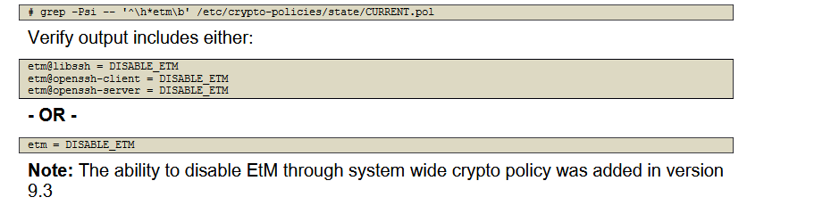

dnf install sshpass


# don't consider below thing
* unconfined services


ansible-playbook harden.yaml -k --start-at-task="Check  setroubleshoot and mcstrans  not installed"


# config system-wide-crypto-policy

#### Ensure system wide crypto policy is not set to legacy
```sh
update-crypto-policies --show

```


#### Ensure system wide crypto policy is not set in sshd configuration

```sh
grep -Pi '^\h*CRYPTO_POLICY\h*=' /etc/sysconfig/sshd # should retrun nothing

```


#### Ensure system wide crypto policy disables sha1 hash and signature support
```sh

awk -F= '($1~/(hash|sign)/ && $2~/SHA1/ && $2!~/^\s*\-\s*([^#\n\r]+)?SHA1/){print}' /etc/crypto-policies/state/CURRENT.pol   # Nothing should be returned


grep -Psi -- '^\h*sha1_in_certs\h*=\h*' /etc/crypto-policies/state/CURRENT.pol  # Run the following command to verify that sha1_in_certs is set to 0 (disabled):


vim /etc/crypto-policies/policies/modules/NO-SHA1.pmod
-----
hash = -SHA1
sign = -*-SHA1
sha1_in_certs = 0
-----

update-crypto-policies --set DEFAULT:NO-SHA1

reboot


awk -F= '($1~/(hash|sign)/ && $2~/SHA1/ && $2!~/^\s*\-\s*([^#\n\r]+)?SHA1/){print}' /etc/crypto-policies/state/CURRENT.pol # Nothing should be returned


```


#### Ensure system wide crypto policy disables macs less than 128 bits

```sh
grep -Pi -- '^\h*mac\h*=\h*([^#\n\r]+)?-64\b' /etc/crypto-policies/state/CURRENT.pol   # Nothing should be returned

# if return , you can disable with below instructions
vim /etc/crypto-policies/policies/modules/NO-WEAKMAC.pmod
-----
mac = -*-64* # Disables weak macs
-----

update-crypto-policies --set DEFAULT:NO-SHA1:NO-WEAKMAC

reboot
```

#### Ensure system wide crypto policy disables cbc for ssh

```sh

vim /etc/crypto-policies/policies/modules/NO-SSHCBC.pmod
-------
cipher@SSH = -*-CBC # Disables the CBC cipher for SSH
-------

update-crypto-policies --set DEFAULT:NO-SHA1:NO-WEAKMAC:NO-SSHCBC

reboot


```


#### Ensure system wide crypto policy disables chacha20-poly1305 for ssh

```sh

vim /etc/crypto-policies/policies/modules/NO-SSHCHACHA20.pmod
-----
cipher@SSH = -CHACHA20-POLY1305 # Disables the chacha20-poly1305 cipher for SSH
-----

update-crypto-policies --set DEFAULT:NO-SHA1:NO-WEAKMAC:NO-SSHCBC:NO-SSHCHACHA20
reboot

```

#### Ensure system wide crypto policy disables EtM for ssh
```sh

grep -Psi -- '^\h*etm\b' /etc/crypto-policies/state/CURRENT.pol

```


```sh
vim /etc/crypto-policies/policies/modules/NO-SSHETM.pmod

------
etm@SSH = DISABLE_ETM # This disables EtM for openSSH and libssh
------
update-crypto-policies --set DEFAULT:NO-SHA1:NO-WEAKMAC:NO-SSHCBC:NO-SSHCHACHA20:NO-SSHETM
reboot

```