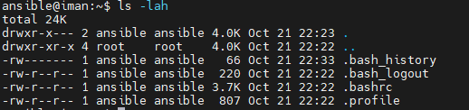
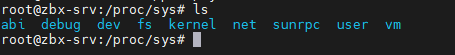

# Linux Engineering:
- [ ] Introduction
- [ ] Basic linux command
- [ ] User management and Permission
- [ ] text editor (vim)
- [ ] Basic Linux permision
- [ ] finding file and directories
- [ ] Text Processing
- [ ] compression and tar
- [ ] Disk management
- [ ] SCP (Secure COPY)
- [ ] Package manager
- [ ] Networking
- [ ] Iptables


## rocky linux repo
```sh
## local rocky linux repo 
vim /etc/yum.repos.d/rocky.repo
--------
[baseos]
name=Rocky Linux $releasever - BaseOS
#mirrorlist=https://mirrors.rockylinux.org/mirrorlist?arch=$basearch&repo=BaseOS-$releasever$rltype
#baseurl=http://dl.rockylinux.org/$contentdir/$releasever/BaseOS/$basearch/os/
baseurl=https://repo.iut.ac.ir/repo/rocky-linux/$releasever/BaseOS/$basearch/os/
gpgcheck=1
enabled=1
countme=1
metadata_expire=6h
gpgkey=file:///etc/pki/rpm-gpg/RPM-GPG-KEY-Rocky-9


[appstream]
name=Rocky Linux $releasever - AppStream
#mirrorlist=https://mirrors.rockylinux.org/mirrorlist?arch=$basearch&repo=AppStream-$releasever$rltype
baseurl=https://repo.iut.ac.ir/repo/rocky-linux/$releasever/AppStream/$basearch/os/
gpgcheck=1
enabled=1
countme=1
metadata_expire=6h
gpgkey=file:///etc/pki/rpm-gpg/RPM-GPG-KEY-Rocky-9


[extras]
name=Rocky Linux $releasever - Extras
#mirrorlist=https://mirrors.rockylinux.org/mirrorlist?arch=$basearch&repo=extras-$releasever$rltype
#baseurl=http://dl.rockylinux.org/$contentdir/$releasever/extras/$basearch/os/
baseurl=https://repo.iut.ac.ir/repo/rocky-linux/$releasever/extras/$basearch/os/
gpgcheck=1
enabled=1
countme=1
metadata_expire=6h
gpgkey=file:///etc/pki/rpm-gpg/RPM-GPG-KEY-Rocky-9
```


## good package for linux 

```sh

apt install iotop sysstat lsof dstat bash-completion vim nano tar zip unzip wget curl git net-tools dnsutils traceroute htop tcpdump apt-transport-https rsync jq tree tmux iperf3

dnf install iotop sysstat lsof dstat bash-completion vim nano tar zip unzip wget curl git net-tools  traceroute htop tcpdump apt-transport-https rsync jq tree tmux iperf3
 

# by def , show cpu info 
sar 1
sar 1 10
sar -b 1  # show block device info
sar -d 1  # per block device info

sar -n TCP 1

ss -nltp   # check for tcp listen interface
ss -nlup   # check for udp listen interface
ps auxf | less  # for finding which command run by which user


## disk usage
du -sh /*

lsof file.txt  # show file opened by a file
 while true; do lsof data.file ;done
 
watch -n 5 ls -lah 
```

## installation

```sh
# To check which repo a package comes from:
apt-cache policy postgresql

apt show postgresql


ps -eo pid,ppid,cmd


```


## two main Linux ditributions
* Debina Based(ubuntu(18.20,22,24), debain(10,11,12)) -->  pakage manager apt
* RHEL Based(centos(dead), fedora, rockey(8,9)) --> package manager yum, dnf


## file system hierarchy


* `/`: The root directory / is the starting point for the entire Linux filesystem hierarchical tree
* `/boot`:  is where the kernel is stored.
* `/etc`: configuration files information.
* `/proc`: system processes/resources 
* `/dev`: its a location of a device files like: /dev/sda, /dev/sdb , /dev/nvme
* `/home`: personal directories for each user account 
* `/root`:  home directory for administrator account 
* `/var`: variable and log files
* `/usr`: user related program
* `/tmp`: temporary files purged on reboot
* `/bin`: common binary executables
* `/lib`: library files (A library file in Linux is a collection of precompiled functions that programs can use to perform tasks without having to code them from scratch.)


lests start: 
download and install putty.


## basic linux command  

```sh
ls 
ls -lah             # long-list, hidden, human-readable
pwd
touch file1.txt     # create a file
touch .file         # create hidden file
echo "Hello world" > file1.txt
echo "Hello world" >> file1.txt
touch file{1..3}      # {} curly Brace, curly Braket
cat file1.txt

cd ~                  # ~ is home directory for user
cd .                  # . is current working directory
cd ..                 # change the current directory to the parent directory
cd                    # go to home directory

cd /home/test         # absolute pass
cd test               # relative path

mkdir dir1            # create a directory(folder)
mkdir dir{1..5} 
mkdir -p dire1/dire2


ls -lah /dev/        # block device: hard disk ,cd-rom, flash.  character device: mouse, keyboard

d > directory
l > link
c > character device
b > block device
- > regular file 

ls -li                # inode number(Each file or directory has an inode number that indicates its location on the hard disk.)
```


```sh


sudo apt install tree
tree .

stat file
file {directory, file-name}  # give you the type of the file or dirctory or zip or ....
which pwd

tail /var/log/file.txt
tail -f /var/log/file.txt
tail -n +2     # show from line 2 to the end of the file

head /var/log/file.txt
cat /var/log/file.txt


cat file.txt | wc    # show line, word, char
cat file.txt | wc -l # show only the number of line

cp <src> <dest>       # copy file and directory
cp file1 /etc/file.conf     
cp /etc/nginx/nginx.conf ~

mkdir ~/backup
cp -r /etc/ ~/backup
cp -r /etc/* ~/backup

mv <src> <dest>

rm file
rm -r directory
rm -rf directory


md5sum file
sha256sum file.tar


# redirect output and input
echo "hi" > file              # standard output   STDOUT
caaat file 2> /dev/null       # standard error    STDERR
caaaat file &> /dev/null     # stdout, stderr
echo $?


w
who

# pts: show console session
# tty: show ssh session


```

## User management and Permission
`we have to main method for authenticating our user:`
* local database
* domain controller: Openldap, Active-Directory


```sh
useradd iman                      # This is a low-level command that creates a user account without any additional setup.

adduser iman   --> user-friendly  # This is a higher-level command, typically a script that uses useradd under the hood. It simplifies the process by providing a more interactive experience, often prompting for details like the password and home directory


useradd prometheus -r -s /sbin/nologin -u 8000 -d /prom-data/ 

-r : system account
-s : default shell
-d : home directory
-u : uid and gid


cat /etc/passwd

which passwd      # a binary file for changing the user password
passwd iman
```


```sh
gid, uid
id -u     # show user uid
id -g     # show user gid
addgroup
delgroup

cat /etc/groups


usermod -aG <group> <user>
usermod -aG sudo iman
groups <user>   # show groups which this user joind 


usermod -L <user>   # lock(disable) a user
usermod -U <user>   # unlock a user

cat /etc/shadow

```


```sh
cd /etc/skel
touch /etc/skel/info.text
adduser iman1
ls -lah /home/iman1


who
last      # last login

```


## text editor (vim)
```sh
set cursorline
:5          $ go to line 5

dd          # delete a line 
d5          # delete line 5

u           # undo change

gg          # go to the begining of the file
shift + g   # go to the end of the file

shift+A     # go to the end of a specefic line
$           # go to the end of a specefic line

0                   # go to the begining of a specific line

/text               # search text in the file

:s/find/replace/    # find first word in the current line (not in all line)
:%s/find/replace/   # find and replace first match in any line
:%s/find/replace/g  # find and replace globally


yy          # copy the line 
p           # paste the line


:set number         # show line number


# vim Configuration:
vim ~/.vimrc
--------------------
set number
set cursorline
--------------------

```
[document](https://devhints.io/vim)


## Basic Linux permision

```sh


chown user:group file.txt   # change ownership of a file

chgrp group_name file.txt   # change group of a file


chmod u-x file.txt
chmod g-x file.txt
chmod o-x file.txt
chmod a-x file.txt


chmod u-rx file.txt
chmod g-rwx file.txt
chmod o+rw file.txt
chmod a-x file.txt

sudo -H -u <user> bash -c 'cat /etc/add-route.sh'

sudo -H -u ansible bash -c 'echo "fsdf" >>  /etc/add-route.sh'

chmod g=rx file.txt

chmod -R 444 directory

R       W       X
2^2     2^1     2^0

4       2        1   = 7

user, group, other

chmod 724 file > user: RWX, group: W, Other: R


# umask

# umask denfine default permision for a directory content, umask apply to a directory and after that any file we create on that directory got the umask permision

!!! with umask we can't set execute permision 


      user                    group                      other
-----------------         --------------           -----------------
R       W       X         R       W       X        R       W       X    
1       1       0         1       1       0        0       0       0

0 0 2^0=1                  0 0 2^1=1                2^2, 2^1,2^0=7

umask 117 dirctory_1   >>   RW- RW- ---

# for security reasons it cannot be set excute permision with umask
umask only apply to new file which we create on the directory


# Special Permission: 
SUID            4
SGID            2
StickyBit       1

# SUID
ls -lah /usr/bin/passwd
chmod 4644 /usr/bin/passwd
chmod u+s /usr/bin/passwd


# SGID
chmod 2644 file
chmod g+s file


# stickeyBit   # only apply on directory
when stickeyBit is enable on a dirctory , only the owner of file can delete the file but other and gourp can't delete.

mkdir /test
chmod 1777 /test
# chmod o+t  /test
touch /test/file1
chmod 777 /test/file1

su user2
cd /test
rm -rf file1


# by default stickyBit is enable on /tmp


# change and show file attributes
lsattr file


chattr +i file      # immutable file
rm -rf file
echo 3 >> file
lsattr file


chattr +a file      # append only
rm -rf file
echo 3 >> file
lsattr file


```


## finding file and directories

```sh
# we have two option for finding a file in linux: 1-locate, 2-find
# 'locate' is faster than a 'find', because it use a database which we need update it constantly


# locate
apt install mlocate                             # install locate
sudo updatedb                                   # update database

locate file_name
locate admin

locate -i file_name                             # it isn't case sensetive


# find ----> find search in realtime, therefor it is more slower than locate
find / -type f                                  # find all files
find / -type d                                  # find all directoris
find . -iname file.txt                          # case insensetive
sudo find /etc -type f -name "*.conf"

find . -name "file*" -delete                   # find "file.*" and delete all of them
find /etc/ -name shadow                         # search for "shadow" in /etc/ directory


find /etc/ -type d                              # show all directory in /etc
find /etc/ -type d -maxdepth 2                  # show directory in /etc/ which have depth=2
find /etc/ -type d -maxdepth 2 -perm 755        # find by permision


find /var/ -type f -size +100K -ls              # find the dirctory more than 100K size
find /var/ -type f -size +10M -ls
find /var/ -type f -size +5M -size -10M

find / -type f -perm 777

```

```sh
# atime — Access Time   
# The last time the file was read or accessed.
# Example: When you open a file with cat, less, or a program reads it.
cat file.txt   # This updates the atime.


# mtime — Modification Time
# The last time the file’s content was modified.
echo "Hello" >> file.txt  # This updates the mtime.

# ctime — Change Time
# The last time the file’s metadata (inode) changed, such as permissions, ownership, or content.
chmod 644 file.txt  # This updates ctime, but not mtime (because content didn’t change).

stat file.txt

```
| Timestamp        | Meaning            | Changes when...                       |
| ---------------- | ------------------ | ------------------------------------- |
| **atime**        | Last access        | File is read                          |
| **mtime**        | Last modification  | File content changes                  |
| **ctime**        | Last status change | Permissions, owner, or content change |
| **crtime/birth** | File creation      | File is created (if supported)        |


```sh

find /var/ -type f -mtime 0 -ls                 # show file which modified in one day past
find /var/ -type f -mtime 1 -ls                 # show file which modified in two day past
find /var/ -type f -mmin -60 -ls                 # show file which modified in 60 minute past
find /var/ -type f -mmin +60 -ls                 # show file which modified in more than 60 minute past
find /var/ -type f -mmin -1 -ls                 # show file which modified in 1 minute past


find /var/ -type f -user iman -ls

find /etc/ -type f -not -group root -ls

sudo find /etc/ -type f -not -group adm -ls


# find and execute a comand on each element 

sudo find / -type f -size +5M -exec ls -lah {} \;
find . -type f -name "text*"  -exec rm -rf {} \;

find / -type f -name "*.logs" -exec grep 'iman' {} \;

find /path/to/start/directory -depth -type d -empty -exec rmdir {} \;   # remove all epmty director

find /etc/ -mtime 7 -type f -exec cp {} /backup \;

mtime: 
      -7: from now to 7 days past
       7: exactly 7 days past
      +7: more that 7 days past


```

## Text Processing
### cat, cut, sed

```sh
cat file
cat -E file     # show \n too
cat -n file     # show line number

cat file | wc -l

zcat      # decompress and cat a file
zip -o file.zip file1.txt
zcat file.zip


# cut

data.csv
----------------------------------
name,age,city
user1,32,city1
user2,22,city2
----------------------------------
cat data.csv | cut -d"," -f 2
cat data.csv | cut -d"," -f 1


data
----------------------------------
name age city
user1 32 city1
user2 22 city2
----------------------------------
cat data | cut -d" " -f 2
cat data | cut -d" " -f 1


data
----------------------------------
name-age-city
user1-32-city1
user2-22-city2
----------------------------------
cat data | cut -d"-" -f 2
cat data | cut -d"-" -f 1


data
----------------------------------
name;age;city
user1;32;city1
user2;22;city2
----------------------------------
cat data | cut -d";" -f 2
cat data | cut -d";" -f 1


data (tab)
----------------------------------
name    age     city
user1   32      city1
user2   22      city2
----------------------------------
cat data | cut -d$'\t' -f 2
cat data | cut -d$'\t' -f 1


# Show all users in linux
cat /etc/passwd | cut -d":" -f 1


sed       # a way to search and replace
--------------------------------
hello this is my course on linux
linux is very good
--------------------------------

sed -i 's/find/replace/' file
sed -i 's/find/replace/g' file

# -i = inplace
# s  = substitute 

sed -i '/^$/d' file    # remove empty line from file
sed 's/.*/\U&/' file   # transfer lower case to UPPER CASE


## tr (translate)

file
----------------------------
this is test
----------------------------

cat file | tr a-z A-Z
----------------------------
THIS IS TEST
----------------------------


cat file | tr 'i' 'I'               # convert `i` to `I`
cat test | tr [:lower:] [:upper:]   # this not work on zsh
cat file | tr -d 't'                # remove 't' 
cat file | tr -d 'test'             # remove 't' , 'e', 's'  
cat test | tr -d [:digit:]          # remove all digits in a file
cat test | tr -d [:space:]          # remove all spaces
cat test | tr -d ' '                # remove all spaces
cat test | tr -d [:blank:]          # remove all blank
cat test  | tr -s ' '               # delete multiple space and replace with one space

iman@iman:~$ cat file
this is               test
iman@iman:~$ cat file | tr -s ' '
this is test


ip 
----------------
1.1.1.1
192.168.1.1
1.1.1.1
192.168.1.2
192.168.1.1

cat ip | sort | uniq

cat ip | sort | uniq -c     # count the duplicate 
cat ip | sort | uniq -d    # show only duplicate


```


### grep (text configurations)
```sh
grep iman /etc/passwd
grep "pattern" /etc/shadow
grep -i "SSH" /etc/ssh/ssh_config           # case insensitive

grep -in "ssh" /etc/..                      # case insensitive and show line number too

grep -v "pattern" /etc/..                   # inverted result
grep -c "pattern" /etc/...                  # sum of the result that match the condition

grep -A 3 -B 4 "pattern" /etc/..            # show 3 line after match and 4 line before match


```

### comparing files

```sh

# we have three way to compare files in linux: 1-cmp, 2-diff, 3-sha256sum or other hash function

cmp file1 file2
echo $? # if return 1, it means not eqal
        # if return 0, it means eqal

sha256sum a b   

diff file1 file2            # diff only used for files
diff -B file1 file2         # ignore blank line
diff -w a b                 # ignore space
diff -i a b                 # case insensitive
diff -y a b                 # pretty output


```


## hard link and soft link

```sh
# hard link, hard link only used for files
* hardlink only work with files
* hardlink only work on the same partition
* hardlink is a pointer to the inode on the disk
ln file1.txt file2.txt          


# sof link(symbol link)
# soft link, soft link can be used for both file and directory
* work on both file and directory
* can be use on multiple partitions
* softlink is a pointer to the file or directory not direct to the inode
ls -s file1.txt file2.txt       


```


## Package manager
```sh
# debian
apt list --installed
dpkg -l 

# Show which package owns a file and where it stores its files
dpkg -L vim 
dpkg -L docker-ce

sudo dpkg -i file.deb  # install .deb file 

# remove
dpkg -r vim 


sudo apt-key list    # list of gpg keys , gpg is used for preventing man in the middle, gpg is a key
                     # between you and repositroy server.

apt remove nginx # remove the nginx 
apt autoremove   # remove the dependencies which not needed anymore


| Command          | Effect                                 |
| ---------------- | -------------------------------------- |
| `apt remove`     | Remove package, keep configs           |
| `apt autoremove` | Remove unused dependencies             |
| `apt purge`      | Remove package + configs               |
| `apt autopurge`  | Purge + autoremove dependencies        |
| `apt clean`      | Delete all cached .deb files           |
| `apt autoclean`  | Delete only outdated cached .deb files |


# RPM or yum or dnf

rpm -qa  # show all program which is installed 
rpm -qa | grep nginx


# how to set proxy for apt

sudo vim /etc/apt/apt.conf.d/01proxy
-----------------------------
Acquire::http::Proxy "http://127.0.0.1:8080"
Acquire::https::Proxy "http://127.0.0.1:8080"
-----------------------------

or we can set these two env variable in terminal

export HTTP_PROXY=http://127.0.0.1:8080
export HTTPS_PROXY=https://127.0.0.1:8080


# how to set proxy on rocky or RHEL based linux for dnf 
vim /etc/dnf/dnf.conf
-----
proxy=http://192.168.1.1:3128
-----

```


## Process management

```sh
ps       
ps -ef        # show pid and ppid
ps -aux
ps -f -u root           # only show root process

ps aux --sort=%mem
ps aux --sort=-%cpu
ps aux --sort=-%cpu | head -n 10 

ps -eo user,pid,pcpu,pmem,state,command
ps -eo user,pid,pcpu,pmem,state,command --sort=-%cpu
ps -eo user,pid,pcpu,pmem,state,command --sort=-pcpu          # pcpu = percentage cpu 

ps -eo user,pid,pcpu,pmem,state,command --sort=-%mem | head  
ps -eo user,pid,pcpu,pmem,state,command --sort=-pmem | head   # pmem = percentage memory
ps -eo user,pid=process-id,pcpu,pmem=percent-memory,state,command --sort=-pmem | less


pidof docker
pgrep docker
pgrep zabbix_server     # get the pid of zabbix_server

ps -A -o stat,pid,ppid | grep -e '[zZ]'

ps -A -o stat,pid,ppid | grep -e '[zZ]' | awk '{print $3}' | xargs sudo kill -9


pgrep python3
pgrep sshd                  # get process id

pgrep -l sshd               # get process id with service name


pidof sshd
pidof chrome


nohub ./app.sh                          # or we can use tmux


sleep 1000 &
sleep 1000 &
sleep 1000 &
sleep 1000 &
sleep 1000 &

pidof sleep

pidof sleep | xargs sudo kill -9
pidof zabbix_server | xargs sudo kill -9


```


## compression and tar
[refrence](https://www.rootusers.com/gzip-vs-bzip2-vs-xz-performance-comparison/) for comparing these three method for compress files.
**tip**: before compres any file, first use tar and then use compres method
```sh
gzip -c file  > file.gz
file file.gz
gzip -d file.gz       # uncompress the file

c: compress
v: verbose
f: file-name
x: extract
z: zip


tar gather all file to a single tar file

tar -cvf backup.tar file1 file2 file3                   # tar the files
tar -tvf backup.tar                                     # only show which file is in the backup.tar
tar -xvf backup.tar                                     # untar the file

sudo tar -cvf archive.tar /etc/*


tar -zcvf backup.tar.gz file2 file3
tar -zcfv backup-etc.tar.gz /etc/*
tar -zxvf backup-etc.tar.gz

tar -zxvf backup-etc.tar.gz -c /data


-----------------------------------
sudo apt install bzip2
bzip2 file.tar
bzip2 -d file.tar.bz2


xz file.tar
xz -d file.xz
----------------------------------------
```


# Disk management

```sh
# Max inode is : 2^32

Buffer + Cache    # part of RAM, for speed the application performace
Swap              # part of disk, act as a RAM

echo 3 > /proc/sys/vm/drop_caches     # clear buffer + cache

sync              # this command write buffer to disk


file system       # A program that manages reading and writing to the disk; 
                    when we say format the hard disk,we mean installing a new file system on it. 


1) Linux Based File system

Name                  MaxFsSize       MaxFileSize         journaling      
ext2                  2 TiB               2 TiB              no
ext3                  2 TiB               16 TiB             yes
ext4                  1 EiB               1 EiB              yes


2) non-linux file system

Name                  MaxFsSize       MaxFileSize         journaling      
NTFS                  2 TiB               256 TiB              no
XFS                   8 EiB               8 EiB                yes


bit 
Byte = 8 bit


KB    -> * 10^3               KiB    -> * 2^10 = 1024 
MB    -> * 10^6               MiB    -> * 2^20 = 1024 * 1024
GB    -> * 10^9               GiB    -> * 2^30 = 1024 * 1024 * 1024 
TB    -> * 10^12              TiB    -> * 2^40 = 1024 * 1024 * 1024 * 1024
PB    -> * 10^15              PiB    -> * 2^50 
EB    -> * 10^18              EiB    -> * 2^60 
ZB    -> * 10^21              ZiB    -> * 2^70 
YB    -> * 10^24              YiB    -> * 2^80 


fdisk /dev/sdb
mkfs.ext4 /dev/sdb1
echo $?
lsblk -f

mount /dev/sdb1 /data
mount -r /dev/sdb1 /data    # read-only mount


# open /etc/fstab
-----------------------------------------------
/dev/sdb1 /data ext4  defaults  0 0

/dev/sdb1 /data ext4  ro,noexec 0 0
------------------------------------------------
sudo systemctl daemon-reload
sudo mount -a
df -TH
df -hi

```

**always-mount with UUID**


### craete a swap file in linux
We can create swap space in two ways:

1. **File-based swap**
2. **Partition-based (disk-based) swap**


### other storage configuration
```sh
dnf install smartmontools
smartctl -i /dev/sda  # info about the disk

du -sh .
du -sh ./* | sort -h

ncdu          # graphical way to see the disk sizes


blkid
lsblk
lsblk -f


umount /dev/sdb1
fsck.ext4 /dev/sdb1      # file system repair
xfs_repair  /dev/sdc1


echo "- - -" | tee /sys/class/scsi_host/host*/scan


dd if=/dev/zero of=file1 bs=1M count=5000
dd if=/dev/urandom of=file1 bs=1M count=5000


## distory all data in a disk
sudo dd if=/dev/zero of=/dev/sdb1 status=progress

## creating a bootable usb-drive
sudo dd if=/path/to/iso of=/dev/sdX bs=4M status=progress && sync


# backup /boot
lsblk
dd if=/dev/sda2 of=/data/boot status=progress
dd if=/data/boot of=/dev/sda2 status=progress


# create a big file
dd if=/dev/zero of=bigfile bs=1M count=1024 status=progress


# monitoring I/O in disk
sudo apt  install iotop
sudo iptop         # show disk i/o statistics


# du command
du -d1 -h /
du -d1 -h /var
du -d1 -h .
du -d1 -h / | sort -rh
du -d1 -h / | sort -rh | head -10
find / -type f -size +500M -exec du -h {} +

```


## SCP (Secure COPY)
```sh
scp -p 22 file.tar user@172.16.2.2:/home/user/backup/                           # for scp a file or tar file
scp -r -p 22 dirctory user@172.16.2.2:/home/user/backup/                        # for scp a dirctory

scp user@172.16.2.2:/home/user/backup/backup.tar user1@172.16.2.4:/home/user1/backup/   # scp from a server to another server

# you can use WinSCP for transfer file between linux and Windows 


rsync -avz  /path/to/local/directory username@remote_host:/path/to/remote/directory
sudo rsync -avzh /etc/ /home/user/etc-backup              # if target directory does not exist, rsync will be create for us


mkdir test1
mkdir test2

touch test1/file{1..10}

rsync test1/* test2/

# -a === incrimental copy 
# -P === progress bar
# -v === verbose
# -z === compress
# -h ==== human readable
rsync -avP test1/* test2/


rsync -avP test1/* -e "ssh -p 22" iman@10.10.56.101:/home/iman/test1


rsync -avP {dir1,dire2} -e "ssh -p 22" iman@10.10.56.101:/home/iman/test1


```


# Networking
## types of networking services in linux
todays linux servers used one of the three below network services. the three most common are: 
* `networking` ->  debain server
* `networkd` -> ubuntu server
* `NetworkManager` -> redhat, fedora, centos, ubuntu desktop


| Network Service                    | Typical Use                                | Common Distributions                                                              | Notes                                                                                 |
| ---------------------------------- | ------------------------------------------ | --------------------------------------------------------------------------------- | ------------------------------------------------------------------------------------- |
| **`networking`** (a.k.a. ifupdown) | Traditional network configuration          | **Debian Server**, older Ubuntu Server                                            | Uses `/etc/network/interfaces`. Simple but manual; being phased out on newer systems. |
| **`systemd-networkd`**             | Lightweight, modern systemd-native service | **Ubuntu Server**, some Debian, Arch, openSUSE (minimal)                          | Uses `/etc/systemd/network/*.network`. Fast and ideal for cloud/server setups.        |
| **`NetworkManager`**               | Dynamic and user-friendly network manager  | **Red Hat**, **Fedora**, **CentOS**, **Ubuntu Desktop**, also optional on servers | Provides GUI tools (like `nmcli`, `nmtui`, GNOME applet). Manages Wi-Fi, VPN, etc.    |


```sh

ip -br -c a
ip r     ##short for `ip route show `

# Nmap for searching IP in subnet
nmap -sP 172.16.2.0/24

```

### networking service

```sh
systemctl status networking.service

nano /etc/network/interfaces

### set static ip
-------------------------
nano /etc/network/interfaces
# add below
allow-hotplug enp0s8
iface enp0s8 inet static
        address 192.168.85.85
        netmask 255.255.255.0
        gateway 192.168.85.2
        dns-nameservers 8.8.8.8 8.8.4.4
-------------------------

#### set dynamic ip address
--------------------------
nano /etc/network/interfaces
# add below
allow-hotplug enp0s3
iface enp0s3 inet dhcp

--------------------------


systemctl restart networking.service

ifdown enp0s3
ifup enp0s3
ifquery enp0s8  # show ip address , gateway, netmask


```

### networkd


```sh
systemctl status systemd-networkd


### dhcp configuration

vim /etc/netplan/00-installer-config.yaml

-----
network:
  ethernets:
    enp0s8:
      dhcp4: true
    enp0s3:
      dhcp4: true
  version: 2


------

#### Static ip addressing

-----
network:
  ethernets:
    enp0s3:
      addresses:
        - 192.168.56.101/24
      routes:
        - to: default
          via: 192.168.56.1
      nameservers:
        addresses:
          - 8.8.8.8

    enp0s8:
      dhcp4: true
  version: 2
  renderer: networkd


------


netplay try
netplan apply
networkctl
networkctl status
networkctl lldp
networkctl down enp0s3
networkctl up enp0s3


### you can set dns server info in 

vim /etc/systemd/resolved.conf

----
#DNS=
#FallbackDNS=
#Domains=

----


resolvectl
resolvectl  flush-caches
resolvectl statistics


```


### NetworkManager


```sh

nmtui
nmcli 


## configuration file is here:

/etc/NetworkManager/system-connections

journalctl -u NetworkManager.service

journalctl -u NetworkManager.service  | tail -10

journalctl -u NetworkManager.service  | tail -10 | column -t

```
## ip command

```sh

 ip link show   === ip l  # show layer 2 of OSI-model

 ip address show === ip a  # show layer3 of OSI-model


 ip address show | sed -ne 's,^ *inet6* \([^ /]*\)/.*$,\1,p' | sort -u


ip -j address show # output json
ip -j -p address show # json pretty output

ip -j -p address show | jq

ip a | grep inet | sort -n

ip a | grep inet | sort -n | column -t


ip -o -4 a

ip -o -4 a | awk '{print $4}'


cd /sys/class/net/
cat /sys/class/net/enp0s3/statistics/tx_bytes

cat /sys/class/net/enp0s3/statistics/tx_errors

cat /sys/class/net/enp0s3/statistics/rx_errors


# ip route

ip route show

ip -c route show | column -t

ip -c route | grep default

# delete default route

sudo ip route del default


# add default route

ip route add default via 10.10.5.1

# add route
ip route add 10.10.10.0/24 dev enp0s8

ip route del 10.10.10.0/24

sudo route add -net 10.10.10.0 netmask 255.255.255.0 gw 192.168.229.173


ip -6 route list
```
## Network testing command

```sh

# how to disable ping 

echo 1 > /proc/sys/net/ipv4/icmp-echo-ignore-all

ping -c 100 10.10.5.3  # send 100 icmp echo

ping -s 1000 10.10.5.3  # size of packet


traceroute 8.8.8.8


whois google.com

whois google.com -H -I


dig google.com
dig -x google.com

nslookup google.com


### Nmap
nmap is a network discovery and security auditing tool, there are a variety scans that can be perform nmap, TCP SYN scan is the default and most popular scan option for good reason


sudo apt install nmap  # if you want to install nmap in windows you can install zenmap which is a GUI for nmap

sudo nmap IP_address
sudo nmap -sS IP_address

# by default nmap scan most common 1000 port for each protocol
nmap -p 22,50000 -sV IP_address

# if you want to sacn all port
nmap -p- IP_address


# for UDP scan
namp -sU localhost


nmap 10.10.10.10

nmap -sn 10.10.10.0/24

nmap -sP 172.16.2.0/24


```

## Lets-ecrypt

```sh
sudo apt update
sudo apt install certbot

sudo certbot certonly --manual --preferred-challenges dns -d repo.mydomain.com


# on another terminal you can check you dns recored updated or not
dig TXT _acme-challenge.repo.mydomain.com

# if everything ok , you can check you certificate in /etc/letsencrypt/live/repo.mydomain.com/*

```
## Get wild-card certificate
```sh
sudo certbot certonly --manual --preferred-challenges dns -d "*.mydomain.com" -d mydomain.com


```


## Time Sync server
* Setup chrony as an ntp server
```sh
apt installl chrony
# sudo nano /etc/chrony.conf   # in rocky linux
sudo nano /etc/chrony/chrony.conf # in ubuntu based system
---------
# Allow NTP clients in a specific subnet (adjust as needed)
allow 192.168.217.0/24

# (Optional) Listen on all interfaces
bindaddress 0.0.0.0

---------

sudo systemctl restart chronyd

ss -ulpn | grep chronyd

```


## Auditing 
```sh

apt install auditd
vim /etc/audit/auditd.conf


```


## Iptables
* Iptables,  Netfilter is a packet filtering inside a linux kernel


```sh
iptables -L             # list rules in filter table

# list in specific table
iptables -t filter -L   # list rules in filter table
iptables -t mangle -L   # list rules in mangle table

iptables -t filter -nvL           # list rules with packets details


# flush a specific chain of table
iptables -t filter -F INPUT
iptables -t mangle -F
iptables -t nat -F

iptables -Z             # reset byte and counters

iptables -N custom-chain        # Create Custom chain
iptables -X custom-chain        # delete chain


iptables -t filter -A INPUT -p icmp --icmp-type echo-request -j DROP
iptables -t filter -A OUTPUT -p tcp --dport 80 -d 8.8.8.8 -j DROP


iptables -t filter -A INPUT -p tcp --dport 22 -s 10.10.10.1 -j ACCEPT
iptables -t filter -A INPUT -p tcp --dport 22 -s 10.10.10.0/24 -j DROP
iptables -t filter -A INPUT -p tcp --dport 22 -s 0/0 -j DROP
iptables -t filter -A INPUT  -s 0/0 -j DROP


iptables -t filter -A INPUT -p tcp --dport 22 ! -s 10.10.10.1 -j DROP

# multi-port

iptables -t filter -A INPUT -p tcp -m multiport --dport 22,80,3306 -s 192.168.56.0/24 -j ACCEPT
iptables -t filter -A INPUT -p tcp -m multiport --dport 22,80,3306 -s 0/0 -j DROP


# ip-range
iptables -t filter -A INPUT -p tcp --dport 80 -m iprange  --src-range 10.10.10.1-10.10.10.10 -j ACCEPT
iptables -t filter -A INPUT -p tcp --dport 80 -m iprange  --src-range 10.10.10.11-10.10.10.100 -j DROP


# DROP all outgoing multicast address
iptables -t filter -A OUTPUT -m addrtype --dst-type MULTICAST -j DROP


# change default policy

iptables -P INPUT DROP
iptables -P FORWARD DROP
iptables -P OUTPUT ACCEPT


# statefull

iptables -t filter -i enp0s3 -A INPUT -p tcp --dport 22 -s 172.16.2.0/24 -m state --state NEW,ESTABLISHED -j ACCEPT


#!/bin/bash
iptables -F
iptables -t filter -A INPUT -p tcp --dport 22 -s 0/0 -m state --state ESTABLISHED,RELATED -j ACCEPT
iptables -t filter -A INPUT -p tcp --dport 22 -s 0/0 -m state --state NEW -j DROP


## filter by date and time ( time module for in UTC time)

iptables -A INPUT -p tcp --dport 22 -m time --timestart 14:00 --timestop 20:00 -j ACCEPT
iptables -A INPUT -p tcp --dport 22 -j DROP


## IPset
apt install ipset

ipset -N myset hash:ip

ipset -A myset 1.1.1.1
ipset -A myset 8.8.8.8


iptables -A INPUT -m set --match-set myset src -j DROP


# iptables-save
iptables rules are stored in memory, so they are not persistent, because when the system is shutting down all rules will be deleted.


1) first option
iptables-save > rules
iptables-restore rules


2) second option
sudo apt install iptables-persistent
iptables-save > /etc/iptables/rules.v4


```


## nftables
```sh
dpkg -L nftables

systemctl status nftables
nft list ruleset


vim /etc/nftables.conf

----


---


# load the rules
nft -f /etc/nftables.conf


# flush all rules
nft flush ruleset

```

## ufw

```sh

sudo ufw enable

sudo ufw disable

sudo ufw status

sudo ufw reset


sudo ufw allow 80/tcp
sudo ufw deny 80/tcp


# Allow a Port Range:
sudo ufw allow 6000:7000/tcp


# Allow from a Specific IP Address:
sudo ufw allow from 10.10.1.10


# Allow from a Specific IP Address to a Specific Port:
sudo ufw allow from 10.10.1.10 to any port 22


# Delete a Rule:
sudo ufw delete allow 80/tcp


#  show ufw default policy
sudo ufw status verbose

# change default policy
ufw reset 
ufw allow in 22/tcp
ufw enable 
sudo ufw default deny incoming
sudo ufw default allow outgoing
sudo ufw default deny routed

```

## firewalld
```sh
# list and show the current config
firewall-cmd --state
firewall-cmd --get-default-zone
firewall-cmd --get-active-zones
firewall-cmd --list-all

firewall-cmd --get-zones
firewall-cmd --list-all --zone=home

firewall-cmd --list-all --zone=drop

# add port
firewall-cmd --add-port=8080/tcp --permanent
firewall-cmd --reload

firewall-cmd --add-service=http --permanent
firewall-cmd --reload

# remove port
firewall-cmd --remove-port=8080/tcp --permanent
firewall-cmd --reload


firewall-cmd --set-default-zone=public

firewall-cmd --zone=public --add-interface=eth0 --permanent
firewall-cmd --reload


# allow icmp
firewall-cmd --permanent --add-icmp-block-inversion
firewall-cmd --permanent --add-icmp-block=echo-reply
firewall-cmd --permanent --add-icmp-block=echo-request
firewall-cmd --reload
```


## linux as a router 

```sh
echo 1 >  /proc/sys/net/ipv4/ip_forward

```
# advance file-system
1. Ext4(fourth version of Extended file system): 
    * max file-system size: 16EB
    * max file size:        1EB

2. XFS (Extended file system)


# LVM (logical volume management)
[ref](https://www.tecmint.com/create-lvm-storage-in-linux/)
```sh
cat /proc/sys/vm/swappiness
cat /proc/swaps
swapon -s


pvcreate /dev/sd[bc][12]
pvs
vgcreate myvg /dev/sd[bc][12]
vgs

lvcreate -n lv1 -L 5g myvg
lvcreate -n lv2 -L 9g myvg
lvcreate -n lv3 -l 100%FREE myvg
ll /dev/myvg/
 

mkfs.ext4 /dev/myvg/lv1
mkfs.ext4 /dev/myvg/lv2
mkfs.ext4 /dev/myvg/lv3


vim /etc/fstab
/dev/myvg/lv1   /LVM1   ext4    defaults        0       0
/dev/myvg/lv2   /LVM2   ext4    defaults        0       0
/dev/myvg/lv3   /LVM3   ext4    defaults        0       0

mount -a


sha1sum LVM*/*.txt >  checksum
sha1sum LVM*/*.txt -c checksum


# extend vg
fdisk /dev/sdd
pvcreate /dev/sdd1
vgextend myvg /dev/sdd1
vgreduce myvg /dev/sdd1
vgdisplay myvg
vgrename myvg new-name
lvs


# extend lv
lvextend -L +4G /dev/myvg/lv2  # add 4G size to privious size  
lvextend -l +100%FREE /dev/myvg/lv1

resize2fs /dev/myvg/lv2
resize2fs /dev/myvg/lv1


## Reducing Logical Volume (LV)

* Before starting, it is always good to backup the data, so that it will not be a headache if something goes wrong.
* To Reduce a logical volume there are 6 steps needed to be done very carefully.
* While extending a volume we can extend it while the volume under mount status (online), but for reduce we must need to unmount the file system before reducing.

Let’s see what are the 5 steps below: \
* unmount the file system for reducing
* Check the file system after unmount.
* Reduce the file system
* Reduce the Logical Volume size than Current size
* Recheck the file system for error
* Remount the file-system back to stage


# backup
tar -zcfv backup-etc.tar.gz /etc/*


check for ok
mkdir /data2
tar -zxvf backup-etc.tar.gz -C /data2


df -TH
# 1
umount -v /LVM1

# 2
e2fsck -f /dev/myvg/mylv1
echo $?

#3
resize2fs /dev/myvg/mylv1 10G
echo $?

#4 
lvreduce -L 10G /dev/myvg/lv1 # reduce to 10GB
echo $?

#5 
resize2fs /dev/myvg/mylv1
# xfs_growfs /dev/myvg/lv1	# if file system is xfs
echo $?

# 6
mount -a
lvs 
vgs


# reduce vg
# make sure the pv is free

pvdisplay /dev/sdd1
# make sure   : `Total PE = Free PE`    , and `Allocated PE = 0`
# then you can reduce the vg
vgreduce myvg /dev/sdd1

if Total PE != Free PE  you can use pvmove then reduce the vg
pvmove /dev/sdd1
vgreduce myvg /dev/sdd1


# remove pv
pvremove /dev/sdd1

partprobe

----------------------------------------------------------------------------
# full example1

pvcreate /dev/sd[bc][12]
pvs

vgcreate myvg /dev/sd[bc][12]
vgs


lvcreate -l 74%free myvg --name lv01

mkfs.ntfs /dev/myvg/lv01
mount /dev/myvg/lv01 /LVM


------------------------------------------------------------------------
# full example2

pvcreate /dev/sd[bc][12]

vgcreate -s 32M myvg /dev/sd[bc][12] # PE size 32MB
vgs


lvcreate -L 6G -n mylv1 myvg
lvcreate -L 6G -n mylv2 myvg
lvcreate -L 6G -n mylv3 myvg

# format lvs

mkfs.ext4 /dev/myvg/mylv1
mkfs.ext4 /dev/myvg/mylv2
mkfs.ext4 /dev/myvg/mylv3


mount /dev/myvg/mylv1 /LVM1
mount /dev/myvg/mylv2 /LVM2
mount /dev/myvg/mylv3 /LVM3

df -TH


cat /etc/mtab

# copy and paste in /etc/fstab, change rw to defaults
/dev/mapper/myvg-mylv1 /LVM1 ext4 defaults 0 0
/dev/mapper/myvg-mylv2 /LVM2 ext4 defaults 0 0
/dev/mapper/myvg-mylv3 /LVM3 ext4 defaults 0 0


 mount -av

pvscan

vgdisplay
lvextend -l +331 /dev/myvg/mylv1  # +331 is PE size
resize2fs /dev/myvg/mylv1
lvdisplay
df -TH
lsblk
```

# pvmove

```sh
fdisk /dev/sdf

pvcreate /dev/sdf1
vgextend myvg /dev/sdf1
pvmove /dev/sdb1 /dev/sdf1
sync


# You don't need to specify the destination PV; in this case, LVM will move the data to any available space within the VG. like this:
pvmove /dev/sdb1
sync

# now you can remove /dev/sdb1 
vgreduce myvg /dev/sdb1


# finally remove the pv
pvremove /dev/sdb1 

# You can now safely remove the disk physically.
```


# lvm snapshot
```sh
lvcreate --size 1G --snapshot --name lv1-snapshot /dev/myvg/lv1

# lvcreate -L 1GB -s -n lv1-snapshot /dev/myvg/lv1

lvs

# for remove
lvremove /dev/myvg/lv1-snapshot

# be-causon that the snapshot doesn't overflow, if overflow happend all data will crashed.

# It is good to create a snapshot with the exact size.
for example if lv has 20G , then create a snapshot with 20G size.

# resize snap shot before overflow
lvextend -L +2G /dev/myvg/lv1-snapshot


# resotore snapshot


umount /LVM1
df -TH

lvconvert --merge /dev/myvg/lv1-snapshot
# After the merge is completed, the snapshot volume will be removed automatically.


swapon -s               # show list of swaps
mount -a                # apply changes in /etc/fstab


```


## modules 
```sh
lsmod                               # print all modules which already added to kernel
modprobe module_name                # add module and requiremnt modules to kernel
modprobe -r module_name             # remove a modlue and all dependencies
insmod module_name                  # only add module and can't load requirement modules
rmmod module_name                   # remove a module from a kernel
modinfo module_name                 # get info of modules

# if you want to permenent loaded modules, add modules to "/etc/modules-load.d"


```

# Grub


```sh
# do not edit this file
vim /boot/grub/grub.cfg


# you can edit below file

vim /etc/default/grub


grub-mkconfig -o /boot/grub/grub.cfg
echo $?

```

## change root password in grub in Rockey Linux

prees e to edit the boot loader


remove red line selected and add `init=/bin/sh`


pree ctrl+x or F10

then add below command

```sh
/usr/sbin/load_policy -i

mount -o remount,rw /

passwd 

mount -o remount,ro /

exec /sbin/init
```

## change root password in grub in ubuntu

pree e to edit the boot loader


change selected line to 


```sh
mount -o remount,rw /

passwd 

mount -o remount,ro /

exec /sbin/init
```

## set password for grub in Rocke linux

```sh
grub2-setpassword

grub2-mkconfig -o /boot/grub2/grub.cfg

```

## if you gone the grub.cfg file you have to add rockey-linux image as a live cd and go to the rescue mode

```sh

grub2-mkconfig -o /boot/grub2/grub.cfg
```


## set grub password in ubuntu 

```sh
grub-mkpasswd-pbkdf2
Enter password:
Reenter password:
PBKDF2 hash of your password is grub.pbkdf2.sha512.10000.2E41F2FEE11120CCEEAC4D529405C22E08030E93AF888ADE3E3F648B5955C99C108C57726CBC21F5CED8A64F68F1881E38D0EADE7475A15521F863C3BD1503BB.CE5E06453BA23D45A49B2E55EC8331C62C402548E996DD3D9E218109B8A4B2EC00121554C2CE7BC801D1914F3F813A94C3232F30B5A546916745F3E182E1EF39


sudo vim /etc/grub.d/40_custom  
-----
set superusers="iman"
password_pbkdf2 iman grub.pbkdf2.sha512.10000.2E41F2FEE11120CCEEAC4D529405C22E08030E93AF888ADE3E3F648B5955C99C108C57726CBC21F5CED8A64F68F1881E38D0EADE7475A15521F863C3BD1503BB.CE5E06453BA23D45A49B2E55EC8331C62C402548E996DD3D9E218109B8A4B2EC00121554C2CE7BC801D1914F3F813A94C3232F30B5A546916745F3E182E1EF39

-----

update-grub

```
# only ask grub password when you want to go to the grub configuration

```sh
# open below file and add below config like picture like this 
vim /etc/grub.d/10_linux
-------
--unrestricted
--------
```


```sh
# then update the grub configuration , by doing so , only ask you the grub password when you want to go in the grub configuration on boot.

update-grub
echo $?

```


## common-system-maintanace

```sh
# give you zabbix_server pids
pidof zabbix_server

# how to find a pid open which files
lsof -p <PID>
lsof -p 1003


```

### EOF template

```sh
cat <<EOF > config.txt
# Configuration file
server_ip=192.168.1.1
port=8080
EOF

```


## how to secure ssh
```sh

1 - change default port from 22 to something else
2 - disable root login
3 - allowed only required user to connect to server via ssh
4 - enable iptables from specific IP
5 - use ssh version2
6 - ClientAliveInterval 300 and clientAliveCountMax 0
7 - Banner 


Banner /etc/banner.txt

```


## Sysctl

**always backup the sysctl before make any change**
```sh
cp /etc/sysctl.conf /etc/sysctl.conf.back
sysctl -a > sysctl.backup
```
kernel parameter stored in /proc/sys/

- net ( network related parameter)
- vm (virtual memory management)
- fs (filesystem settings)
- kernel (core kernel settings)

```sh
sysctl -a   # view all loaded parameters
sysctl net.ipv4.ip_forward   # show this parameter

# for permanent configuration save int /etc/sysctl.conf
vim /etc/sysctl.conf
-------
net.ipv4.ip_forward = 1
-------

sysctl -p   # reload changes 


# commonly Tuned parameters
# - Network parameters: 
sysctl -w net.ipv4.tcp_syncookies=1      # enables syn flood attack prevention
sysctl -w net.core.somaxconn=1024        # set the maximum number of queued connections
sysctl -w kernel.randomize_va_space=2    # enables address space layout randomization(ASLR)

sysctl -w fs.protected_symlinks=1        # protects against symlink-based attacks


# - Memory Management:
sysctl -w vm.swappiness = 10


```


## DNS


```sh

hostnamectl set-hostname test.local

```


## nmcli


```sh

nmcli connection show
nmcli connection down enp0s3
nmcli connection up enp0s3

nmcli connection edit enp0s3


# static ip addressing
nmcli connection modify enp0s8 ipv4.method manual ipv4.addresses 10.10.10.1/24 ipv4.gateway 10.10.10.254 ipv4.dns 8.8.8.8 ipv4.dns-search "xample.com"
nmcli connection down enp0s8 && nmcli connection up enp0s8


# dhcp ip addressing
nmcli connection modify enp0s8 ipv4.method auto


# scan wifi
nmcli device wifi
nmcli device wifi connect "ssid" password pass  name "wifi1-profile"

```


## SFTP


```sh
sftp user@10.10.10.1 


ls # list content of sftp server
get file.tar  # download from sftp server
reget file.tar
mkdir dir1 # create directory on sftp server
?


lls # list context of local server
put file.tar # upload to the sftp server
lmkdir # create directory on local server


```

# Additional network tools

```sh
# neofetch

apt install neofetch
neofetch

vim .config/neofetch/config.conf


# wget

wget google.com
wget -r site.com


# btop
apt install btop
btop


# bmon
apt install bmon
bmon


arp 
arp -a
arp --help


apt install speedtest-cli
speedtest-cli 


netstat -ntlp
lsof -i :3306
lsof -i :22


```


## NIC Bonding
NIC Bonding like ether-channel in cisco devices
```sh


```


# figlet
```sh
sudo apt install figlet
figlet imanjowkar

bc      # terminal calculator

```


## fail2ban

```sh
fail2ban-client status sshd
fail2ban-client set sshd unbanip 192.168.1.1


```


## maintanance

```sh
shutdown -r 23:00     # reboot on 23:00
shutdown -r +15       # reboot in 15 minute
shutdown -r now       # reboot now


```

## check a udp port with netcat
```sh
# check tcp port
nc -zv 192.168.1.10 80


# check udp port
nc -zvu 10.10.200.5 161


# check tcp range
nc -zv 192.168.1.10 20-100


```


## ipv6 disable in grub on both ubuntu and rocky linux
```sh
# on ubuntu 
sudo nano /etc/default/grub
------
GRUB_CMDLINE_LINUX_DEFAULT="quiet splash ipv6.disable=1"
GRUB_CMDLINE_LINUX="ipv6.disable=1"
------

sudo update-grub
reboot


# on rocky linux
grubby --update-kernel=ALL --args="ipv6.disable=1"
# verify, You should see ipv6.disable=1 in the args=... line.
sudo grubby --info=ALL | grep args
reboot

```


## bypass grub password
boot system with live image

```sh

lsblk 
mount /dev/sda2 /test
vim /test/grub.grub.cfg
# remove the password below in this file
----
set superusers="iman"
password_pbkdf2 iman grub.pbkdf2.sha512.10000.2E41F2FEE11120CCEEAC4D529405C22E08030E93AF888ADE3E3F648B5955C99C108C57726CBC21F5CED8A64F68F1881E38D0EADE7475A15521F863C3BD1503BB.CE5E06453BA23D45A49B2E55EC8331C62C402548E996DD3D9E218109B8A4B2EC00121554C2CE7BC801D1914F3F813A94C3232F30B5A546916745F3E182E1EF39

----

sync

reboot

```

## netcat working

```sh
server: 192.168.1.1
client: 192.168.1.2


# server
nc -ul -p 1519


# client
echo tessssssssst | nc -u 192.168.1.1 -p 1519
```


## NFS-server
[nfs-server](img/nfs.png)
```sh

# nfs-server

----------
sudo dnf install nfs-utils
sudo mkdir /mnt/nfs/data -p
sudo chown nobody /mnt/nfs/data
----------
# now go the  /etc/exports and add below config
vim /etc/exports
--------------
/mnt/nfs/data    192.168.244.20(rw,sync,no_subtree_check)
--------------
sudo systemctl enable nfs-server
sudo systemctl start nfs-server

firewall-cmd --permanent --add-service=nfs
firewall-cmd --permanent --add-service=mountd
firewall-cmd --permanent --add-service=rpc-bind
firewall-cmd --reload


## nfs client

apt install nfs-common

sudo mkdir -p /mnt/nfs/data
-----
mount 192.168.244.10:/mnt/nfs/data /mnt/nfs/data
-----

# you can permanent it in /etc/fstab
vim /etc/fstab
-----
192.168.244.10:/mnt/nfs/data   /mnt/nfs/data   nfs auto,nofail,noatime,nolock,intr,tcp,actimeo=1800 0 0
-----

df -Th 
lsblk

```
## GlusterFS

```sh
# install on all nodes
sudo apt install glusterfs-server

```


## Debug
```sh
apt install iotop
apt install sysstat   # used in sar
apt install lsof
apt install dstat


dnf install iotop
dnf install sysstat   # used in sar
dnf install lsof

uptime # look for load avg 
free -h 

top 
```


```sh
# by def , show cpu info 
sar 1
sar 1 10

sar -b 1  # show block device info

sar -d 1  # per block device info


sar -n TCP 1

ss -nltp   # check for tcp listen interface
ss -nlup   # check for udp listen interface

iotop
ps auxf | less  # for finding which command run by which user


## disk usage
du -sh /*

lsof file.txt  # This command shows which processes have file.txt open and provides details about how the file is being used

# lsof = List Open Files. It displays all open files on the system (files, directories, sockets, pipes, etc.).

while true; do lsof data.file ;done
 
watch -n 5 ls -lah 

wc -l access.log

cat /var/log/mariadb/error.log | grep -B5 -A5 connections

```


# Docker 
*What is daemon less in docker
it means container can run whenever docker damon is stoped
you have to set below config in /etc/docker/daemon.json
note: live restore only works on linux not in windows*
```sh
vim /etc/docker/daemon.json
------
{
  "live-restore": true
}
------
systemctl reload docker

```


```sh


# ubuntu 
vim /etc/netplan/
-----
network:
  version: 2
  renderer: networkd
  ethernets:
    eth0:
      dhcp4: no
      addresses:
        - 192.168.1.100/24
      routes:
        - to: default
          via: 192.168.1.1
      nameservers:
        addresses:
          - 8.8.8.8
          - 1.1.1.1

      # Static routes
      routes:
        - to: 10.10.10.0/24
          via: 192.168.1.254
        - to: 172.16.0.0/16
          via: 192.168.1.253
-----
netplan apply

```

# debian
```sh
apt install sudo 
su -
visudo
## grant user with sudo privilege


# debian
sudo vim /etc/network/interfaces
-----
auto eth0
iface eth0 inet static
    address 192.168.1.100
    netmask 255.255.255.0
    gateway 192.168.1.1
    dns-nameservers 8.8.8.8 1.1.1.1

-----
sudo systemctl restart networking


```

# Keepalived

#### node1
```sh
# debian
sudo apt -y install keepalived
ip -br -c a
apt install nginx curl
sudo iptables -I INPUT -p 112 -j ACCEPT
# -p 112 → VRRP (IP protocol number)


vim /etc/keepalived/keepalived.conf
----
# create new
global_defs {
    # set hostname
    router_id node1
}

# Custom health check script
vrrp_script chk_http_port {
  script "/usr/local/bin/healthcheck.sh"
  interval 5 # Check every 5 seconds
  fall 2 # Number of consecutive failures before considering the server as down
  rise 2 # Number of consecutive successes before considering the server as up
}


vrrp_instance VRRP1 {

    # on primary node, specify [MASTER]
    # on backup node, specify [BACKUP]
  state MASTER
  preempt
  # set correct network interface
  interface ens33
  
  # set unique ID on each VRRP interface
  # on the a VRRP interface, set the same ID on all nodes
  virtual_router_id 101
  
  # set priority : [Master] > [BACKUP]
  priority 100

  # VRRP advertisement interval (sec)
  advert_int 1


  authentication {
    auth_type PASS
    auth_pass mypassword
  }

  # virtual IP address
  virtual_ipaddress {
    192.168.96.20
  }

  track_script {
    chk_http_port
  }
}


----

vim /usr/local/bin/healthcheck.sh
----
#!/bin/bash
# Define the URL to check
URL="http://192.168.96.211:80"
# Make an HTTP GET request and store the response
RESPONSE=$(curl -s -o /dev/null -w "%{http_code}" "$URL")
# Check the HTTP response code
if [ "$RESPONSE" == "200" ]; then
  # Server is healthy
  exit 0
else
  # Server is unhealthy
  exit 1
fi
----
# if the user keepalived_script not exists you can create it by below 
sudo useradd -r -s /usr/sbin/nologin keepalived_script


chown keepalived_script: /usr/local/bin/healthcheck.sh
chmod u+x /usr/local/bin/healthcheck.sh

systemctl restart keepalived.service
systemctl status keepalived.service
```

#### node2
```sh
# debian
sudo apt -y install keepalived
ip -br -c a
apt install nginx curl

apt install iptables
sudo iptables -I INPUT -p 112 -j ACCEPT
# -p 112 → VRRP (IP protocol number)

vim /etc/keepalived/keepalived.conf
------
# create new
global_defs {
    # set hostname
    router_id node2
}

# Custom health check script
vrrp_script chk_http_port {
  script "/usr/local/bin/healthcheck.sh"
  interval 5 # Check every 5 seconds
  fall 2 # Number of consecutive failures before considering the server as down
  rise 2 # Number of consecutive successes before considering the server as up
}


vrrp_instance VRRP1 {

    # on primary node, specify [MASTER]
    # on backup node, specify [BACKUP]
  state BACKUP
  nopreempt
  # set correct network interface
  interface ens33
  
  # set unique ID on each VRRP interface
  # on the a VRRP interface, set the same ID on all nodes
  virtual_router_id 101
  
  # set priority : [Master] > [BACKUP]
  priority 90

  # VRRP advertisement interval (sec)
  advert_int 1


  authentication {
    auth_type PASS
    auth_pass mypassword
  }

  # virtual IP address
  virtual_ipaddress {
    192.168.96.20
  }

  track_script {
    chk_http_port
  }
}


----

vim /usr/local/bin/healthcheck.sh
----
#!/bin/bash
# Define the URL to check
URL="http://192.168.96.212:80"
# Make an HTTP GET request and store the response
RESPONSE=$(curl -s -o /dev/null -w "%{http_code}" "$URL")
# Check the HTTP response code
if [ "$RESPONSE" == "200" ]; then
  # Server is healthy
  exit 0
else
  # Server is unhealthy
  exit 1
fi
----

chown keepalived_script: /usr/local/bin/healthcheck.sh
chmod u+x /usr/local/bin/healthcheck.sh
# if the user keepalived_script not exists you can create it by below 
# sudo useradd -r -s /usr/sbin/nologin keepalived_script

systemctl restart keepalived.service
systemctl status keepalived.service

```


# Keepalived with notify and zabbix_sender

```sh
# installing the zabbix sender
wget https://repo.zabbix.com/zabbix/7.0/debian/pool/main/z/zabbix-release/zabbix-release_latest_7.0+debian12_all.deb
dpkg -i zabbix-release_latest_7.0+debian12_all.deb
apt update

apt install zabbix-sender


```

# FreeBSD
```sh

# Change default shell
chsh -s /usr/local/bin/bash

# package mgmt
pkg update
pkg install nginx
pkg install python3
pkg install vim
pkg install sudo bash vim htop wget curl git bash-completion
pkg install tcpdump nmap mtr iftop iperf3 bind-tools
pkg search nginx
pkg info htop
pkg delete packagename
pkg update && pkg upgrade

# show all files and direcoty added by installing this packages
pkg info -l zabbix7-agent
pkg info -l nginx


# config zabbix agnet
pkg install  zabbix7-agent
pkg info -l zabbix7-agent

vim /usr/local/etc/zabbix7/zabbix_agentd.conf
----
Server=192.168.1.10
ServerActive=192.168.1.10
Hostname=freebsd-node1

----
sysrc zabbix_agentd_enable="YES"
service zabbix-agent2 status

# permanently enable nginx
sysrc nginx_enable="YES"


# like netstat freebsd -ntlp in ubuntu and rocky
sockstat -4 -6

service -l | grep zabbix
service zabbix_agentd status
service nginx onestart


# Networking
ifconfig
ifconfig em0 up


vim /etc/rc.conf
----
# if dhcp enabled
hostname="my-freebsd14-vm"
ifconfig_em0="DHCP"
sshd_enable="YES"


# static ip configuration
ifconfig_em0="inet 192.168.1.10/24"
defaultrouter="192.168.1.1"
sshd_enable="YES"

----


service netif restart && service routing restart

# another way to set ip address permanently
sysrc hostname="fbsd.example.com"
sysrc ifconfig_em0="inet 192.168.1.150 netmask 255.255.255.0"
sysrc defaultrouter="192.168.1.1"

vim /etc/resolv.conf
----
nameserver 8.8.8.8
nameserver 8.8.4.4
----

service netif restart && service routing restart

# show gateway and routing
netstat -rn

# add route
route add 10.10.10.0/24 192.168.10.1
route delete 10.10.10.0/24

# add route permanently
vim /etc/rc.conf
------
# static route
static_routes="net1 net2"
route_net1="-net 10.10.0.0/16 192.168.85.4"
route_net2="-net 172.16.5.0/24 192.168.85.5"

------
service netif restart && service routing restart 
netstat -rn


# Freebsd as a router
sysctl net.inet.ip.forwarding=1
echo 'gateway_enable="YES"' >> /etc/rc.conf
service routing restart


# Traffic Monitoring
tcpdump -i em0


pkg install iftop
iftop -i em0


# make user sudoer add in visudo in freebsd
visudo


# working with storage and disk
# After physically adding the disk or attaching a virtual disk, rescan devices:
camcontrol rescan all 

# List disks:
geom disk list

# or
ls /dev/da*
ls /dev/ada*

```
SATA/SAS disks → /dev/ada0, /dev/ada1

SCSI/VM disks → /dev/da0, /dev/da1

NVMe → /dev/nvme0ns1

```sh

# WARNING: fdisk is deprecated and is not available in FreeBSD 15 or later.
camcontrol rescan all
geom disk list
gpart create -s gpt /dev/da2
gpart add -t freebsd-ufs /dev/da2
newfs -U /dev/da2p1
mkdir /mnt/data
mount /dev/da1p1 /mnt/data
vim /etc/fstab
-------
/dev/da1p1   /mnt/data   ufs   rw   2   2
-------

```


# zfs

```sh
sudo apt update
sudo apt install -y zfsutils-linux

zfs version
lsmod | grep zfs


# Single disk pool (testing)
sudo zpool create tank /dev/sdb


# Mirror pool (recommended)
sudo zpool create tank mirror /dev/sdb /dev/sdc

zpool status
zpool list


# Create Datasets (instead of partitions)
zfs create tank/data
zfs list


```

