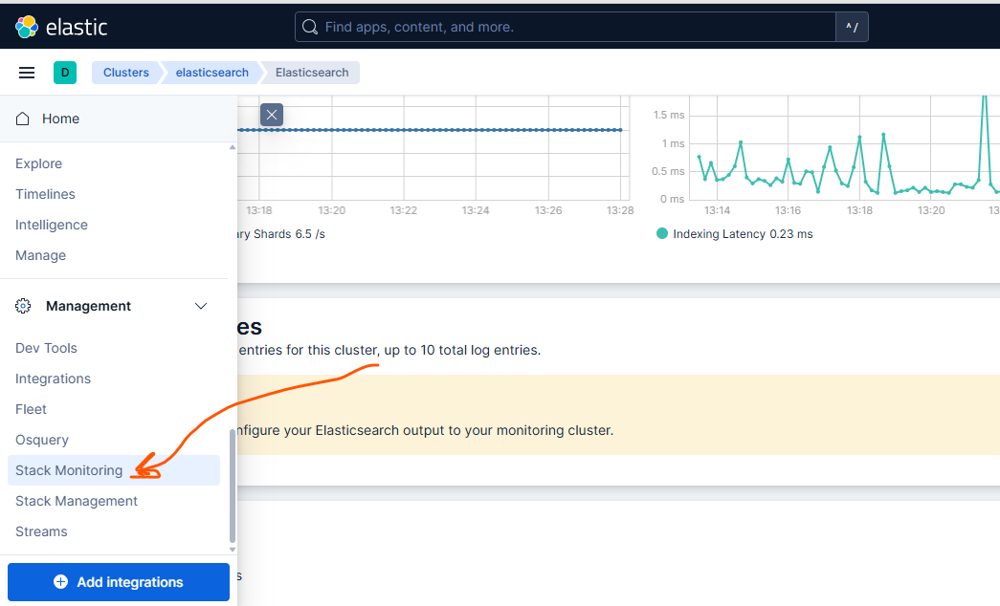

# Elastic Search

```sh
apt install ./elasticsearch

(Reading database ... 104918 files and directories currently installed.)
Preparing to unpack .../elasticsearch-9.2.4-amd64.deb ...
Creating elasticsearch group... OK
Creating elasticsearch user... OK
Unpacking elasticsearch (9.2.4) ...
Setting up elasticsearch (9.2.4) ...
--------------------------- Security autoconfiguration information ------------------------------

Authentication and authorization are enabled.
TLS for the transport and HTTP layers is enabled and configured.

The generated password for the elastic built-in superuser is : zkanwSi+FBfxp9=o==Ze

If this node should join an existing cluster, you can reconfigure this with
'/usr/share/elasticsearch/bin/elasticsearch-reconfigure-node --enrollment-token <token-here>'
after creating an enrollment token on your existing cluster.

You can complete the following actions at any time:

Reset the password of the elastic built-in superuser with
'/usr/share/elasticsearch/bin/elasticsearch-reset-password -u elastic'.

Generate an enrollment token for Kibana instances with
 '/usr/share/elasticsearch/bin/elasticsearch-create-enrollment-token -s kibana'.

Generate an enrollment token for Elasticsearch nodes with
'/usr/share/elasticsearch/bin/elasticsearch-create-enrollment-token -s node'.

-------------------------------------------------------------------------------------------------
### NOT starting on installation, please execute the following statements to configure elasticsearch service to start automatically using systemd
 sudo systemctl daemon-reload
 sudo systemctl enable elasticsearch.service
### You can start elasticsearch service by executing
 sudo systemctl start elasticsearch.service


# kibana verification token 
cat /var/lib/kibana/verification_code

# or you can see the verification_code in /usr/share/kibana/bin

```


## setp monitoring stack in kibana

```sh
# after enable stack monitoring mayby you see the error for encryption key

cd /usr/share/kibana/bin
./kibana-encryption-keys generate

# and add otuput in /etc/kibana/kibana.yml
vim /etc/kibana/kibana.yml
----
xpack.encryptedSavedObjects.encryptionKey: 0e35771aab80f0004988ff905e258732
xpack.reporting.encryptionKey: d40ab97d956fafdc1cdc97b1d1212cc3
xpack.security.encryptionKey: 46d59502090298fcb66b73fd2afaf856
----

```


## filebeat
```sh

vim /etc/filebeat/filebeat.yml
-------
filebeat.inputs:

- type: filestream

  id: my-filestream-id

  enabled: true
  paths:
    - /var/log/*.log


output.elasticsearch:
  hosts: ["https://192.168.85.214:9200"]
  ssl.verification_mode: "none"


# create apikey in stack managemnet in kibana type beats
  api_key: "sjtblJwBMkKzqZCqeUXS:S6eyf_3bywGfaA-CaCzjCA"


setup.kibana:
  host: "192.168.85.214:5601"


------------

filebeat test config

filebeat setup -e


for i in {1..10000} ; do echo $i; echo $i-"myname is iman" >> /myfile ; done


filebeat modules list
filebeat modules enable nginx

ls /etc/filebeat/modules.d

```

### example-1
send custom log to elastic search via filebeat
```sh
# create script for generate log and store to a file
sudo mkdir -p /opt/log-generator
sudo nano /opt/log-generator/generate_logs.py
----------
import json
import random
import time
from datetime import datetime

log_file = "/var/log/app/app.log"

levels = ["INFO", "WARNING", "ERROR"]
services = ["auth-service", "payment-service", "order-service"]

def generate_log():
    return {
        "timestamp": datetime.utcnow().isoformat(),
        "level": random.choice(levels),
        "service": random.choice(services),
        "user_id": random.randint(1000, 1100),
        "response_time_ms": random.randint(10, 500),
        "message": "Simulated application log"
    }

while True:
    log_entry = generate_log()
    with open(log_file, "a") as f:
        f.write(json.dumps(log_entry) + "\n")
    
    time.sleep(2)
----------

sudo mkdir -p /var/log/app
sudo touch /var/log/app/app.log
sudo chmod 666 /var/log/app/app.log

# now config the filebeat to read this file
vim /etc/filebeat/filebeat.yml
-----
filebeat.inputs:
  - type: filestream
    id: app-log-input
    enabled: true
    paths:
      - /var/log/app/app.log
    parsers:
      - ndjson:
          overwrite_keys: true

-----


sudo filebeat test config

sudo filebeat test output


```