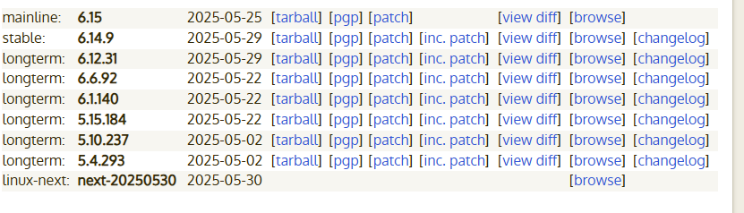

## Check unused file system

```sh

lsmod | grep -E 'cramfs|freevxfs|jffs2|hfs|hfsplus|squashfs|udf|autofs|afs|ceph|cifs|exfat|ext|fat|fscache|fuse|gfs2|nfs_common|nfsd|smbfs_common|usb-storage'

```

## check seperate partitions for /tmp, /var , /home, /var/log, /var/tmp, var/log/audit, /dev/shm

nodev, nosuid, noexec  --->  /tmp, /dev/shm, /var/tmp, /var/log, /var/log/audit
nodev, nosuid          ---> /var, /home


```bash
mount | grep -E '/tmp|/var|/home|/dev/shm|/var/log|/var/log/audit'

```

## check kernel version


* for ubuntu its recommended 5.15
* Use the default kernel provided by your distribution (e.g., kernel-4.18.x for RHEL 8, kernel-5.14.x for RHEL 9).

```sh
uname -r

```

## check gpgcheck is enable

```bash
grep -r "gpgcheck" /etc/yum.repos.d/


grep -r "gpgcheck" /etc/yum.repos.d/ | grep gpgcheck=0
```

## ensure gpg-check is globally enabled
```sh
grep ^gpgcheck /etc/dnf/dnf.conf

grep ^repo_gpgcheck=1 /etc/dnf/dnf.conf


```

## check update and patches and additional security software installed
```sh

dnf check-update

dnf needs-restarting -r


```

## check selinux

```bash
rpm -q mcstrans setroubleshoot
```


```sh
# check selinux are not disabled on the bootloader

grep -i 'selinux\|enforcing' /etc/default/grub
grep -i 'selinux\|enforcing' /boot/grub2/grub.cfg


# for uefi systems
grep -i 'selinux\|enforcing' /boot/efi/EFI/*/grub.cfg

```

You should not see:

* selinux=0

* enforcing=0

If those are present, SELinux is disabled or not in enforcing mode.

```sh
getenforce                                  #  check for enforcing
grep ^SELINUXTYPE= /etc/selinux/config      #  check for targeted 

# Unconfined services are processes running without SELinux domain labels (usually unconfined_service_t). This is a security risk.

ps -eZ | grep unconfined_service_t # no output is produced


# If you see any output, those are unconfined services. Example:
unconfined_u:system_r:unconfined_service_t:s0 1234 ? someprocess

```


## Boot Loader configuration

```sh

# ensure password set on bootloader
grep -E 'set superusers|password_pbkdf2' /boot/grub2/grub.cfg


# for UEFI based systems
grep -E 'set superusers|password_pbkdf2' /boot/efi/EFI/*/grub.cfg

```

must show something like this
grep -E 'set superusers|password_pbkdf2' /boot/grub2/grub.cfg
set superusers="root"
password_pbkdf2 root grub.pbkdf2.sha512.10000.0C3F3998ACCA8CEC25D4CE83EA9E89F442EB5400039AA6D8F0C5816B50EB61AE0D392AFF9264471943531966A7303D01D86ACFDE5D4B49F36422373BC2AE0AAE.3B12AAF739902F01FE3A7580E9C7A8EFE8E226857A6958258E08E8AFE359E6D0BD8C69AC92310A771B67614AE01E1AC371FA20EDE0F7B6DF21F116215AE96ECD


```bash

chown -R root:root /boot/grub2/
chown -R root:root /boot/efi/

chmod -R 700 /boot/grub2
chmod -R 700 /boot/efi


# check /boot/grub2 permissions
ls -lahd /boot/grub2
ls -lah /boot/grub2

ls -lah /boot/efi


ls -lahd /boot/efi/EFI
ls -lah /boot/efi/EFI/


```

## check ALSR 
```bash
cat /proc/sys/kernel/randomize_va_space
# it must be 2 which enabled and recommended
sysctl -a | grep randomize_va_space


```
## restrict p-trace

| Value | Description                                                          |
| ----- | -------------------------------------------------------------------- |
| `0`   | ptrace is unrestricted (default on some Linux systems)               |
| `1`   | Only a parent process can ptrace its own child (recommended) ✅       |
| `2`   | Only root can use ptrace (more strict)                               |
| `3`   | ptrace is completely disabled except for CAP\_SYS\_PTRACE capability |

```bash
cat /proc/sys/kernel/yama/ptrace_scope

# should be 1
sysctl -a | grep ptrace_scope

```


## Disable coredump storage
```bash
cat /etc/security/limits.conf | grep "* hard core 0"

cat /etc/systemd/coredump.conf | grep -E "Storage=none|ProcessSizeMax=0"
```


## show system-wide-crypto-policy

```sh
update-crypto-policies --show
# must not in legacy mode

```


```bash
update-crypto-policies --set DEFAULT

```


## system-wide crypto policy , check from CIS book
```sh


```

## system banner

```sh
# not exist r, v, m, s in below file
vim /etc/issue
vim /etc/issue.net
vim /etc/motd


ls -lah /etc/issue
ls -lah /etc/issue.net
ls -lah /etc/motd

chown root:root /etc/issue
chown root:root /etc/issue.net
chown root:root /etc/motd

chmod 600 /etc/issue
chmod 600 /etc/issue.net
chmod 600 /etc/motd


```


## disable CBC algorithm in ssh 

```sh
grep -i cbc /etc/ssh/sshd_config

```


## check package are installed or not
```sh
#!/bin/bash

packages=(
  gdm
  xinetd
  rsh
  telnet
  xorg-x11-server-common
  avahi-autoipd
  avahi
  cpus         # Likely invalid, no such base package
  dhcp-server
  bind
  ftp          # Possibly a dummy entry — `vsftpd` is actual server
  vsftpd
  tftp-server
  dovecot
  cyrus-imapd
  squid
  autofs
  dhcp         # Generic – might be invalid, use dhclient/dhcp-server
  dns          # Invalid – usually bind
  dnsmasq
  samba
  nfs-utils
  nis          # Possibly invalid, use ypbind
  cups
  rpcbind
  rsync
  snmp         # Possibly invalid, use net-snmp
  httpd
  nginx
  x-window     # Invalid – use xorg-x11-server-Xorg
  dhclient
  ypbind
  net-snmp
  xorg-x11-server-Xorg
  bluez  # for bluetooth
)

echo "Checking package installation status..."

for pkg in "${packages[@]}"; do
  if dnf list installed "$pkg" &>/dev/null; then
    echo "[✔] $pkg is installed"
  else
    echo "[✘] $pkg is NOT installed"
  fi
done

```


## only accpted port listen on NIC interface

```sh
netstat -ntlp
netstat -ntlup

ss -ntlp
ss -ntlup

```


## check postfix is installed or not
```sh
rpm -q postfix
```
if installed add below line in `sudo vi /etc/postfix/main.cf` 
```sh
inet_interfaces = localhost

sudo systemctl restart postfix
```

## delete unused package
```

sudo dnf remove openldap* vsftpd telnet tftp tftp-server -y

```

## time sync

```sh
rpm -q chrony
cat /etc/passwd | grep chrony

ps -aux | grep chron | grep -v grep

# if not running with chrony user you can add into the below file

vim /etc/sysconfig/chronyd
----
OPTIONS="-u chrony"
----

```

## change default user umask

```sh

vim /etc/profile.d/set_umask.sh
---------
umask 027
---------


```


## Secure cron

```sh
vim /etc/cron.allow
-----
root
iman
------
# you can add use in cron.allow to use other user to use crontab
systemctl restart crond


chown root:root /etc/crontab
chown root:root /etc/cron.hourly/
chown root:root /etc/cron.daily/
chown root:root /etc/cron.weekly/
chown root:root /etc/cron.monthly/
chown root:root /etc/cron.d
chown root:root /etc/at.allow


chmod 700 /etc/crontab
chmod 700 /etc/cron.hourly/
chmod 700 /etc/cron.daily/
chmod 700 /etc/cron.weekly/
chmod 700 /etc/cron.monthly/
chmod 700 /etc/cron.d
chmod 700 /etc/at.allow


```


## check wireless is enabled or not

```sh
ip link show
# must doesn't have wireless card

```

## delete blow packages from kernel module

```sh
lsmod | grep -E "sctp|rdc|tipc|dccp"

```

## config kernel parameter for network

```sh
# sysctl config
sysctl_settings:
  net.ipv4.ip_forward: 0
  
  net.ipv4.conf.all.send_redirects: 0
  net.ipv4.conf.default.send_redirects: 0
  
  net.ipv4.conf.all.secure_redirects: 0
  net.ipv4.conf.default.secure_redirects: 0
  
  net.ipv4.conf.all.accept_redirects: 0
  net.ipv4.conf.default.accept_redirects: 0

  net.ipv4.conf.all.accept_source_route: 0
  net.ipv4.conf.default.accept_source_route: 0

  net.ipv4.icmp_ignore_bogus_error_responses: 1
  net.ipv4.icmp_echo_ignore_broadcasts: 1
  
  net.ipv4.conf.all.rp_filter: 1
  net.ipv4.conf.default.rp_filter: 1

  net.ipv4.conf.all.log_martians: 1
  net.ipv4.conf.default.log_martians: 1

  net.ipv4.tcp_syncookies: 1

  kernel.yama.ptrace_scope: 1
  kernel.randomize_va_space: 2 # change alsr to value 2
  fs.suid_dumpable: 0

  net.ipv6.conf.all.accept_ra: 0
  net.ipv6.conf.default.accept_ra: 0
  net.ipv6.conf.all.disable_ipv6: 1
  net.ipv6.conf.default.disable_ipv6: 1


sysctl -a | grep net.ipv6.conf.all.disable_ipv6

```

| Option                          | Description                                                                                                        | Example                                                           |
| ------------------------------- | ------------------------------------------------------------------------------------------------------------------ | ----------------------------------------------------------------- |
| `sysctl -a` or `sysctl --all`   | Show **all** current kernel parameters with their values.                                                          | `sysctl -a`                                                       |
| `sysctl -w` or `sysctl --write` | **Set** a kernel parameter at runtime.                                                                             | `sudo sysctl -w net.ipv4.ip_forward=1`                            |
| `sysctl -p` or `sysctl --load`  | Load kernel parameters from a file (default `/etc/sysctl.conf`). Applies settings permanently (until next reboot). | `sudo sysctl -p` or `sudo sysctl -p /etc/sysctl.d/99-custom.conf` |
| `sysctl variable`               | Show value of a specific kernel parameter.                                                                         | `sysctl net.ipv4.ip_forward`                                      |


## firewall configurations

```sh

firewall-cmd --state
firewall-cmd --get-default-zone
firewall-cmd --get-active-zones
firewall-cmd --list-all
firewall-cmd --get-zones
firewall-cmd --list-all --zone=home

firewall-cmd --list-all --zone=drop
firewall-cmd --list-all --permanent --zone=drop


```
## set system wide crypto policy for ssh

```
cat /etc/ssh/sshd_config | grep -Ei 'Ciphers|MACs|KexAlgorithms'

# mush empty
like below
```


## ssh configuration

```sh

chmod 600 /etc/ssh/sshd_config
chmod -R 600 /etc/ssh/sshd_config.d

# private key permision set to 600
# public key permision set to 644

```

```sh
# ssh configuration
sshd_options:
  LogLevel: INFO
  UsePAM: "yes"
  PermitRootLogin: "no"
  GSSAPIAuthentication: "no"
  HostbasedAuthentication: "no"
  PermitEmptyPasswords: "no"
  PermitUserEnvironment: "no"
  IgnoreRhosts: "yes"
  X11Forwarding: "no"
  AllowTcpForwarding: "no"
  MaxAuthTries: 4
  MaxStartups: 8
  MaxSessions: 10
  LoginGraceTime: 20
  ClientAliveInterval: 900
  ClientAliveCountMax: 0
  Banner: /etc/issue.net

```


## restric user to use su command


## sudoers file configurations
```sh

cat /etc/sudoers
# must have below this
Defaults use_pty
Defaults logfile="/var/log/sudo.log"
Defaults timestamp_timeout=0

```
## check a server joined to active directory

```
realm list

```


## check PAM

```sh
rpm -q authselect libpwquality


```


## check password in /etc/login.defs
PASS_MAX_DAYS < 365
PASS_MIN_DAYS > 0
```sh

cat /etc/login.defs | grep -E "PASS_MAX_DAYS|PASS_MIN_DAYS"

```

## check options in cat /etc/security/pwquality.conf 
difok = 2 or more
maxrepeat < 3 and not 0
dictcheck = 0
```sh
cat /etc/security/pwquality.conf | grep -E "dictcheck|maxrepeat|difok"

```


## ensure only root has UID = 0

```sh
awk -F: '$3 == 0 { print $1 }' /etc/passwd
# output must be root
```


## ensure only root has GID = 0

```sh
awk -F: '$1 == "root" { print $4 }' /etc/passwd
# output must be root
```

## ensure only group root is the only GID 0 group, must return only root
```sh
awk -F: '$3=="0"{ print $1":"$3 }' /etc/group
```

## logging and auditing

```sh
rpm -q aide

aide --init
mv /var/lib/aide/aide.db.new.gz /var/lib/aide/aide.db.gz
# ensure filesystem integrity is regularly checked
crontab -l

crontab -u root -e
-------------
0 5 * * * /usr/sbin/aide --check
-------------


# ensure rsyslog is enabled
dnf install rsyslog


# ensure journald is configured to send logs to rsyslog
vim /etc/systemd/journald.conf
---------
ForwardToSyslog=yes
---------

# ensure file create mode is configured

vim /etc/ryslog.conf
------
FileCreateMode="0640"
------

# ensure rsyslog send to syslog server
vim /etc/rsyslog.d/sendrsyslog.conf
--------------
*.* @192.168.1.1:514
--------------

# ensure rsyslog not accept log from remote host

vim /etc/rsyslog.conf
# remove below line 
----
module(load="imtcp")
input(type="imtcp" port="514")
----

systemctl restart rsyslog


# ensure rsyslog logroutate is configured
--------------------------------------
cat /etc/logrotate.conf
# see "man logrotate" for details

# global options do not affect preceding include directives

# rotate log files weekly
weekly

# keep 4 weeks worth of backlogs
rotate 4

# create new (empty) log files after rotating old ones
create

# use date as a suffix of the rotated file
dateext

# uncomment this if you want your log files compressed
compress

# packages drop log rotation information into this directory
include /etc/logrotate.d

# system-specific logs may be also be configured here.
---------------------------------------------------


```

## auditing

```sh

systemctl --now enable auditd


# ensure 
grubby --update-kernel ALL --args 'audit=1'
# grub2-mkconfig -o /boot/grub2/grub.cfg           # BIOS systems
# grub2-mkconfig -o /boot/efi/EFI/centos/grub.cfg  # UEFI systems
cat /boot/grub2/grub.cfg | grep audit


# Ensure audit_backlog_limit is sufficient
grubby --info=ALL | grep -i audit_backlog_limit
grubby --update-kernel ALL --args 'audit_backlog_limit=8192'


# ensure audit log storage size is configured
vim /etc/audit/auditd.conf
-----------------
max_log_file = 100 # in megabyte
-----------------

# ensure audit logs are not automatically deleted
vim /etc/audit/auditd.conf
-----------------
max_log_file_action = keep_logs
space_left_action = SYSLOG
-----------------


```

## configuring auditd rules
5-6-3-3
```sh

cat /etc/audit/rules.d/audit.rules
must have below record
------
  -w /etc/sudoers -p wa -k scope
  -w /etc/sudoers.d -p wa -k scope
  -a always,exit -F arch=b64 -C euid!=uid -F auid!=unset -S execve -k user_emulation
  -a always,exit -F arch=b32 -C euid!=uid -F auid!=unset -S execve -k user_emulation
  -a always,exit -F arch=b64 -S adjtimex,settimeofday,clock_settime -k timechange
  -a always,exit -F arch=b32 -S adjtimex,settimeofday,clock_settime -k timechange
  -w /etc/localtime -p wa -k time-change
  -a always,exit -F arch=b64 -S sethostname,setdomainname -k system-locale
  -a always,exit -F arch=b32 -S sethostname,setdomainname -k system-locale
  -w /etc/issue -p wa -k system-locale
  -w /etc/issue.net -p wa -k system-locale
  -w /etc/hosts -p wa -k system-locale
  -w /etc/sysconfig/network -p wa -k system-locale
  -w /etc/sysconfig/network-scripts/ -p wa -k system-locale
  -w /etc/group -p wa -k group_changes
  -w /etc/shadow -p wa -k shadow_changes
  -w /etc/gshadow -p wa -k shadow_changes
  -w /etc/opasswd -p wa -k shadow_changes
  -w /etc/sudoers -p wa -k sudoers_changes
  -w /etc/sudoers.d -p wa -k sudoers.d_changes
  -w /etc/selinux -p wa -k selinux_changes
  -w /usr/share/selinux -p wa -k selinux_changes
  -w /sbin/insmod -p x -k module_insertion
  -w /sbin/rmmod -p x -k rmmod_insertion
  -w /sbin/modprobe -p x -k modprobe_insertion
  -a always,exit -F arch=b64 -S mount -F auid>=500 -F auid!=4294967295 -k export
  -a always,exit -F arch=b64 -S adjtimex -S settimeofday -k time_change
  -a always,exit -S sethostname -S setdomainname -k system_locale
  -w /etc/localtime -p wa -k audit_time_rules
  -w /etc/passwd -p wa -k passwd_change
  -w /bin/hostnamectl -p wa -k hostname_change
  -w /etc/sysconfig/network -p wa -k network_change
  -w /etc/sysconfig/network_scripts -p wa -k network_scripts_change
  -w /etc/hosts -p wa -k hosts_change
  -w /etc/issue -p wa -k issuenet_change
  -w /etc/issue.net -p wa -k issuenet_change
  -w /usr/bin/setfacl -p wa -k setxattr_change
  -w /usr/bin/chmod -p wa -k setxattr_change
  -w /usr/bin/fchmod -p wa -k setxattr_fchmod_change
  -w /usr/bin/fchmodat -p wa -k setxattr_fchmodat_change
  -w /usr/bin/fchown -p wa -k setxattr_fchown_change
  -w /usr/bin/fchownat -p wa -k setxattr_fchownat_change
  -w /usr/bin/lchown -p wa -k setxattr_lchown_change
  -w /usr/bin/chown -p wa -k setxattr_change
  -w /var/log/lastlog -p wa -k sudo_change
  -w /var/log/lastlog -p wa -k last_change
  -w /var/log/faillog -p wa -k fail_change
  -w /var/log/btmp -p wa -k btmp_change
  -w /var/log/wtmp -p wa -k wtmp_change
  -w /var/log/utmp -p wa -k utmp_change
  -w /var/log/suid -p wa -k suid_change
  -w /var/log/sgid -p wa -k sgid_change
  -w /var/log/ftruncate -p wa -k ftruncate_change
  -w /var/log/truncate -p wa -k truncate_change
  -w /var/log/truncate -p wa -k openat_change
  -w /var/log/openat -p wa -k openat_change
  -w /var/log/open -p wa -k open_change
  -w /var/log/kernel -p wa -k kernel_change
  -w /var/log/create -p wa -k create_change
  -a always,exit -F arch=b64 -S unlink,unlinkat,rename,renameat,rmdir -F auid>=500 -F auid!=4294967295 -k delete
  -a always,exit -F arch=b64 -S chmod,fchmod,fchmodat,chown,fchown,fchownat,lchown -F auid>=500 -F
  auid!=4294967295 -k perm_mod
  -a always,exit -F arch=b64 -S creat,open,openat,open_by_handle_at,truncate,ftruncate -F exit=-EPERM -F
  auid>=500 -F auid!=4294967295 -k access
  -a always,exit -F arch=b64 -S creat,open,openat,open_by_handle_at,truncate,ftruncate -F exit=-EACCES -F
  auid>=500 -F auid!=4294967295 -k access
  -a always,exit -F arch=b64 -S setxattr,fsetxattr,lsetxattr,removexattr,fremovexattr,lremovexattr -F auid>=500 -F
  auid!=4294967295 -k perm_mod
  -a always,exit -F arch=b64 -S creat,open,openat,truncate,ftruncate -F exit=-EACCES -F auid>=500 -F
  auid!=4294967295 -k access
  -a always,exit -F arch=b64 -S creat,open,openat,truncate,ftruncate -F exit=-EPERM -F auid>=500 -F
  auid!=4294967295 -k access
  -a always,exit -F arch=b32 -S creat,open,openat,truncate,ftruncate -F exit=-EACCES -F auid>=500 -F
  auid!=4294967295 -k access
  -a always,exit -F arch=b32 -S creat,open,openat,truncate,ftruncate -F exit=-EPERM -F auid>=500 -F
  auid!=4294967295 -k access
  -w /etc/group -p wa -k identity
  -w /etc/passwd -p wa -k identity
  -w /etc/gshadow -p wa -k identity
  -w /etc/shadow -p wa -k identity
  -w /etc/security/opasswd -p wa -k identity
  -a always,exit -F arch=b64 -S chmod,fchmod,fchmodat -F auid>=500 -F auid!=4294967295 -F key=perm_mod
  -a always,exit -F arch=b64 -S chown,fchown,lchown,fchownat -F auid>=500 -F auid!=4294967295 -F
  key=perm_mod
  -a always,exit -F arch=b32 -S chmod,fchmod,fchmodat -F auid>=500 -F auid!=4294967295 -F key=perm_mod
  -a always,exit -F arch=b32 -S lchown,fchown,chown,fchownat -F auid>=500 -F auid!=4294967295 -F
  key=perm_mod
  -a always,exit -F arch=b32 -S setxattr,lsetxattr,fsetxattr,removexattr,lremovexattr,fremovexattr -F auid>=500 -F
  auid!=4294967295 -F key=perm_mod
  -w /var/run/faillock -p wa -k logins
  -a always,exit -F arch=b64 -S rename,unlink,unlinkat,renameat -F auid>=500 -F auid!=4294967295 -F key=delete
  -a always,exit -F arch=b32 -S rename,unlink,unlinkat,renameat -F auid>=500 -F auid!=4294967295 -F key=delete
  -w /etc/selinux -p wa -k MAC-policy
  -w /usr/share/selinux -p wa -k MAC-policy
  -a always,exit -F path=/usr/bin/chcon -F perm=x -F auid>=500 -F auid!=4294967295 -k perm_chng
  -a always,exit -F path=/usr/bin/setfacl -F perm=x -F auid>=500 -F auid!=4294967295 -k perm_chng
  -a always,exit -F path=/usr/bin/chacl -F perm=x -F auid>=500 -F auid!=4294967295 -k perm_chng
  -a always,exit -F path=/usr/sbin/usermod -F perm=x -F auid>=500 -F auid!=4294967295 -k usermod
  -a always,exit -F arch=b64 -S init_module,finit_module,delete_module,create_module,query_module -F auid>=500
  -F auid!=4294967295 -k kernel_modules
  -a always,exit -F path=/usr/bin/kmod -F perm=x -F auid>=500 -F auid!=4294967295 -k kernel_modules
  -a always,exit -F arch=b32 -S mount -F auid>=500 -F auid!=4294967295 -k mounts
  -a always,exit -F arch=b64 -S mount -F auid>=500 -F auid!=4294967295 -k mounts
  -e 2

------


```


### system maintenance

```sh

chmod 644 /etc/passwd
chmod 644 /etc/group
chmod ugo-xwr /etc/shadow


ls -hal /etc/gshadow
ls -hal /etc/gshadow-

chmod 644 /etc/shells
ls -lah /etc/shells

chmod 600 /etc/security/opasswd


# all world-writable files and direcotries sticky bit set on them

find / -type d -perm -0002 ! -perm -1000 -exec ls -ld {} \;

# find / -type d -perm -0002 ! -perm -1000 -exec chmod +t {} \;

# Setting the sticky bit on files is not standard and typically not recommended, because:
# Sticky bit on regular files is obsolete and ignored on most modern systems.
# Originally used to keep the file in memory after execution (only for executables).


# Find files/directories without an owner
find / -xdev -nouser

# Find files/directories without a group

find / -xdev -nogroup


# check duplicate uid
cut -d: -f3 /etc/passwd | sort | uniq -d


# check for duplicate gid
cut -d: -f3 /etc/group | sort | uniq -d


# bash_history set 0600 permission
ls -lah ~


# ensure not .rhost, .forward, .netrc not exists in user home direcotries

```