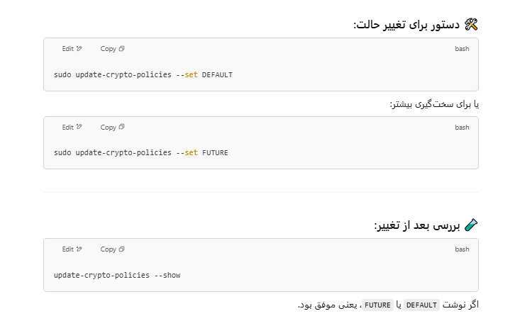
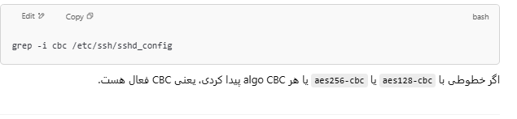
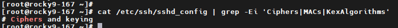
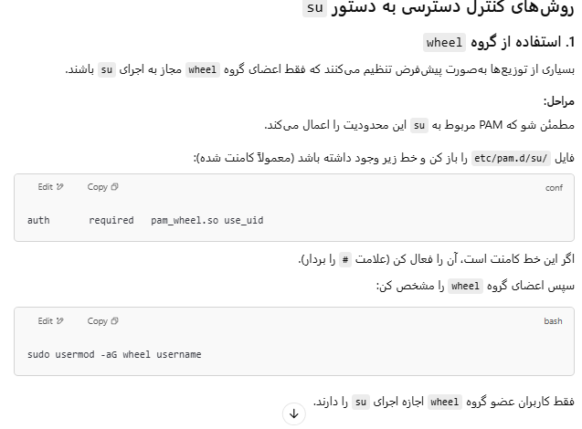

## Check unused file system

```bash

lsmod | grep -E 'cramfs|freevxfs|jffs2|hfs|hfsplus|squashfs|udf|autofs|afs|ceph|cifs|exfat|ext|fat|fscache|fuse|gfs2|nfs_common|nfsd|smbfs_common|usb-storage'


```

## check seperate partitions for /tmp, /var , /home, /var/log, /var/tmp, var/log/audit, /dev/shm

nodev, nosuid, noexec  --->  /tmp, /dev/shm, /var/tmp, /var/log, /var/log/audit
nodev, nosuid          ---> /var, /home


```bash
mount | grep -E '/tmp|/var|/home|/dev/shm|/var/log|/var/log/audit'

```

## check gpgcheck is enable

```bash
grep -r "gpgcheck" /etc/yum.repos.d/


grep -r "gpgcheck" /etc/yum.repos.d/ | grep gpgcheck=0
```

## check selinux

```bash
rpm -q mcstrans setroubleshoot


# check selinux are not disabled on the bootloader

grep -i 'selinux\|enforcing' /etc/default/grub
grep -i 'selinux\|enforcing' /boot/grub2/grub.cfg


# for uefi systems
grep -i 'selinux\|enforcing' /boot/efi/EFI/*/grub.cfg

```

You should not see:

* selinux=0

* enforcing=0

If those are present, SELinux is disabled or not in enforcing mode.

```bash
getenforce                                  #  check for enforcing
grep ^SELINUXTYPE= /etc/selinux/config      #  check for targeted 

# Unconfined services are processes running without SELinux domain labels (usually unconfined_service_t). This is a security risk.

ps -eZ | grep unconfined_service_t

# If you see any output, those are unconfined services. Example:
unconfined_u:system_r:unconfined_service_t:s0 1234 ? someprocess

```


## Boot Loader configuration

```bash

# ensure password set on bootloader
grep -E 'set superusers|password_pbkdf2' /boot/grub2/grub.cfg


# for UEFI based systems
grep -E 'set superusers|password_pbkdf2' /boot/efi/EFI/*/grub.cfg

```

must show something like this
grep -E 'set superusers|password_pbkdf2' /boot/grub2/grub.cfg
set superusers="root"
password_pbkdf2 root grub.pbkdf2.sha512.10000.0C3F3998ACCA8CEC25D4CE83EA9E89F442EB5400039AA6D8F0C5816B50EB61AE0D392AFF9264471943531966A7303D01D86ACFDE5D4B49F36422373BC2AE0AAE.3B12AAF739902F01FE3A7580E9C7A8EFE8E226857A6958258E08E8AFE359E6D0BD8C69AC92310A771B67614AE01E1AC371FA20EDE0F7B6DF21F116215AE96ECD


```bash

# check /boot/grub2 permissions
ls -lahd /boot/grub2
ls -lah /boot/grub2


ls -lahd /boot/efi/EFI
ls -lah /boot/efi/EFI/


```

## check ALSR 
```bash
cat /proc/sys/kernel/randomize_va_space
# it must be 2 which enabled and recommended
sysctl -a | grep randomize_va_space


```
## restrict p-trace

| Value | Description                                                          |
| ----- | -------------------------------------------------------------------- |
| `0`   | ptrace is unrestricted (default on some Linux systems)               |
| `1`   | Only a parent process can ptrace its own child (recommended) ✅       |
| `2`   | Only root can use ptrace (more strict)                               |
| `3`   | ptrace is completely disabled except for CAP\_SYS\_PTRACE capability |

```bash
cat /proc/sys/kernel/yama/ptrace_scope

# should be 1
sysctl -a | grep ptrace_scope

```

## Disable coredump storage

```bash
cat /etc/security/limits.conf | grep "* hard core 0"

cat /etc/systemd/coredump.conf | grep -E "Storage=none|ProcessSizeMax=0"


```

## show system-wide-crypto-policy

```sh
update-crypto-policies --show
# must not in legacy mode

```



```bash
update-crypto-policies --set DEFAULT

```

```sh
cat /etc/ssh/sshd_config | grep -Ei 'Ciphers|MACs|KexAlgorithms'
# must empty key

# set comment 
sudo sed -i '/^(Ciphers|MACs|KexAlgorithms)/ s/^/#/' /etc/ssh/sshd_config


```

## disable CBC algorithm in ssh 

```sh
grep -i cbc /etc/ssh/sshd_config

```



## check package are installed or not
```sh
#!/bin/bash

packages=(
  gdm
  xinetd
  rsh
  telnet
  xorg-x11-server-common
  avahi-autoipd
  avahi
  cpus         # Likely invalid, no such base package
  dhcp-server
  bind
  ftp          # Possibly a dummy entry — `vsftpd` is actual server
  vsftpd
  tftp-server
  dovecot
  cyrus-imapd
  squid
  autofs
  dhcp         # Generic – might be invalid, use dhclient/dhcp-server
  dns          # Invalid – usually bind
  dnsmasq
  samba
  nfs-utils
  nis          # Possibly invalid, use ypbind
  cups
  rpcbind
  rsync
  snmp         # Possibly invalid, use net-snmp
  httpd
  nginx
  x-window     # Invalid – use xorg-x11-server-Xorg
  dhclient
  ypbind
  net-snmp
  xorg-x11-server-Xorg
  bluez  # for bluetooth
)

echo "Checking package installation status..."

for pkg in "${packages[@]}"; do
  if dnf list installed "$pkg" &>/dev/null; then
    echo "[✔] $pkg is installed"
  else
    echo "[✘] $pkg is NOT installed"
  fi
done

```

## only accpted port listen on NIC interface

```
netstat -ntlp
netstat -ntlup

ss -ntlp
ss -ntlup


```


## check postfix is installed or not
```sh
rpm -q postfix
```
if installed add below line in `sudo vi /etc/postfix/main.cf` 
```sh
inet_interfaces = localhost

sudo systemctl restart postfix
```

## delete unused package
```

sudo dnf remove openldap* vsftpd telnet tftp tftp-server -y

```

## time sync

```sh
rpm -q chrony
cat /etc/passwd | grep chrony

ps -aux | grep chron | grep -v grep

# if not running with chrony user you can add into the below file

vim /etc/sysconfig/chronyd
----
OPTIONS="-u chrony"
----

```

## Secure cron

```sh
vim /etc/cron.allow
-----
root
iman
------
# you can add use in cron.allow to use other user to use crontab
systemctl restart crond


```

## check wireless is enabled or not

```sh
ip link show
# must doesn't have wireless card

```

## delete blow packages from kernel module

```sh
lsmod | grep -E "sctp|rdc|tipc|dccp"

```

## config kernel parameter for network

```sh
# sysctl config
sysctl_settings:
  net.ipv4.ip_forward: 0
  
  net.ipv4.conf.all.send_redirects: 0
  net.ipv4.conf.default.send_redirects: 0
  
  net.ipv4.conf.all.secure_redirects: 0
  net.ipv4.conf.default.secure_redirects: 0
  
  net.ipv4.conf.all.accept_redirects: 0
  net.ipv4.conf.default.accept_redirects: 0

  net.ipv4.conf.all.accept_source_route: 0
  net.ipv4.conf.default.accept_source_route: 0

  net.ipv4.icmp_ignore_bogus_error_responses: 1
  net.ipv4.icmp_echo_ignore_broadcasts: 1
  
  net.ipv4.conf.all.rp_filter: 1
  net.ipv4.conf.default.rp_filter: 1

  net.ipv4.conf.all.log_martians: 1
  net.ipv4.conf.default.log_martians: 1

  net.ipv4.tcp_syncookies: 1

  kernel.yama.ptrace_scope: 1
  kernel.randomize_va_space: 2 # change alsr to value 2
  fs.suid_dumpable: 0

  net.ipv6.conf.all.accept_ra: 0
  net.ipv6.conf.default.accept_ra: 0
  net.ipv6.conf.all.disable_ipv6: 1
  net.ipv6.conf.default.disable_ipv6: 1


sysctl -a | grep 

```

| Option                          | Description                                                                                                        | Example                                                           |
| ------------------------------- | ------------------------------------------------------------------------------------------------------------------ | ----------------------------------------------------------------- |
| `sysctl -a` or `sysctl --all`   | Show **all** current kernel parameters with their values.                                                          | `sysctl -a`                                                       |
| `sysctl -w` or `sysctl --write` | **Set** a kernel parameter at runtime.                                                                             | `sudo sysctl -w net.ipv4.ip_forward=1`                            |
| `sysctl -p` or `sysctl --load`  | Load kernel parameters from a file (default `/etc/sysctl.conf`). Applies settings permanently (until next reboot). | `sudo sysctl -p` or `sudo sysctl -p /etc/sysctl.d/99-custom.conf` |
| `sysctl variable`               | Show value of a specific kernel parameter.                                                                         | `sysctl net.ipv4.ip_forward`                                      |


## firewall configurations

```sh

firewall-cmd --state
firewall-cmd --get-default-zone
firewall-cmd --get-active-zones
firewall-cmd --list-all
firewall-cmd --get-zones
firewall-cmd --list-all --zone=home

firewall-cmd --list-all --zone=drop
firewall-cmd --list-all --permanent --zone=drop


```
## set system wide crypto policy for ssh

```
cat /etc/ssh/sshd_config | grep -Ei 'Ciphers|MACs|KexAlgorithms'

# mush empty
like below
```



```sh
# ssh configuration
sshd_options:
  LogLevel: INFO
  UsePAM: "yes"
  PermitRootLogin: "no"
  GSSAPIAuthentication: "no"
  HostbasedAuthentication: "no"
  PermitEmptyPasswords: "no"
  PermitUserEnvironment: "no"
  IgnoreRhosts: "yes"
  X11Forwarding: "no"
  AllowTcpForwarding: "no"
  MaxAuthTries: 4
  MaxStartups: 8
  MaxSessions: 10
  LoginGraceTime: 20
  ClientAliveInterval: 900
  ClientAliveCountMax: 0
  Banner: /etc/issue.net

```


## restric user to use su command



## sudoers file configurations
```sh

cat /etc/sudoers
# must have below this
Defaults use_pty
Defaults logfile="/var/log/sudo.log"
Defaults timestamp_timeout=0

```

# check PAM

```
rpm -q authselect libpwquality


```


## check password in /etc/login.defs
PASS_MAX_DAYS < 365
PASS_MIN_DAYS > 0
```sh

cat /etc/login.defs | grep -E "PASS_MAX_DAYS|PASS_MIN_DAYS"

```

## check options in cat /etc/security/pwquality.conf 
difok = 2 or more
maxrepeat < 3 and not 0
dictcheck = 0
```sh
cat /etc/security/pwquality.conf | grep -E "dictcheck|maxrepeat|difok"

```


## ensure only root has UID = 0

```sh
awk -F: '$3 == 0 { print $1 }' /etc/passwd
# output must be root
```


## ensure only root has GID = 0

```sh
awk -F: '$1 == "root" { print $4 }' /etc/passwd
# output must be root
```


