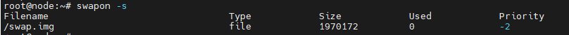
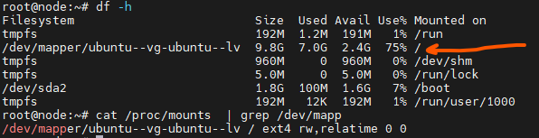

# Wordpress on ubuntu

```sh

# firewall configuration
sudo ufw status verbose

sudo ufw allow shh
sudo ufw allow http
sudo ufw allow https

sudo ufw reload

sudo ufw default deny incoming 
sudo ufw default allow outgoing
sudo ufw reload

# config time sync and timezone

sudo timedatectl set-timezone Asia/Tehran
sudo apt install chronyd

vim /etc/chrony/chrony.conf
---------
pool ntp.day.ir        iburst maxsources 4
---------

systemctl restart chrony
chronyc sources

# swap


free -h


# if the below output show you, it means the swap is enabled
# if no output the swap is not enabled
# in our case swap is enabled
swapon -s



# remove swap 
swapoff -a
# open fstab and remove the swap record from this file
vim /etc/fstab
------
# /swap.img       none    swap    sw      0       0
------
rm -rf /swap.img


# create swap
# 4G swap
dd if=/dev/zero of=/swapfile bs=1M count=4000
chmod 600 /swapfile
mkswap /swapfile
swapon /swapfile
vim /etc/fstab
-----
/swapfile       none    swap    sw      0       0
-----
systemctl daemon-reload
mount -a


# sysctl config
vim vim /etc/sysctl.conf
-----
vm.swappiness = 60
vm.vfs_cache_pressure = 100

# network hardening (IP SPOOFING)
net.ipv4.conf.default.rp_filter = 1
net.ipv4.conf.all.rp_filter = 1

# SYN FLOOD
net.ipv4.tcp_syncookies = 1
net.ipv4.tcp_max_syn_backlog = 2048
net.ipv4.tcp_syn_retries = 5
net.ipv4.tcp_synack_retries = 2

# SOURCE PACKET ROUTING
net.ipv4.conf.all.accept_source_route = 0
net.ipv6.conf.all.accept_source_route = 0
net.ipv4.conf.default.accept_source_route = 0
net.ipv6.conf.default.accept_source_route = 0 

# SOURCE PACKET ROUTING
net.ipv4.conf.all.accept_source_route = 0
net.ipv6.conf.all.accept_source_route = 0
net.ipv4.conf.default.accept_source_route = 0
net.ipv6.conf.default.accept_source_route = 0

# Increase number of usable ports:
net.ipv4.ip_local_port_range = 1024 65535

# Increase the size of file handles and inode cache and restrict core dumps:
fs.file-max = 2097152
fs.suid_dumpable = 0

# Change the number of incoming connections and incoming connections backlog:
net.core.somaxconn = 65535
net.core.netdev_max_backlog = 262144

# Increase the maximum amount of memory buffers:
net.core.optmem_max = 25165824

# Increase the default and maximum send/receive buffers:
net.core.rmem_default = 31457280
net.core.rmem_max = 67108864
net.core.wmem_default = 31457280
net.core.wmem_max = 67108864


-----


modprobe tcp_bbr
sudo bash -c 'echo "tcp_bbr" > /etc/modules-load.d/bbr.conf'
lsmod | grep tcp_bbr

sudo vim /etc/sysctl.conf
------
net.ipv4.tcp_congestion_control = bbr
net.core.default_qdisc = fq

------


# file access time


vim /etc/fstab
-----
/dev/disk/by-id/dm-uuid-LVM-karPALjNtWWlCm1OjLWkVUPk2WodDdziiNWudIQ1jFsIzl6EJd4mlXdO1No8PtJb / ext4 defaults,noatime 0 1
----

# increase the max open file limit
ulimit -Hn # default hard limit value

ulimit -Sn # default soft limit value

# change the soft and hard limit
vim  /etc/security/limits.d/custom_overrides.conf
-----
#<domain>   <type>  <item>      <value>
    *       soft    nofile      120000
    *       hard    nofile      120000
    root    soft    nofile      120000
    root    hard    nofile      120000

-----
reboot
# you can check again to verify the value changend
ulimit -Hn # default hard limit value

ulimit -Sn # default soft limit value


###############################################################
# config PAM
sudo bash -c 'echo session required pam_limits.so >> /etc/pam.d/common-session'
sudo bash -c 'echo session required pam_limits.so >> /etc/pam.d/common-session-noninteractive'


# disable ipv6
vim /etc/default/grub
------
GRUB_CMDLINE_LINUX="ipv6.disable=1"
------
update-grub
reboot


# hardening shared memory
mount | grep shm

vim /etc/fstab
------
none    /dev/shm        tmpfs   defaults,noexec,nosuid,nodev    0       0
------

reboot


############################################ installing the stack 


apt install mariadb-server
mariadb-secure-installation

create database shop;
# create user

# allow from localhost
CREATE USER 'iman'@'localhost' IDENTIFIED BY 'test';
GRANT ALL ON shop.* TO 'iman'@'localhost';
FLUSH PRIVILEGES;


```