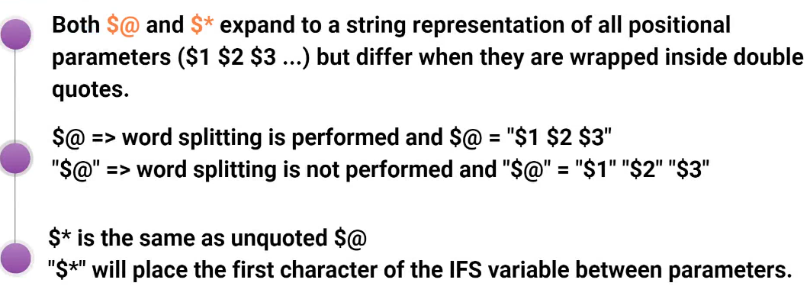
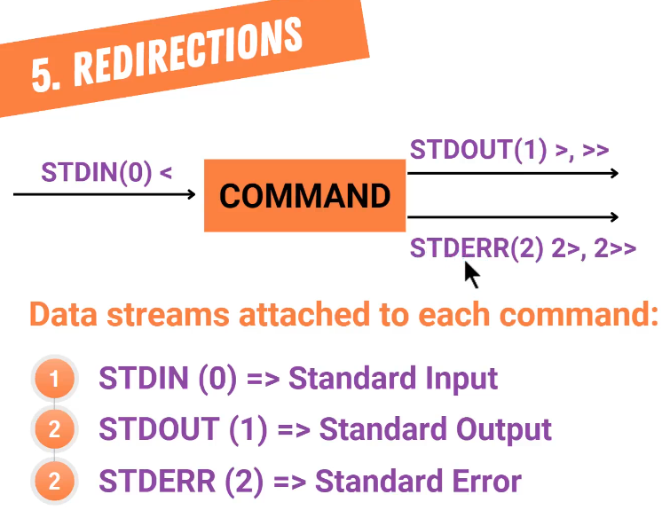

# Basic

```
# for defining alias
alias
alias dc="docker compose"
alias c="clear"
alias now="date +%F\ %T"
alias ports="netstat -ntlp"
alias root="sudo su -"


# for permenent add alaises:
vim ~/.bashrc
# add alias to this file
# and run
source ~/.bashrc

# for remove an alias
unalias now
unalias dc


```

## how to update PATH variable

```


vim ~/.bashrc
# add: 
PATH="$PATH:/home/script"


```

# Multiline comment

```

: '
This is multiline 
command in
bash
script
'

```

## about $@ and $*




# Brace expansion

```

# You're not allowed use space after and before comman(,)

echo {hi,how,are,you}
echo 01-{hi,file,name}.txt

touch 01-{filex,filey,filez}.txt
rm -rf 01-{filex,filey,filez}.txt


touch 01-{filex,filey,filez,{10,20,30,40}-filew}

```


```

echo {1..100}
echo {1..30..5}
echo {01..30}
echo {001 ..100}
echo {100..1}
echo {100..1..4}


echo {a..z}
echo {z..a}


```


## Create Multiple directory and subdirectory

```

mkdir -p logs/{January/{1..31},February/{1..28},March/{1..31}}
touch  logs/{January/{1..31}/log.daily,February/{1..28}/log.daily,March/{1..31}/log.daily}


```


# Tilde(~) expansion

```

echo ~
cd ~
~ # This is home user directory


```


# Parameter expansion

```
variable=5
echo $variable
echo ${variable}


var1=osLINx
echo ${var1}
echo ${var1^^}   # upper
echo ${var1,,}   # lower


# default values in bash

ping -c 6 ${ip:-4.2.2.4}    # if the ip varaable is not set, use 4.2.2.4 as a default value for ip
echo $ip
ping -c 6 ${ip:=4.2.2.4}    # if the ip varaable is not set, set 4.2.2.4 as a default value for ip
echo $ip

```


# command substitution

```

now="`date`"
echo $now

now=$(date)
echo $now

users=$(who)
echo $users

output=$(ps -ef | grep docker)
echo $output


sudo tar -czf etc-$(date +%F_%H%M).tar.gz /etc/


```


# Arithmetic expansion

```

x=$(( 8*5))
echo $x

x=$(( 8**5))
echo $x


let y=3**9
echo $y


let z=5**3434            # overflow
echo $z                  # overflow and show 0


echo "5/4" | bc


echo "scale=4; 5/3.5" | bc
bc <<< "scale=4; 5/3.5"


```


# Globbing Character

```

touch f{a..c}{1..10}.txt
ls file*
ls fa*
ls fa?.txt
ls f?3.txt
ls fa[43].txt
ls f[ab]*.txt


```



# tee command

```

ifconfig | tee config.txt      # overwrite
ifconfig | tee -a config.txt   # append
ifconfig | tee -a config.txt file.txt


```
