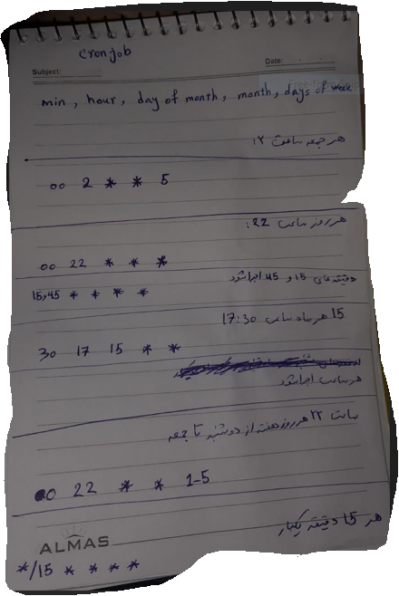

# Crontab

```
crontab -l      # list all crontab in linux
crontab -e      # add new crontab
# add below
#######
* * * * * /root/venv/bin/python /home/tst/main.py

########

chmod +x main.py


```


# Crontab example

min, hour , days of month, month, days of week

```
# each friday on 2 PM  
00 14 * * 5


echo day on 22 PM

0 22 * * * 


```


