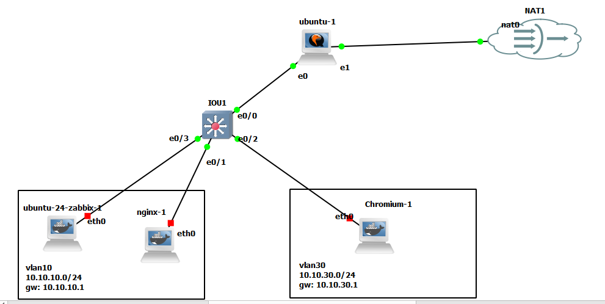

# inter-vlan routing


## On Ubuntu Server

```sh

vim /etc/sysctl.conf
---------
net.ipv4.ip_forward=1
--------

sysctl -p


apt install vlan


modprobe 8021q
lsmod | grep 8021q
echo "8021q" | sudo tee /etc/modules-load.d/8021q.conf


vim /etc/netplan/inter-vlan-routing.yaml 
----------
network:
  version: 2
  ethernets:
    ens3:
      dhcp4: no
  vlans:
    vlan10:
      id: 10
      link: ens3
      addresses: [10.10.10.1/24]
    vlan30:
      id: 30
      link: ens3
      addresses: [10.10.30.1/24]
----------

chmod 600 inter-vlan-routing.yaml

netplay apply


iptables -t nat -A POSTROUTING -o ens4 -j MASQUERADE

```

## On Rocky Linux

```bash
sysctl -w net.ipv4.ip_forward=1

echo "net.ipv4.ip_forward = 1" |  tee -a /etc/sysctl.conf
sysctl -p

modprobe 8021q

echo "8021q" | tee /etc/modules-load.d/8021q.conf


nmcli connection add type vlan con-name vlan10 dev eth1 id 10 ip4 10.10.10.1/24
nmcli connection add type vlan con-name vlan30 dev eth1 id 30 ip4 10.10.30.1/24

nmcli con up vlan10
nmcli con up vlan30

ip -brief addr show


iptables -t nat -A POSTROUTING -o eth0 -j MASQUERADE

```

## OSPF on linux
[frr](https://github.com/FRRouting/frr)

```sh
# add GPG key
curl -s https://deb.frrouting.org/frr/keys.gpg | sudo tee /usr/share/keyrings/frrouting.gpg > /dev/null

# possible values for FRRVER: 
frr-6 frr-7 frr-8 frr-9 frr-9.0 frr-9.1 frr-10 frr10.0 frr10.1 frr-10.2 frr-10.3 frr-rc frr-stable
# frr-stable will be the latest official stable release. frr-rc is the latest release candidate in beta testing
FRRVER="frr-stable"
echo deb '[signed-by=/usr/share/keyrings/frrouting.gpg]' https://deb.frrouting.org/frr \
     $(lsb_release -s -c) $FRRVER | sudo tee -a /etc/apt/sources.list.d/frr.list

# update and install FRR
sudo apt update && sudo apt install frr frr-pythontools


sudo systemctl enable frr
sudo systemctl start frr

vim /etc/frr/daemons
-------------
ospfd=yes
------------

sudo systemctl restart frr


sudo vtysh


configure terminal
!
router ospf
 network 192.168.1.0/24 area 0
 passive-interface lo
!
exit
write memory


show ip ospf neighbor
show ip ospf route


# at linux level

ip route


# you can create dummy interface 
sudo ip link add dummy0 type dummy
sudo ip addr add 10.10.10.1/24 dev dummy0
sudo ip link set dummy0 up

```