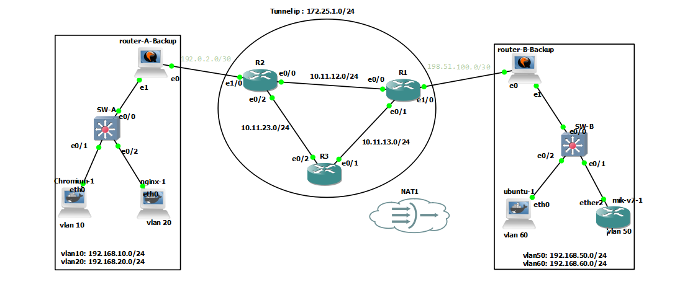

# Linux Networking
## inter-vlan routing


## Inter-vlan routing On Ubuntu Server

```sh

vim /etc/sysctl.conf
---------
net.ipv4.ip_forward=1
--------

sysctl -p


# apt install vlan


modprobe 8021q
lsmod | grep 8021q
echo "8021q" | sudo tee /etc/modules-load.d/8021q.conf


vim /etc/netplan/inter-vlan-routing.yaml 
----------
network:
  version: 2
  ethernets:
    ens3:
      dhcp4: no
  vlans:
    vlan10:
      id: 10
      link: ens3
      addresses: [10.10.10.1/24]
    vlan30:
      id: 30
      link: ens3
      addresses: [10.10.30.1/24]
----------

chmod 600 inter-vlan-routing.yaml

netplay apply


iptables -t nat -A POSTROUTING -o ens4 -j MASQUERADE

```

## Inter-vlan routing On Rocky Linux

```bash
sysctl -w net.ipv4.ip_forward=1

echo "net.ipv4.ip_forward = 1" |  tee -a /etc/sysctl.conf
sysctl -p

modprobe 8021q

echo "8021q" | tee /etc/modules-load.d/8021q.conf


nmcli connection add type vlan con-name vlan10 dev eth1 id 10 ip4 10.10.10.1/24
nmcli connection add type vlan con-name vlan30 dev eth1 id 30 ip4 10.10.30.1/24

nmcli con up vlan10
nmcli con up vlan30

ip -brief addr show


iptables -t nat -A POSTROUTING -o eth0 -j MASQUERADE

```

## OSPF on linux
[frr](https://github.com/FRRouting/frr)

```sh
# add GPG key
curl -s https://deb.frrouting.org/frr/keys.gpg | sudo tee /usr/share/keyrings/frrouting.gpg > /dev/null

# possible values for FRRVER: 
frr-6 frr-7 frr-8 frr-9 frr-9.0 frr-9.1 frr-10 frr10.0 frr10.1 frr-10.2 frr-10.3 frr-rc frr-stable
# frr-stable will be the latest official stable release. frr-rc is the latest release candidate in beta testing
FRRVER="frr-stable"
echo deb '[signed-by=/usr/share/keyrings/frrouting.gpg]' https://deb.frrouting.org/frr \
     $(lsb_release -s -c) $FRRVER | sudo tee -a /etc/apt/sources.list.d/frr.list

# update and install FRR
sudo apt update && sudo apt install frr frr-pythontools


sudo systemctl enable frr
sudo systemctl start frr

vim /etc/frr/daemons
-------------
ospfd=yes
------------


sudo systemctl restart frr


sysctl -w net.ipv4.ip_forward=1

echo "net.ipv4.ip_forward = 1" |  tee -a /etc/sysctl.conf
sysctl -p


sudo vtysh


configure terminal
!
router ospf
 network 192.168.1.0/24 area 0
 passive-interface lo
!
exit
write memory


show ip ospf neighbor
show ip ospf route


# at linux level

ip route


# you can create dummy interface 
sudo ip link add dummy0 type dummy
sudo ip addr add 10.10.10.1/24 dev dummy0
sudo ip link set dummy0 up

```


## GRE Tunnel




#### R2
```sh

conf t
int eth 0/0
no sh
ip addr 10.11.12.2 255.255.255.0


int eth 0/2
no sh
ip addr 10.11.23.2 255.255.255.0


int eth 1/0
no sh
ip addr 192.0.2.1 255.255.255.252


router eigrp 1
network 10.11.23.2 0.0.0.0 
network 10.11.12.2 0.0.0.0 
network 192.0.2.1 0.0.0.0 
passive-interface eth 1/0
```


#### R1
```sh

conf t
int eth 0/0
no sh
ip addr 10.11.12.1 255.255.255.0


int eth 0/1
no sh
ip addr 10.11.13.1 255.255.255.0


int eth 1/0
no sh
ip addr 198.51.100.1 255.255.255.252


router eigrp 1
network 10.11.12.1 0.0.0.0 
network 10.11.13.1 0.0.0.0 
network 198.51.100.1  0.0.0.0 
passive-interface eth 1/0
```


#### R3
```sh

conf t
int eth 0/2
no sh
ip addr 10.11.23.3 255.255.255.0


int eth 0/1
no sh
ip addr 10.11.13.3 255.255.255.0

router eigrp 1
network 10.11.23.3 0.0.0.0 
network 10.11.13.3 0.0.0.0 
```


#### ruoter - A
```sh
nano /etc/netplan/60.yaml
---------

network:
  version: 2
  renderer: networkd
  ethernets:
    ens3:
      dhcp4: no
      addresses:
        - 192.0.2.2/30
      routes:
        - to: default
          via: 192.0.2.1
    ens4:
      dhcp4: no
  vlans:
    vlan10:
      id: 10
      link: ens4
      addresses: [192.168.10.1/24]
    vlan20:
      id: 20
      link: ens4
      addresses: [192.168.20.1/24]
  tunnels:
    gre-1:
      mode: gre
      local: 192.0.2.2
      remote: 198.51.100.2
      ttl: 255
      addresses: [172.25.1.1/24]

---------


vim /etc/sysctl.conf
---------
net.ipv4.ip_forward=1
--------

sysctl -p

# apt install vlan


modprobe 8021q
lsmod | grep 8021q
echo "8021q" | sudo tee /etc/modules-load.d/8021q.conf


# Setting up the GRE Tunnel

# Create the GRE tunnel
# ip tunnel add gre-1 mode gre remote 198.51.100.2 local 192.0.2.2 ttl 255
# Assign an IP address to the tunnel interface
# ip addr add 172.25.1.1/24 dev gre-1

# Bring the tunnel interface up
# ip link set gre-1 up


# ip route add 192.168.50.0/24 via 172.25.1.2
# ip route add 192.168.60.0/24 via 172.25.1.2
# ip route del 192.168.50.0/24
# ip route del 192.168.60.0/24


sed -i 's/^ospfd=no/ospfd=yes/' /etc/frr/daemons
sudo systemctl restart frr


sudo vtysh
configure terminal

router ospf
 network 172.25.1.0/24 area 0
 network 192.168.10.0/24 area 0
 network 192.168.20.0/24 area 0

exit
write memory


```


#### ruoter - B
```sh
nano /etc/netplan/60.yaml
----
network:
  version: 2
  renderer: networkd
  ethernets:
    ens3:
      dhcp4: no
      addresses:
        - 198.51.100.2/30
      routes:
        - to: default
          via: 198.51.100.1

    ens4:
      dhcp4: no
  vlans:
    vlan50:
      id: 50
      link: ens4
      addresses: [192.168.50.1/24]
    vlan60:
      id: 60
      link: ens4
      addresses: [192.168.60.1/24]

  tunnels:
    gre-1:
      mode: gre
      local: 198.51.100.2
      remote: 192.0.2.2
      ttl: 255
      addresses: [172.25.1.2/24]
----


vim /etc/sysctl.conf
---------
net.ipv4.ip_forward=1
--------

sysctl -p

# apt install vlan


modprobe 8021q
lsmod | grep 8021q
echo "8021q" | sudo tee /etc/modules-load.d/8021q.conf


# Setting up the GRE Tunnel

# Create the GRE tunnel
# ip tunnel add gre-1 mode gre remote 192.0.2.2  local 198.51.100.2 ttl 255
# Assign an IP address to the tunnel interface
# ip addr add 172.25.1.2/24 dev gre-1

# Bring the tunnel interface up
# ip link set gre-1 up


# ip route add 192.168.10.0/24 via 172.25.1.1
# ip route add 192.168.20.0/24 via 172.25.1.1
# ip route del 192.168.10.0/24
# ip route del 192.168.20.0/24


sed -i 's/^ospfd=no/ospfd=yes/' /etc/frr/daemons
sudo systemctl restart frr


sudo vtysh
configure terminal

router ospf
 network 172.25.1.0/24 area 0
 network 192.168.50.0/24 area 0
 network 192.168.60.0/24 area 0

exit
write memory


```

#### SW-A
```sh
vlan 10,20


int eth 0/0
switchport trunk encapsulation dot1q
switchport mode trunk 


int eth 0/1
switchport mode access
switchport access vlan 10

int eth 0/2
switchport mode access
switchport access vlan 20
```


#### SW-B
```sh
vlan 50,60

int eth 0/0
switchport trunk encapsulation dot1q
switchport mode trunk 

int eth 0/1
switchport mode access
switchport access vlan 50

int eth 0/2
switchport mode access
switchport access vlan 60
```


## GRE Tunnel Over IPsec


#### R2
```sh

conf t
int eth 0/0
no sh
ip addr 10.11.12.2 255.255.255.0


int eth 0/2
no sh
ip addr 10.11.23.2 255.255.255.0


int eth 1/0
no sh
ip addr 192.0.2.1 255.255.255.252


router eigrp 1
network 10.11.23.2 0.0.0.0 
network 10.11.12.2 0.0.0.0 
network 192.0.2.1 0.0.0.0 
passive-interface eth 1/0
```


#### R1
```sh

conf t
int eth 0/0
no sh
ip addr 10.11.12.1 255.255.255.0


int eth 0/1
no sh
ip addr 10.11.13.1 255.255.255.0


int eth 1/0
no sh
ip addr 198.51.100.1 255.255.255.252


router eigrp 1
network 10.11.12.1 0.0.0.0 
network 10.11.13.1 0.0.0.0 
network 198.51.100.1  0.0.0.0 
passive-interface eth 1/0
```


#### R3
```sh

conf t
int eth 0/2
no sh
ip addr 10.11.23.3 255.255.255.0


int eth 0/1
no sh
ip addr 10.11.13.3 255.255.255.0

router eigrp 1
network 10.11.23.3 0.0.0.0 
network 10.11.13.3 0.0.0.0 
```


#### ruoter - A
```sh

apt update
apt install strongswan

# install frr
# add GPG key
curl -s https://deb.frrouting.org/frr/keys.gpg | sudo tee /usr/share/keyrings/frrouting.gpg > /dev/null

# possible values for FRRVER: 
frr-6 frr-7 frr-8 frr-9 frr-9.0 frr-9.1 frr-10 frr10.0 frr10.1 frr-10.2 frr-10.3 frr-rc frr-stable
# frr-stable will be the latest official stable release. frr-rc is the latest release candidate in beta testing
FRRVER="frr-stable"
echo deb '[signed-by=/usr/share/keyrings/frrouting.gpg]' https://deb.frrouting.org/frr \
     $(lsb_release -s -c) $FRRVER | sudo tee -a /etc/apt/sources.list.d/frr.list

# update and install FRR
sudo apt update && sudo apt install frr frr-pythontools


nano /etc/netplan/60.yaml
---------

network:
  version: 2
  renderer: networkd
  ethernets:
    ens3:
      dhcp4: no
      addresses:
        - 192.0.2.2/30
      routes:
        - to: default
          via: 192.0.2.1
    ens4:
      dhcp4: no
  vlans:
    vlan10:
      id: 10
      link: ens4
      addresses: [192.168.10.1/24]
    vlan20:
      id: 20
      link: ens4
      addresses: [192.168.20.1/24]
  tunnels:
    gre-1:
      mode: gre
      local: 192.0.2.2
      remote: 198.51.100.2
      ttl: 255
      addresses: [172.25.1.1/24]

---------


vim /etc/sysctl.conf
---------
net.ipv4.ip_forward=1
--------

sysctl -p

# apt install vlan


modprobe 8021q
lsmod | grep 8021q
echo "8021q" | sudo tee /etc/modules-load.d/8021q.conf


# Setting up the GRE Tunnel

# Create the GRE tunnel
# ip tunnel add gre-1 mode gre remote 198.51.100.2 local 192.0.2.2 ttl 255
# Assign an IP address to the tunnel interface
# ip addr add 172.25.1.1/24 dev gre-1

# Bring the tunnel interface up
# ip link set gre-1 up


# ip route add 192.168.50.0/24 via 172.25.1.2
# ip route add 192.168.60.0/24 via 172.25.1.2
# ip route del 192.168.50.0/24
# ip route del 192.168.60.0/24


sed -i 's/^ospfd=no/ospfd=yes/' /etc/frr/daemons
sudo systemctl restart frr


sudo vtysh
configure terminal

router ospf
 network 172.25.1.0/24 area 0
 network 192.168.10.0/24 area 0
 network 192.168.20.0/24 area 0

exit
write memory


exit


vim /etc/ipsec.conf
--------
config setup
  charondebug="ike 2, knl 2, cfg 2"

conn gre-over-ipsec
  keyexchange=ikev2
  auto=start
  authby=secret
  type=transport
  left=192.0.2.2
  right=198.51.100.2
  leftprotoport=gre
  rightprotoport=gre
  esp=aes256-sha256
  ike=aes256-sha256-modp2048
-------

nano /etc/ipsec.secrets
---------
192.0.2.2 198.51.100.2 : PSK "StrongSecretKey123"
---------

systemctl restart strongswan-starter.service


```


#### ruoter - B
```sh

apt update
apt install strongswan

# install frr
# add GPG key
curl -s https://deb.frrouting.org/frr/keys.gpg | sudo tee /usr/share/keyrings/frrouting.gpg > /dev/null

# possible values for FRRVER: 
frr-6 frr-7 frr-8 frr-9 frr-9.0 frr-9.1 frr-10 frr10.0 frr10.1 frr-10.2 frr-10.3 frr-rc frr-stable
# frr-stable will be the latest official stable release. frr-rc is the latest release candidate in beta testing
FRRVER="frr-stable"
echo deb '[signed-by=/usr/share/keyrings/frrouting.gpg]' https://deb.frrouting.org/frr \
     $(lsb_release -s -c) $FRRVER | sudo tee -a /etc/apt/sources.list.d/frr.list

# update and install FRR
sudo apt update && sudo apt install frr frr-pythontools


nano /etc/netplan/60.yaml
----
network:
  version: 2
  renderer: networkd
  ethernets:
    ens3:
      dhcp4: no
      addresses:
        - 198.51.100.2/30
      routes:
        - to: default
          via: 198.51.100.1

    ens4:
      dhcp4: no
  vlans:
    vlan50:
      id: 50
      link: ens4
      addresses: [192.168.50.1/24]
    vlan60:
      id: 60
      link: ens4
      addresses: [192.168.60.1/24]

  tunnels:
    gre-1:
      mode: gre
      local: 198.51.100.2
      remote: 192.0.2.2
      ttl: 255
      addresses: [172.25.1.2/24]
----


vim /etc/sysctl.conf
---------
net.ipv4.ip_forward=1
--------

sysctl -p

# apt install vlan


modprobe 8021q
lsmod | grep 8021q
echo "8021q" | sudo tee /etc/modules-load.d/8021q.conf


# Setting up the GRE Tunnel

# Create the GRE tunnel
# ip tunnel add gre-1 mode gre remote 192.0.2.2  local 198.51.100.2 ttl 255
# Assign an IP address to the tunnel interface
# ip addr add 172.25.1.2/24 dev gre-1

# Bring the tunnel interface up
# ip link set gre-1 up


# ip route add 192.168.10.0/24 via 172.25.1.1
# ip route add 192.168.20.0/24 via 172.25.1.1
# ip route del 192.168.10.0/24
# ip route del 192.168.20.0/24


sed -i 's/^ospfd=no/ospfd=yes/' /etc/frr/daemons
sudo systemctl restart frr


sudo vtysh
configure terminal

router ospf
 network 172.25.1.0/24 area 0
 network 192.168.50.0/24 area 0
 network 192.168.60.0/24 area 0

exit
write memory

exit


vim /etc/ipsec.conf
--------
config setup
  charondebug="ike 2, knl 2, cfg 2"

conn gre-over-ipsec
  keyexchange=ikev2
  auto=start
  authby=secret
  type=transport
  left=198.51.100.2
  right=192.0.2.2
  leftprotoport=gre
  rightprotoport=gre
  esp=aes256-sha256
  ike=aes256-sha256-modp2048

-------

nano /etc/ipsec.secrets
---------
192.0.2.2 198.51.100.2 : PSK "StrongSecretKey123"
---------

systemctl restart strongswan-starter.service


```

#### SW-A
```sh
vlan 10,20


int eth 0/0
switchport trunk encapsulation dot1q
switchport mode trunk 


int eth 0/1
switchport mode access
switchport access vlan 10

int eth 0/2
switchport mode access
switchport access vlan 20
```


#### SW-B
```sh
vlan 50,60

int eth 0/0
switchport trunk encapsulation dot1q
switchport mode trunk 

int eth 0/1
switchport mode access
switchport access vlan 50

int eth 0/2
switchport mode access
switchport access vlan 60
```


## Keepalived

#### node1
```sh
# debian
sudo apt -y install keepalived
ip -br -c a
apt install nginx curl
sudo iptables -I INPUT -p 112 -j ACCEPT
# -p 112 → VRRP (IP protocol number)


vim /etc/keepalived/keepalived.conf
----
# create new
global_defs {
    # set hostname
    router_id node1
}

# Custom health check script
vrrp_script chk_http_port {
  script "/usr/local/bin/healthcheck.sh"
  interval 5 # Check every 5 seconds
  fall 2 # Number of consecutive failures before considering the server as down
  rise 2 # Number of consecutive successes before considering the server as up
}


vrrp_instance VRRP1 {

    # on primary node, specify [MASTER]
    # on backup node, specify [BACKUP]
  state MASTER
  preempt
  # set correct network interface
  interface ens33
  
  # set unique ID on each VRRP interface
  # on the a VRRP interface, set the same ID on all nodes
  virtual_router_id 101
  
  # set priority : [Master] > [BACKUP]
  priority 100

  # VRRP advertisement interval (sec)
  advert_int 1


  authentication {
    auth_type PASS
    auth_pass mypassword
  }

  # virtual IP address
  virtual_ipaddress {
    192.168.96.20
  }

  track_script {
    chk_http_port
  }
}


----

vim /usr/local/bin/healthcheck.sh
----
#!/bin/bash
# Define the URL to check
URL="http://192.168.96.211:80"
# Make an HTTP GET request and store the response
RESPONSE=$(curl -s -o /dev/null -w "%{http_code}" "$URL")
# Check the HTTP response code
if [ "$RESPONSE" == "200" ]; then
  # Server is healthy
  exit 0
else
  # Server is unhealthy
  exit 1
fi
----
chown keepalived_script: /usr/local/bin/healthcheck.sh
chmod u+x /usr/local/bin/healthcheck.sh
# if the user keepalived_script not exists you can create it by below 
# sudo useradd -r -s /usr/sbin/nologin keepalived_script

systemctl restart keepalived.service
systemctl status keepalived.service
```

#### node2
```sh
# debian
sudo apt -y install keepalived
ip -br -c a
apt install nginx curl

apt install iptables
sudo iptables -I INPUT -p 112 -j ACCEPT
# -p 112 → VRRP (IP protocol number)

vim /etc/keepalived/keepalived.conf
------
# create new
global_defs {
    # set hostname
    router_id node2
}

# Custom health check script
vrrp_script chk_http_port {
  script "/usr/local/bin/healthcheck.sh"
  interval 5 # Check every 5 seconds
  fall 2 # Number of consecutive failures before considering the server as down
  rise 2 # Number of consecutive successes before considering the server as up
}


vrrp_instance VRRP1 {

    # on primary node, specify [MASTER]
    # on backup node, specify [BACKUP]
  state BACKUP
  nopreempt
  # set correct network interface
  interface ens33
  
  # set unique ID on each VRRP interface
  # on the a VRRP interface, set the same ID on all nodes
  virtual_router_id 101
  
  # set priority : [Master] > [BACKUP]
  priority 90

  # VRRP advertisement interval (sec)
  advert_int 1


  authentication {
    auth_type PASS
    auth_pass mypassword
  }

  # virtual IP address
  virtual_ipaddress {
    192.168.96.20
  }

  track_script {
    chk_http_port
  }
}


----

vim /usr/local/bin/healthcheck.sh
----
#!/bin/bash
# Define the URL to check
URL="http://192.168.96.212:80"
# Make an HTTP GET request and store the response
RESPONSE=$(curl -s -o /dev/null -w "%{http_code}" "$URL")
# Check the HTTP response code
if [ "$RESPONSE" == "200" ]; then
  # Server is healthy
  exit 0
else
  # Server is unhealthy
  exit 1
fi
----

chown keepalived_script: /usr/local/bin/healthcheck.sh
chmod u+x /usr/local/bin/healthcheck.sh

# if the user keepalived_script not exists you can create it by below 
# sudo useradd -r -s /usr/sbin/nologin keepalived_script

systemctl restart keepalived.service
systemctl status keepalived.service

```


# Keepalived with notify and zabbix_sender
#### node1
```sh
# installing the zabbix sender
wget https://repo.zabbix.com/zabbix/7.0/debian/pool/main/z/zabbix-release/zabbix-release_latest_7.0+debian12_all.deb
dpkg -i zabbix-release_latest_7.0+debian12_all.deb
apt update

apt install zabbix-sender

vim /etc/keepalived/keepalived.conf
------
# create new
global_defs {
    # set hostname
    router_id node1
}

# Custom health check script
vrrp_script chk_http_port {
  script "/usr/local/bin/healthcheck.sh"
  interval 5 # Check every 5 seconds
  fall 2 # Number of consecutive failures before considering the server as down
  rise 2 # Number of consecutive successes before considering the server as up
}


vrrp_instance VRRP1 {

    # on primary node, specify [MASTER]
    # on backup node, specify [BACKUP]
  state MASTER
  preempt
  # set correct network interface
  interface ens33

  # set unique ID on each VRRP interface
  # on the a VRRP interface, set the same ID on all nodes
  virtual_router_id 101

  # set priority : [Master] > [BACKUP]
  priority 100

  # VRRP advertisement interval (sec)
  advert_int 1


  authentication {
    auth_type PASS
    auth_pass mypassword
  }

  # virtual IP address
  virtual_ipaddress {
    192.168.96.20
  }

  track_script {
    chk_http_port
  }

  notify "/usr/local/bin/keepalived_notify.sh"

}
-----

vim /usr/local/bin/keepalived_notify.sh
------
#!/bin/bash

ZBX_SRV="192.168.96.100"
INTERFACE=$2
STATE=$3
# Node name
NODE=$(hostname)

# Map states to numeric value for Zabbix (optional)
# 2 = MASTER, 1 = BACKUP, 0 = FAULT
case "$STATE" in
    MASTER)
        VALUE=2
        ;;
    BACKUP)
        VALUE=1
        ;;
    FAULT)
        VALUE=0
        ;;
    *)
        VALUE=-1
        ;;
esac

# Send state to Zabbix server
# Replace 10.0.0.10 with your Zabbix server IP and keepalive.vrrp as key
/usr/bin/zabbix_sender -z "$ZBX_SRV" -s "$NODE" -k "keepalive.vrrp.$INTERFACE" -o $VALUE

# Optional: log locally
logger "Keepalived VRRP $INTERFACE changed to $STATE, sent to Zabbix as $VALUE"
-----

chown keepalived_script: /usr/local/bin/keepalived_notify.sh
chmod u+x /usr/local/bin/keepalived_notify.sh

```

#### node2
```sh

# installing the zabbix sender
wget https://repo.zabbix.com/zabbix/7.0/debian/pool/main/z/zabbix-release/zabbix-release_latest_7.0+debian12_all.deb
dpkg -i zabbix-release_latest_7.0+debian12_all.deb
apt update

apt install zabbix-sender

vim /etc/keepalived/keepalived.conf
------
# create new
global_defs {
    # set hostname
    router_id node2
}

# Custom health check script
vrrp_script chk_http_port {
  script "/usr/local/bin/healthcheck.sh"
  interval 5 # Check every 5 seconds
  fall 2 # Number of consecutive failures before considering the server as down
  rise 2 # Number of consecutive successes before considering the server as up
}


vrrp_instance VRRP1 {

    # on primary node, specify [MASTER]
    # on backup node, specify [BACKUP]
  state MASTER
  preempt
  # set correct network interface
  interface ens33

  # set unique ID on each VRRP interface
  # on the a VRRP interface, set the same ID on all nodes
  virtual_router_id 101

  # set priority : [Master] > [BACKUP]
  priority 90

  # VRRP advertisement interval (sec)
  advert_int 1


  authentication {
    auth_type PASS
    auth_pass mypassword
  }

  # virtual IP address
  virtual_ipaddress {
    192.168.96.20
  }

  track_script {
    chk_http_port
  }

  notify "/usr/local/bin/keepalived_notify.sh"

}
-----

vim /usr/local/bin/keepalived_notify.sh
------
#!/bin/bash

ZBX_SRV="192.168.96.100"
INTERFACE=$2
STATE=$3
# Node name
NODE=$(hostname)

# Map states to numeric value for Zabbix (optional)
# 2 = MASTER, 1 = BACKUP, 0 = FAULT
case "$STATE" in
    MASTER)
        VALUE=2
        ;;
    BACKUP)
        VALUE=1
        ;;
    FAULT)
        VALUE=0
        ;;
    *)
        VALUE=-1
        ;;
esac

# Send state to Zabbix server
# Replace 10.0.0.10 with your Zabbix server IP and keepalive.vrrp as key
/usr/bin/zabbix_sender -z "$ZBX_SRV" -s "$NODE" -k "keepalive.vrrp.$INTERFACE" -o $VALUE

# Optional: log locally
logger "Keepalived VRRP $INTERFACE changed to $STATE, sent to Zabbix as $VALUE"
-----

chown keepalived_script: /usr/local/bin/keepalived_notify.sh
chmod u+x /usr/local/bin/keepalived_notify.sh

```
now go to zabbix and create the item and value mapping for each hosts and dashboard or widget


now create value mapping


Create item


# Keepalived unicast

### node1
```sh

sudo apt -y install keepalived
ip -br -c a
apt install nginx curl
sudo iptables -I INPUT -p 112 -j ACCEPT
# -p 112 → VRRP (IP protocol number)


vim /etc/keepalived/keepalived.conf
----
# create new
global_defs {
    # set hostname
    router_id node1
}

# Custom health check script
vrrp_script chk_http_port {
  script "/usr/local/bin/healthcheck.sh"
  interval 5 # Check every 5 seconds
  fall 2 # Number of consecutive failures before considering the server as down
  rise 2 # Number of consecutive successes before considering the server as up
}

vrrp_instance VRRP1 {

    # on primary node, specify [MASTER]
    # on backup node, specify [BACKUP]
  state MASTER
  preempt
  # set correct network interface
  interface ens33

  # set unique ID on each VRRP interface
  # on the a VRRP interface, set the same ID on all nodes
  virtual_router_id 101

  # set priority : [Master] > [BACKUP]
  priority 100

  # VRRP advertisement interval (sec)
  advert_int 1


  authentication {
    auth_type PASS
    auth_pass mypassword
  }

  unicast_src_ip 192.168.85.120
  unicast_peer {
      192.168.85.121
  }

  # virtual IP address
  virtual_ipaddress {
    192.168.85.110
  }

  track_script {
    chk_http_port
  }
}

---

vim /usr/local/bin/healthcheck.sh
----
#!/bin/bash
# Define the URL to check
URL="http://192.168.85.120:80"
# Make an HTTP GET request and store the response
RESPONSE=$(curl -s -o /dev/null -w "%{http_code}" "$URL")
# Check the HTTP response code
if [ "$RESPONSE" == "200" ]; then
  # Server is healthy
  exit 0
else
  # Server is unhealthy
  exit 1
fi
-----

chown keepalived_script: /usr/local/bin/healthcheck.sh
chmod u+x /usr/local/bin/healthcheck.sh
# if the user keepalived_script not exists you can create it by below 
# sudo useradd -r -s /usr/sbin/nologin keepalived_script

systemctl restart keepalived.service
systemctl status keepalived.service

```
### node2 
```sh
sudo apt -y install keepalived
ip -br -c a
apt install nginx curl
sudo iptables -I INPUT -p 112 -j ACCEPT
# -p 112 → VRRP (IP protocol number)


vim /etc/keepalived/keepalived.conf
----
# create new
global_defs {
    # set hostname
    router_id node2
}

# Custom health check script
vrrp_script chk_http_port {
  script "/usr/local/bin/healthcheck.sh"
  interval 5 # Check every 5 seconds
  fall 2 # Number of consecutive failures before considering the server as down
  rise 2 # Number of consecutive successes before considering the server as up
}


vrrp_instance VRRP1 {

    # on primary node, specify [MASTER]
    # on backup node, specify [BACKUP]
  state BACKUP
  nopreempt
  # set correct network interface
  interface ens33

  # set unique ID on each VRRP interface
  # on the a VRRP interface, set the same ID on all nodes
  virtual_router_id 101

  # set priority : [Master] > [BACKUP]
  priority 90

  # VRRP advertisement interval (sec)
  advert_int 1


  authentication {
    auth_type PASS
    auth_pass mypassword
  }

  unicast_src_ip 192.168.85.121
  unicast_peer {
      192.168.85.120
  }

  # virtual IP address
  virtual_ipaddress {
    192.168.85.110
  }

  track_script {
    chk_http_port
  }
}
----

vim /usr/local/bin/healthcheck.sh
----
#!/bin/bash
# Define the URL to check
URL="http://192.168.85.121:80"
# Make an HTTP GET request and store the response
RESPONSE=$(curl -s -o /dev/null -w "%{http_code}" "$URL")
# Check the HTTP response code
if [ "$RESPONSE" == "200" ]; then
  # Server is healthy
  exit 0
else
  # Server is unhealthy
  exit 1
fi
-----

chown keepalived_script: /usr/local/bin/healthcheck.sh
chmod u+x /usr/local/bin/healthcheck.sh
# if the user keepalived_script not exists you can create it by below 
# sudo useradd -r -s /usr/sbin/nologin keepalived_script

systemctl restart keepalived.service
systemctl status keepalived.service

```


# haproxy
```sh
# install haproxy on debian
apt update
apt install haproxy
find / -type f -iname "haproxy*"
apt install tree

cd /etc/haproxy
cp haproxy.cfg haproxy.cfg.backup


cd ~
mkdir haproxy
cd haproxy
mkdir nginx{1,2,3}
touch nginx{1,2,3}/index.html
for i in {1..3}; do echo "<h1>srv-$i</h1>" > "nginx$i/index.html"; done
docker compose up -d


haproxy -c -f /etc/haproxy/haproxy.cfg  # check the config file


```