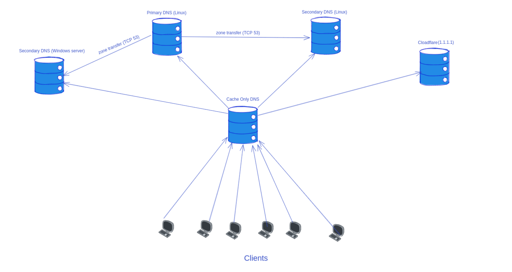

# Setup DNS-server
[ref](https://www.digitalocean.com/community/tutorials/how-to-configure-bind-as-a-private-network-dns-server-on-ubuntu-20-04)





```
Primary                     ---> 172.16.12.30
Secondary(Linux)            ---> 172.16.12.31
Secondary(Windows server)   ---> 172.16.12.15
Cache-only                  ---> 172.16.12.4

```

## Cache Only DNS
```
apt install bind9 bind9utils bind9-doc

# for caching only server set the value of "recursion" to true
recursion yes;


```


# Setup Primary and secondary DNS server

```
sudo apt install bind9 bind9utils bind9-doc
named -v
named -V
rndc status

named-checkconf
named-checkzone example.com /etc/bind/zones/example.com/db.example.com


sudo nano /etc/default/named
# add -4 infront of OPTIONS if you only use ipv4: 

OPTIONS="-u bind -4"

# all config for bind is in the /etc/bind
cd /etc/bind


vim named.conf.options # add configs
vim named.conf.local   # add configs
sudo systemctl restart named
rndc reconfig # like restart named but faster than restart


# if secondary server doesn't load master zone run the below command
rndc retransfer example.com


# add nameserver to netplan file
netplan try
systemd-resolve --status


# check the bind version with nslookup and dig command
dig @rachel.ns.cloudflare.com -c CH -t txt version.bind
dig chaos version.bind txt @172.16.12.15


nslookup -q=txt -class=CHAOS version.bind 172.16.12.30


dig @172.16.12.30 -t ns faradars.com
dig @172.16.12.30 -t a faradars.com
dig soa example.com
dig -x 172.16.12.85 # reverse lookup zone

host dhcp.example.com
realpath /etc/resolv.conf

```


