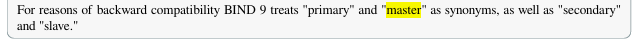

# Setup DNS-server
[ref](https://www.digitalocean.com/community/tutorials/how-to-configure-bind-as-a-private-network-dns-server-on-ubuntu-20-04)



### `we have 3 types of dns server: `
* `cache only dns server (recursive)`
* `Authoritative (master and slave)`
* `forwarders`

`port number: 53/udp for dns query, 53/tcp for zone transfer`

## Cache Only DNS on rocky linux
```sh
# apt install bind9 bind9utils bind9-doc
dnf install bind bind-utils bind-chroot

rpm -ql bind    # show you the files added by bind package

dpkg -L nginx     # show you the files added by nginx
dpkg -L haproxy   # show you the files added by haproxy


cp /etc/named.conf /etc/named.conf.backup
vim /etc/named.conf
------

acl allowedclients {
        192.168.85.0/24;
};


options {
        directory "/var/cache/bind";
        dnssec-validation auto;
        //listen-on-v6 { any; };
        listen-on { 192.168.85.88; };
        recursion yes;
        allow-query { allowedclients; };
        version none;
        hostname none;


        forwarders {
                1.1.1.1;
                8.8.8.8;
                4.2.2.4;
        };
        forward only; 

};


------

named-checkconf
echo $?


systemctl restart named


ss -nlup

firewall-cmd --add-port=53/udp --permanent
firewall-cmd --add-port=53/tcp --permanent
firewall-cmd --reload

# on client to test 
sudo dnf install bind-utils -y

dig yahoo.com
dig google.com @8.8.8.8
dig NS imanjowkar.ir


#### This is the root hints dns servers
cat /var/named/named.ca
```


## Authoritative (master and slave) DNS servers
| Record    | Name / Purpose                                                                      | Example                                            |
| --------- | ----------------------------------------------------------------------------------- | -------------------------------------------------- |
| **A**     | Maps a hostname to an IPv4 address                                                  | `example.com → 93.184.216.34`                      |
| **AAAA**  | Maps a hostname to an IPv6 address                                                  | `example.com → 2606:2800:220:1:248:1893:25c8:1946` |
| **MX**    | Mail Exchange – defines mail servers for a domain                                   | `example.com → mail.example.com (priority 10)`     |
| **SOA**   | Start of Authority – contains domain metadata (primary DNS, serial, refresh timers) | Zone start info (who’s authoritative)              |
| **CNAME** | Canonical Name – alias to another domain                                            | `www.example.com → example.com`                    |
| **TXT**   | Text record – arbitrary text, often used for SPF, DKIM, DMARC                       | `v=spf1 include:_spf.google.com ~all`              |
| **PTR**   | Pointer – reverse DNS (IP → hostname)                                               | `34.216.184.93.in-addr.arpa → example.com`         |


| Record                  | Name / Purpose                                                            | Example                                         |
| ----------------------- | ------------------------------------------------------------------------- | ----------------------------------------------- |
| **NS**                  | Nameserver – delegates authority for a zone                               | `example.com → ns1.example.net`                 |
| **SRV**                 | Service locator – defines services like SIP, XMPP                         | `_sip._tcp.example.com → sipserver.example.com` |
| **CAA**                 | Certificate Authority Authorization – restricts which CAs can issue certs | `example.com → 0 issue "letsencrypt.org"`       |
| **NAPTR**               | Naming Authority Pointer – used with SRV for advanced service discovery   | Mostly telecom/VoIP                             |
| **DNSKEY / RRSIG / DS** | DNSSEC records for signing and validation                                 | Secure DNS chain of trust                       |

```sh
vim /etc/named.conf
-----
listen-on port 53 { any; };
listen-on-v6 port 53 { none; };
allow-query     { localhost; 192.168.96.0/24; };
recursion no;


# add at the end of the file

zone "imanjowkar.ir." IN {
        type master;
        file "imanjowkar.ir.db";
        allow-transfer { 192.168.96.11; };
};


zone "bia2bagh.ir." IN {
        type master;
        file "bia2bagh.ir.db";
        allow-transfer { 192.168.85.170; };
};

-----

named-checkconf
echo $?


rpm -ql bind | grep sample | grep localhost 
cat   $(rpm -ql bind | grep sample | grep localhost) > /var/named/imanjowkar.ir.db

vim /var/named/imanjowkar.ir.db
----------
$TTL 1D
imanjowkar.ir.  IN SOA  ns1.imanjowkar.ir. admin.imanjowkar.ir. (
                                        0       ; serial
                                        60      ; refresh
                                        10      ; retry
                                        1W      ; expire
                                        3H )    ; minimum

; add nameserver here

@       60      NS      ns1.imanjowkar.ir.
@       60      NS      ns2.imanjowkar.ir.

ns1     60      A       192.168.85.170
ns2     60      A       192.168.85.90


; add records here

@       44      A       4.1.2.1

zabbix  23      A       192.168.96.100
*       11      A       10.10.10.1      ; wildcard record

@       MX      10      mail1
@       MX      20      mail2

mail1   A       192.168.1.1
mail2   A       192.168.20.1
ftp     A       192.168.4.2

www     CNAME   zabbix
ww      CNAME   zabbix

----------

named-checkzone imanjowkar.ir /var/named/imanjowkar.ir.db

vim /var/named/bia2bagh.ir.db
-------
$TTL 1D
bia2bagh.ir.  IN SOA  ns1.bia2bagh.ir. admin.bia2bagh.ir. (
                                        0       ; serial
                                        60      ; refresh
                                        10      ; retry
                                        1W      ; expire
                                        3H )    ; minimum

; add nameserver here

@       60      NS      ns1.bia2bagh.ir.

ns1     60      A       192.168.85.90


; add records here

@       44      A       4.1.2.1

zabbix  23      A       192.168.96.100

@       MX      10      mail1
@       MX      20      mail2

mail1   A       192.168.1.1
mail2   A       192.168.20.1
ftp     A       192.168.4.2

www     CNAME   zabbix
ww      CNAME   zabbix

-------


#################################### Secondary on rocky linux ####################################
## setup salve or secondary dns server
# setup another server and install the bind9 package on it

dnf install bind bind-utils bind-chroot

vim /etc/named.conf
-----
listen-on port 53 { any; };
listen-on-v6 port 53 { none; };
allow-query     { localhost; 192.168.96.0/24; };
recursion no;


# add at the end of the file
zone "imanjowkar.ir." IN {
        type slave;
        file "imanjowkar.ir.db";
        masters { 192.168.96.150; };
        masterfile-format text;  # this is optional, # remove in production and let it to store in binary format
};


zone "bia2bagh.ir." IN {
        type slave;
        file "bia2bagh.ir.db";
        masters { 192.168.85.90; };
};
-----

named-checkconf
echo $?


#################################### Secondary on ubuntu ####################################
## setup salve or secondary dns server
# setup another server and install the bind9 package on it

sudo add-apt-repository ppa:isc/bind
sudo apt update

sudo apt install bind9 bind9-dnsutils bind9-doc

# named -v
# BIND 9.18.39-0ubuntu0.24.04.1-Ubuntu (Extended Support Version) <id:>

named -v
BIND 9.20.13-1+ubuntu24.04.1+deb.sury.org+1-Ubuntu (Stable Release) <id:>


vim /etc/bind/named.conf.options
-----
acl allowedclients {
        192.168.85.0/24;
};


options {
        directory "/var/cache/bind";
        dnssec-validation no;
        //listen-on-v6 { any; };
        listen-on { 192.168.85.170; };
        recursion no;
        allow-query { allowedclients; };
        version none;
        hostname none;

};


zone "imanjowkar.ir." IN {
        type slave;
        file "imanjowkar.ir.db";
        masters { 192.168.85.90; };
        masterfile-format text;         # remove in production and let it to store in binary format
};


zone "bia2bagh.ir." IN {
        type slave;
        file "bia2bagh.ir.db";
        masters { 192.168.85.90; };
};
-------


```


## Forwarders
How to add a forwarder to a cache only server
```sh

dnf install bind bind-utils bind-chroot
cp /etc/named.conf /etc/named.conf.backup

vim /etc/named.conf /etc/named.conf
---------
options {
        listen-on port 53 { any; };
        listen-on-v6 port 53 { none; };
        allow-query     { 192.168.0.0/16; 127.0.0.0/8; };
        recursion yes;
.
.
.


};


zone "imanjowkar.ir." IN {
        type forward;
        forward only;
        forwarders { 192.168.85.90; 192.168.85.170; };
};


zone "bia2bagh.ir." IN {
        type forward;
        forward only;
        forwarders { 192.168.85.90; 192.168.85.170; };
};
-------


systemctl restart named


```

# Setup dns server on ubuntu 
```sh
sudo add-apt-repository ppa:isc/bind
sudo apt update

sudo apt install bind9 bind9-dnsutils bind9-doc

# named -v
# BIND 9.18.39-0ubuntu0.24.04.1-Ubuntu (Extended Support Version) <id:>

named -v


```


## Split-horizon DNS (View)
Different answers based on source network
Internal vs external IPs

```sh


```


## DNS Delegation
I purchased the domain a.com and created a DNS zone for it. As the company grew, I opened a new branch in Shiraz. Now I want to create a subdomain called shiraz.a.com, manage it as a separate DNS zone in Shiraz, and create additional subdomains under shiraz.a.com. How can this be done, and what is this concept called in DNS?

`a.com `→ parent zone

`shiraz.a.com` → child zone

The parent zone delegates authority for `shiraz.a.com` to another DNS server (for the Shiraz branch)

```css
a.com (Parent Zone)
 ├── www.a.com
 ├── mail.a.com
 └── shiraz.a.com  → delegated to Shiraz DNS servers
        ├── app.shiraz.a.com
        ├── db.shiraz.a.com
        └── vpn.shiraz.a.com
```


```sh
# paranet dns server

vim /etc/bind/named.conf.options
-----
acl allowedclients {
        192.168.85.0/24;
};


options {
        directory "/var/cache/bind";
        dnssec-validation no;
        //listen-on-v6 { any; };
        listen-on { 192.168.85.170; };
        recursion no;
        allow-query { allowedclients; };
        version none;
        hostname none;

};

zone "bia2bagh.ir." IN {
        type master;
        file "bia2bagh.ir.db";
};
-----

vim /var/cache/bind/bia2bagh.ir.db
----
$TTL 1D
bia2bagh.ir.  IN SOA  ns1.bia2bagh.ir. admin.bia2bagh.ir. (
                                        0       ; serial
                                        60      ; refresh
                                        10      ; retry
                                        1W      ; expire
                                        3H )    ; minimum

@       IN  NS  ns1.bia2bagh.ir.
@       IN  NS  ns2.bia2bagh.ir.
ns1     IN  A   192.168.85.1
ns2     IN  A   192.168.85.2


zabbix  A       192.168.96.100

@       MX      10      mail1
@       MX      20      mail2

mail1   A       192.168.1.1
mail2   A       192.168.20.1
ftp     A       192.168.4.2

www     CNAME   zabbix
ww      CNAME   zabbix


; -------------------------
; Delegation to Shiraz
; -------------------------


shiraz  IN  NS  ns1.shiraz.bia2bagh.ir.
;shiraz  IN  NS  ns2.shiraz.bia2bagh.ir.

; Glue record
ns1.shiraz  IN  A   10.10.10.1
;ns2.shiraz  IN  A   10.10.10.2
----


dnf install bind bind-utils bind-chroot


vim /etc/named.conf
-------
zone "shiraz.bia2bagh.ir" {
    type master;
    file "shiraz.bia2bagh.ir.db";
};
-------


vim /var/named/shiraz.bia2bagh.ir.db
-------
$TTL 86400
@   IN  SOA ns1.shiraz.bia2bagh.ir. admin.shiraz.bia2bagh.ir. (
                2026010101  ; Serial
                3600        ; Refresh
                1800        ; Retry
                604800      ; Expire
                86400 )     ; Minimum TTL


; Name server for Shiraz zone
@       IN  NS  ns1.shiraz.bia2bagh.ir.


; DNS server A record
ns1     IN  A   192.168.85.33


; -------------------------
; Shiraz subdomains
; -------------------------

app     IN  A   10.10.10.10
db      IN  A   10.10.10.20
vpn     IN  A   10.10.10.30


-------


```


# dig 
```sh
dig aparat.com
dig +short aparat.com
dig +noall +answer aparat.com

dig +noall +answer aparat.com +stats

dig @192.168.85.88 version.bind txt CH

dig smtp.gmail.com +trace

```