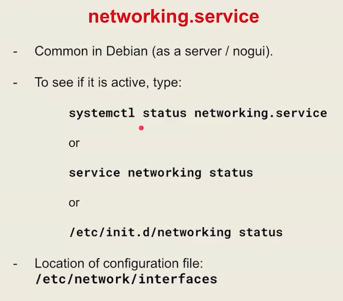
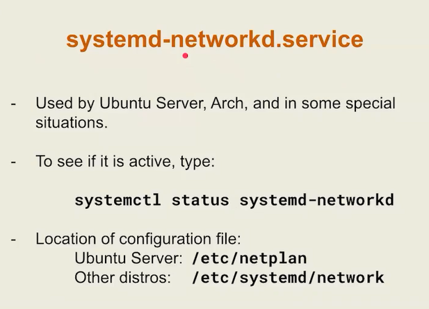
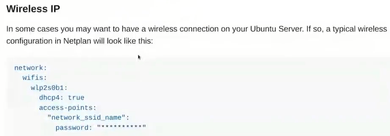
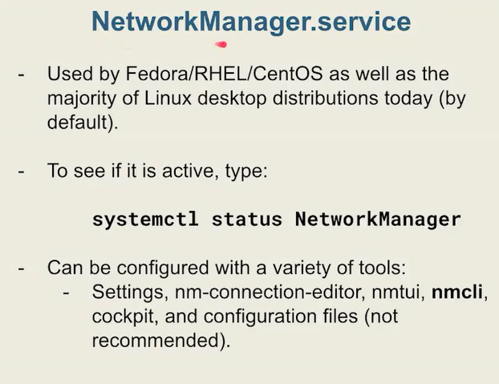
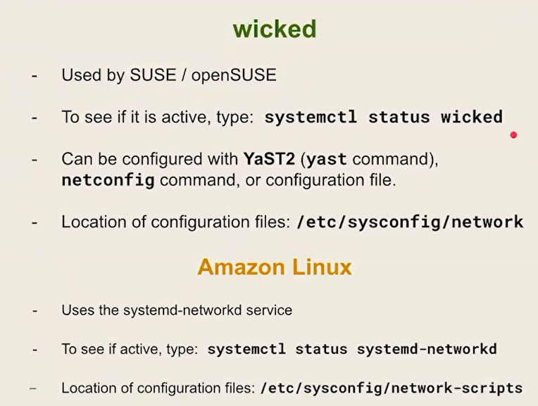
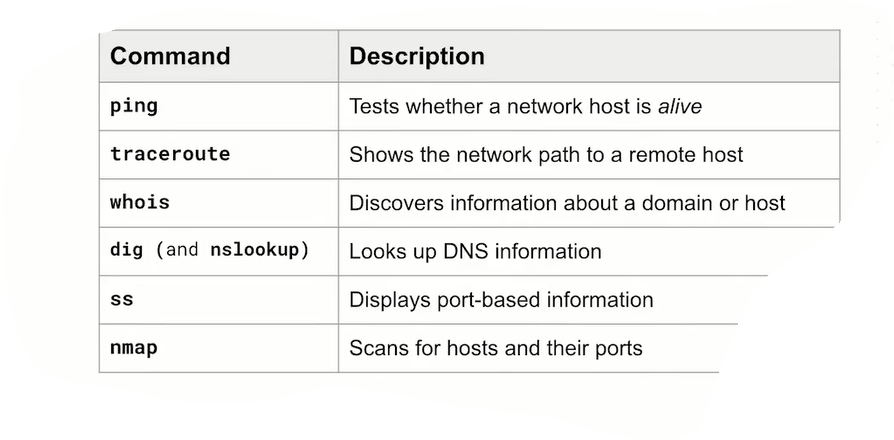

# Linux Networking Command

```
ip -br -c a

ip r     ##short for `ip route show `


```


## types of networking services in linux
todays linux servers used one of the three below network services. the three most common are: 
* `networking` ->  debain server
* `networkd` -> ubuntu server
* `NetworkManager` -> redhat, fedora, centos, ubuntu desktop


### networking service

```

systemctl status networking.service

nano /etc/network/interfaces

### set static ip
-------------------------
allow-hotplug enp0s8
iface enp0s8 inet static
        address 192.168.56.200/24
        gateway 192.168.56.1
-------------------------

#### set dynamic ip address
--------------------------

allow-hotplug enp0s3
iface enp0s3 inet dhcp

--------------------------


systemctl restart networking.service

ifdown enp0s3
ifup enp0s3
ifquery enp0s8  # show ip address , gateway, netmask


```


### networkd



```
systemctl status systemd-networkd


### dhcp configuration

vim /etc/netplan/00-installer-config.yaml

-----

network:
  ethernets:
    enp0s8:
      dhcp4: true
    enp0s3:
      dhcp4: true
  version: 2


------

#### Static ip addressing

-----
network:
  ethernets:
    enp0s3:
      addresses:
        - 192.168.56.101/24
      routes:
        - to: default
          via: 192.168.56.1
      nameservers:
        addresses:
          - 8.8.8.8

    enp0s8:
      dhcp4: true
  version: 2
  renderer: networkd


------


netplay try
netplan apply
networkctl
networkctl status
networkctl lldp
networkctl down enp0s3
networkctl up enp0s3


### you can set dns server info in 

vim /etc/systemd/resolved.conf

----
#DNS=
#FallbackDNS=
#Domains=

----


resolvectl
resolvectl  flush-caches
resolvectl statistics


```



### NetworkManager




```

nmtui
nmcli 


## configuration file is here:

/etc/NetworkManager/system-connections

journalctl -u NetworkManager.service

journalctl -u NetworkManager.service  | tail -10

journalctl -u NetworkManager.service  | tail -10 | column -t

```





# ip command

```

 ip link show   === ip l  # show layer 2 of OSI-model

 ip address show === ip a  # show layer3 of OSI-model


 ip address show | sed -ne 's,^ *inet6* \([^ /]*\)/.*$,\1,p' | sort -u


ip -j address show # output json
ip -j -p address show # json pretty output

ip -j -p address show | jq

ip a | grep inet | sort -n

ip a | grep inet | sort -n | column -t


ip -o -4 a

ip -o -4 a | awk '{print $4}'


cd /sys/class/net/
cat /sys/class/net/enp0s3/statistics/tx_bytes

cat /sys/class/net/enp0s3/statistics/tx_errors

cat /sys/class/net/enp0s3/statistics/rx_errors


# ip route

ip route show

ip -c route show | column -t

ip -c route | grep default

# delete default route

sudo ip route del default


# add default route

ip route add default via 10.10.5.1


# add route
ip route add 10.10.10.0/24 dev enp0s8

ip route del 10.10.10.0/24

```


# Network testing command


```


```

