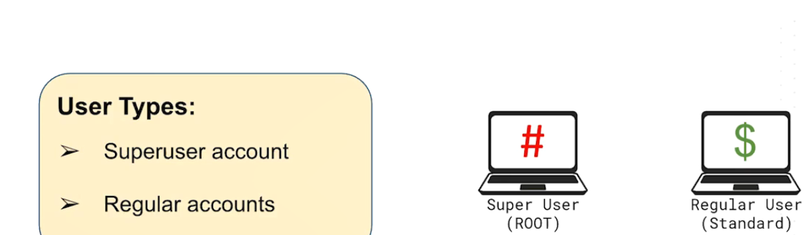

# Linux security


## Users


```
iman@my-deb-iman:~$ id
uid=1000(iman) gid=1000(iman) groups=1000(iman),24(cdrom),25(floppy),29(audio),30(dip),44(video),46(plugdev),100(users),106(netdev)


root@my-deb-iman:~# id
uid=0(root) gid=0(root) groups=0(root)


iman1@my-deb-iman:~$ ls
iman1@my-deb-iman:~$ id
uid=1001(iman1) gid=1001(iman1) groups=1001(iman1),100(users)


# adding a user
adduser iman1


# on debain based : > sudo group
# on redhat based : > wheel group


# change password of a user

passwd user


# generate password with openssl
openssl passwd -6 # sha512

openssl rand -base64 24

openssl rand -hex 24
openssl rand -hex  -out password.txt 24


# set password policy for a specific user

chage iman


# set password policy globally
vim /etc/login.defs
# in this file you have very option example: 
----
PASS_MAX_DAYS   99999
PASS_MIN_DAYS   0
PASS_WARN_AGE   7


----

```