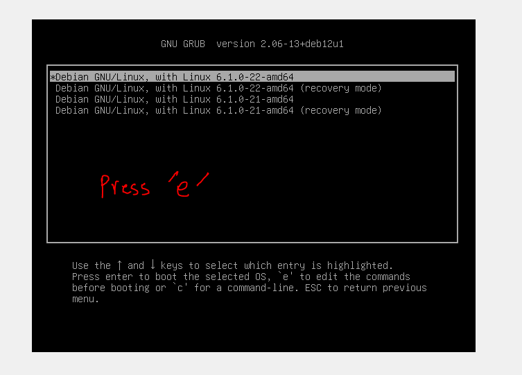
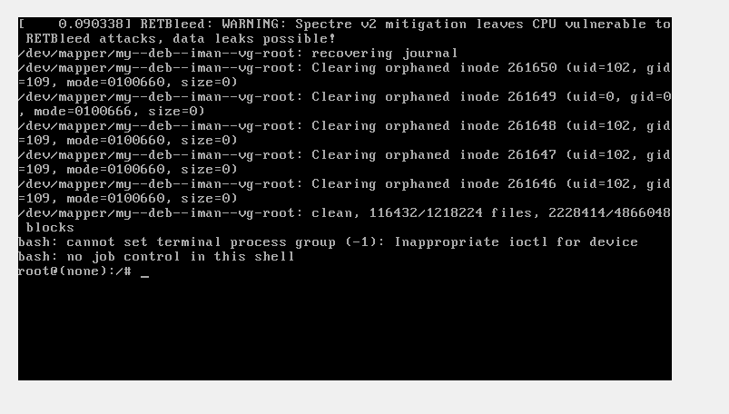
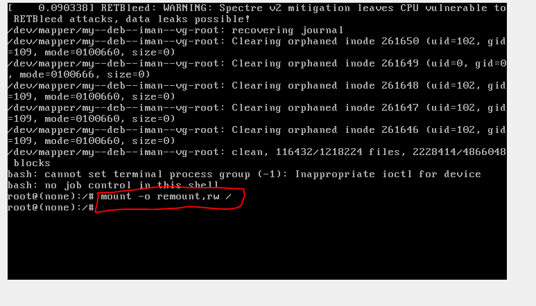
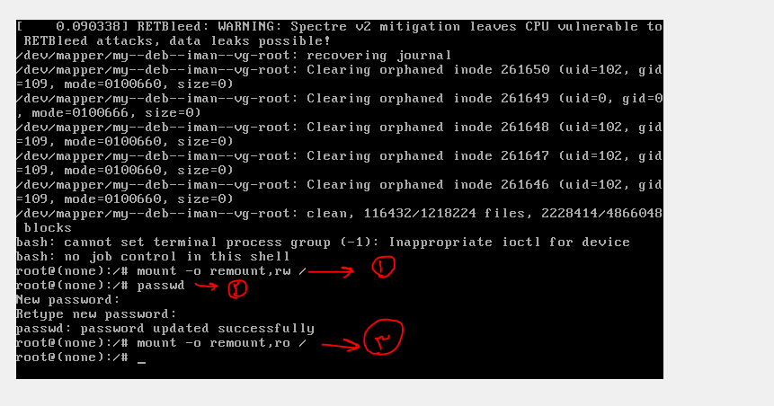

# password recovery


* Reboot your system and access the GRUB menu:

* press e


* Find the line that starts with linux (it will start with linux or linux16 and include the path to the kernel).

* Append init=/bin/bash to the end of this line. This tells the kernel to run /bin/bash instead of the default init system.


* Press Ctrl + X or F10 to boot with the modified parameters.




* remount the root filesystem as read-write


* now run passwd

```

passwd

```

* After changing the password, you can remount the root filesystem as read-only with:



* reboot the system
```
reboot -f

```