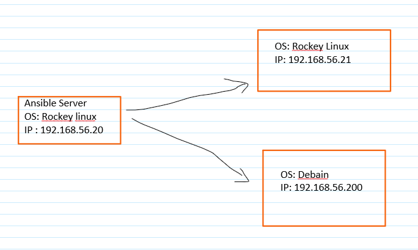

# Ansible




```

# install ansible on ansible server
dnf update && dnf install python3-venv


# create ssh-keygen and copy it to the remote server


```


### Ansible Config file location priority
* define a variable called ANSIBLE_CONFIG
* ansible.cfg
* ~/.ansible.cfg
* /etc/ansible/ansible.cfg


 ansible --version # you can see the location of ansible-config

 
## Ansible installation
```
sudo apt install python3.10-venv

python3 -m venv venv

source venv/bin/activate
pip install ansible

```

## ## Ansible basics
```
ansible-doc service
ansible-doc apt


ansible-config view
ansible all -m ping
ansible all --list-hosts
ansible all -m gather_facts
ansible all -m gather_facts --limit 192.168.93.151
ansible all -m gather_facts | grep -i distribution


ansible servers -m command -a uptime
ansible servers -m command -a who
ansible servers -m command -a "apt install nginx" --become --ask-become-pass

ansible all -m command -a "cat /etc/os-release" --user=iman --become --ask-become-pass --become-user=root

# gathering facts
ansible servers -m setup
ansible servers -m setup -a "filter=ansible_all_ipv4_addresses"


ansible all -m apt -a update_cache=true
ansible all -m apt -a update_cache=true --become --ask-become-pass
ansible all -m apt -a name=vim-nox --become --ask-become-pass
ansible all -m apt -a name=nginx --become --ask-become-pass

ansible-playbook -i inventory/mycluster/hosts.yaml  --become --become-user=root --ask-become-pass cluster.yml
ansible-playbook -i inventory/mycluster/hosts.yaml  --become --become-user=root --ask-become-pass upgrade-cluster.yml


tail -f /var/log/apt/history.log
ansible all -m apt -a "upgrade=dist" --become --ask-become-pass


openssl 

```


## Ansible Playbook

```
ansible-playbook --ask-become-pass playbook1.yaml

ansible-playbook --ask-become-pass playbook1.yaml --start-at-task="task name"


```

## Jinja2 Template
```


{{   varialbe    }}     
{#    comment    #}


```


