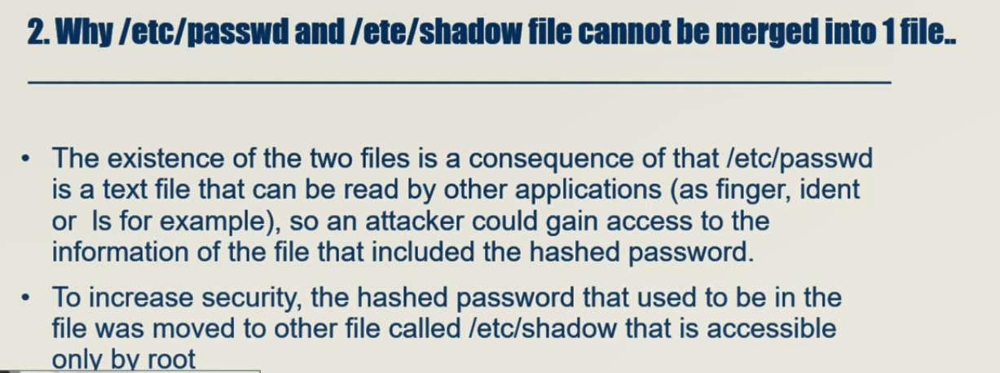
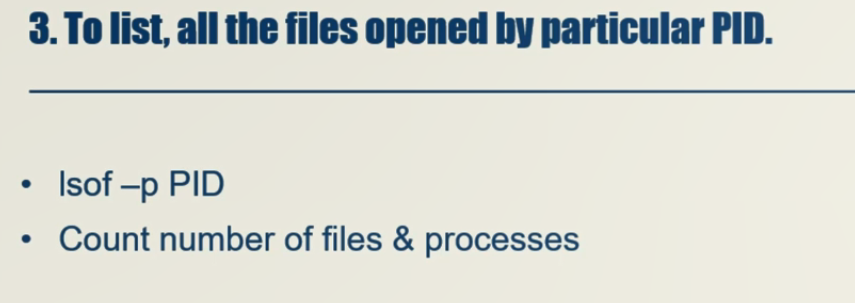
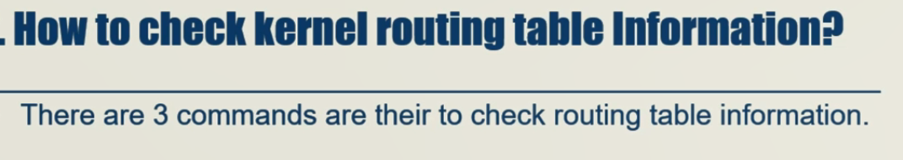
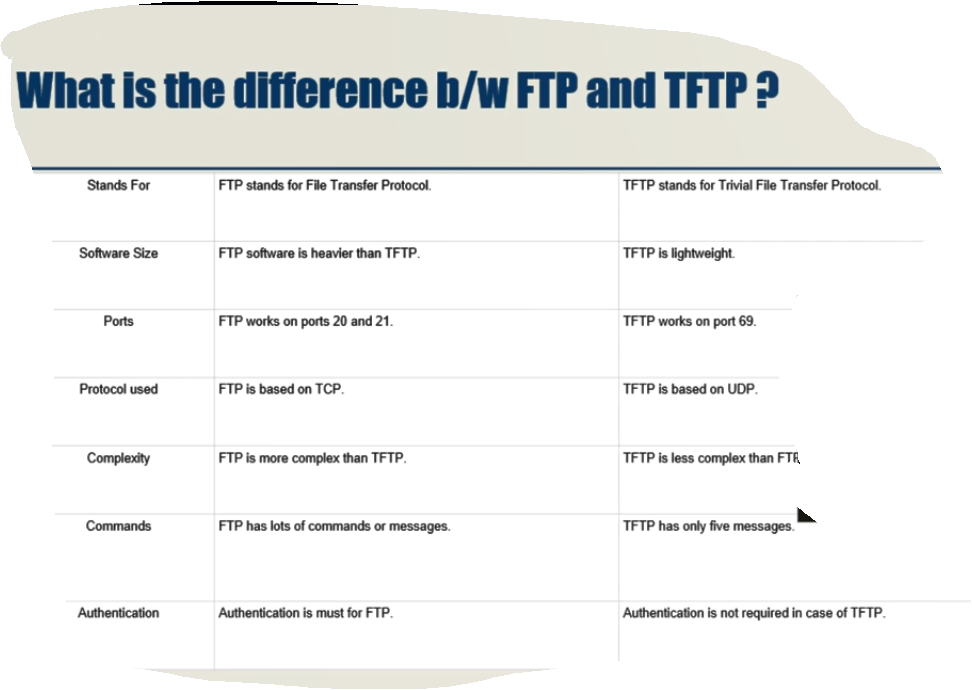
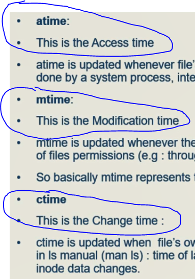
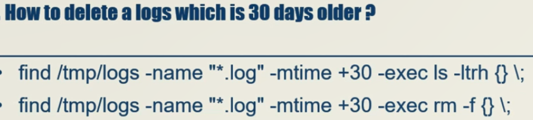

```
chage -M -1 iman
```







```
 route -n
 netstat -rn
 ip route
```



### how to scan disk in linux

```
echo "- - -" | tee /sys/class/scsi_host/host*/scan

```


### search text within multiple file

```
find / -type f -name "*.logs" -exec grep 'iman' {} \;

```






### **3. How do you check the Linux kernel version?**
**Answer:**  
```bash
uname -r
```

---

### **4. How do you find out which Linux distribution you are using?**
**Answer:**  
```bash
cat /etc/os-release
```
or  
```bash
lsb_release -a
```

---

### **5. How do you list all running processes?**
**Answer:**  
```bash
ps aux
```
or  
```bash
top
```

---

### **6. How do you check memory usage in Linux?**
**Answer:**  
```bash
free -m
```
or  
```bash
vmstat -s
```

---

### **7. How do you check disk usage?**
**Answer:**  
```bash
df -h
```

---

### **8. How do you find the top CPU-consuming processes?**
**Answer:**  
```bash
top
```
or  
```bash
ps aux --sort=-%cpu | head
```

---

### **9. How do you search for a file in Linux?**
**Answer:**  
```bash
find /path/to/search -name "filename"
```

---

### **10. How do you find a specific text string in files?**
**Answer:**  
```bash
grep "search_term" filename
```

---

### **11. How do you change file permissions?**
**Answer:**  
```bash
chmod 755 filename
```

---

### **12. How do you change file ownership?**
**Answer:**  
```bash
chown user:group filename
```

---

### **13. How do you check open ports on a Linux system?**
**Answer:**  
```bash
netstat -tulnp
```
or  
```bash
ss -tulnp
```

---

### **14. How do you restart a service in Linux?**
**Answer:**  
```bash
systemctl restart service_name
```

---

### **15. How do you check the status of a service?**
**Answer:**  
```bash
systemctl status service_name
```

---

### **16. How do you check system logs?**
**Answer:**  
```bash
journalctl -xe
```
or  
```bash
tail -f /var/log/syslog
```

---

### **17. How do you add a new user in Linux?**
**Answer:**  
```bash
useradd -m username
passwd username
```

---

### **18. How do you delete a user?**
**Answer:**  
```bash
userdel -r username
```

---

### **19. How do you check your system’s IP address?**
**Answer:**  
```bash
ip a
```
or  
```bash
ifconfig
```

---

### **20. How do you check network connectivity?**
**Answer:**  
```bash
ping google.com
```

---

### **21. How do you view all mounted filesystems?**
**Answer:**  
```bash
mount
```
or  
```bash
df -Th
```

---

### **22. How do you mount a new partition?**
**Answer:**  
```bash
mount /dev/sdX /mnt
```

---

### **23. How do you unmount a partition?**
**Answer:**  
```bash
umount /mnt
```

---

### **24. How do you check disk partitions?**
**Answer:**  
```bash
lsblk
```
or  
```bash
fdisk -l
```

---

### **25. How do you create a new directory?**
**Answer:**  
```bash
mkdir new_directory
```

---

### **26. How do you remove a directory?**
**Answer:**  
```bash
rmdir empty_directory
rm -rf directory
```

---

### **27. How do you copy files?**
**Answer:**  
```bash
cp source destination
```

---

### **28. How do you move files?**
**Answer:**  
```bash
mv source destination
```

---

### **29. How do you create a symbolic link?**
**Answer:**  
```bash
ln -s target link_name
```

---

### **30. How do you change the hostname in Linux?**
**Answer:**  
```bash
hostnamectl set-hostname new_hostname
```

---

### **31. How do you check system uptime?**
**Answer:**  
```bash
uptime
```

---

### **32. How do you list all environment variables?**
**Answer:**  
```bash
printenv
```

---

### **33. How do you schedule a cron job?**
**Answer:**  
```bash
crontab -e
```
Example: Run a script every day at midnight  
```bash
0 0 * * * /path/to/script.sh
```

---

### **34. How do you check the kernel ring buffer logs?**
**Answer:**  
```bash
dmesg | tail
```

---

### **35. How do you show all available shells in Linux?**
**Answer:**  
```bash
cat /etc/shells
```

---

### **36. How do you check system CPU information?**
**Answer:**  
```bash
lscpu
```

---

### **37. How do you check the system’s RAM size?**
**Answer:**  
```bash
cat /proc/meminfo
```

---

### **38. How do you list all installed packages in Debian-based systems?**
**Answer:**  
```bash
dpkg --list
```

---

### **39. How do you list all installed packages in Red Hat-based systems?**
**Answer:**  
```bash
rpm -qa
```

---

### **40. How do you update installed packages in Debian-based systems?**
**Answer:**  
```bash
apt update && apt upgrade -y
```

---

### **41. How do you update installed packages in Red Hat-based systems?**
**Answer:**  
```bash
yum update -y
```

---

### **42. How do you check which users are logged in?**
**Answer:**  
```bash
who
```
or  
```bash
w
```

---

### **43. How do you kill a process by its PID?**
**Answer:**  
```bash
kill PID
```
or  
```bash
kill -9 PID
```

---

### **44. How do you find the process ID (PID) of a running program?**
**Answer:**  
```bash
pgrep program_name
```

---

### **45. How do you check the default gateway?**
**Answer:**  
```bash
ip route
```

---

### **46. How do you show the routing table?**
**Answer:**  
```bash
route -n
```

---

### **47. How do you display all users on a Linux system?**
**Answer:**  
```bash
cat /etc/passwd
```

---

### **48. How do you check the last login of a user?**
**Answer:**  
```bash
last username
```

---

### **49. How do you enable a firewall in Linux?**
**Answer:**  
```bash
ufw enable
```
or  
```bash
firewalld-cmd --state
```

---

### **50. How do you check active firewall rules?**
**Answer:**  
```bash
iptables -L -v
```
or  
```bash
firewall-cmd --list-all
```

---
