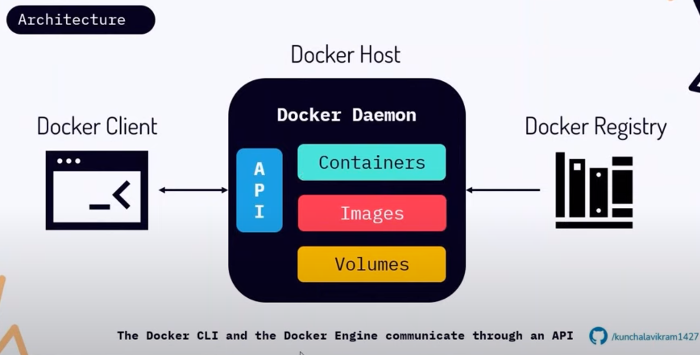
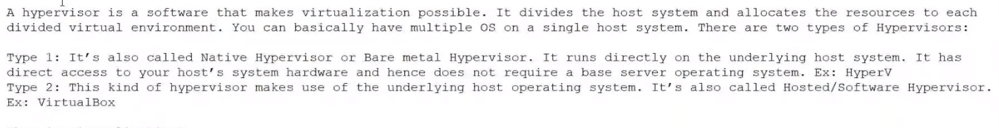
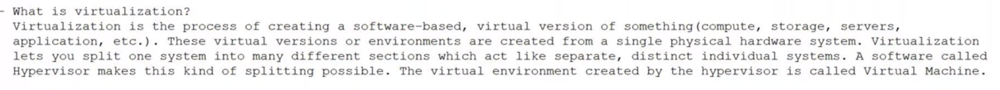
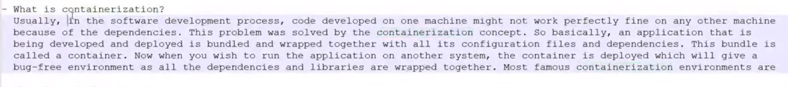
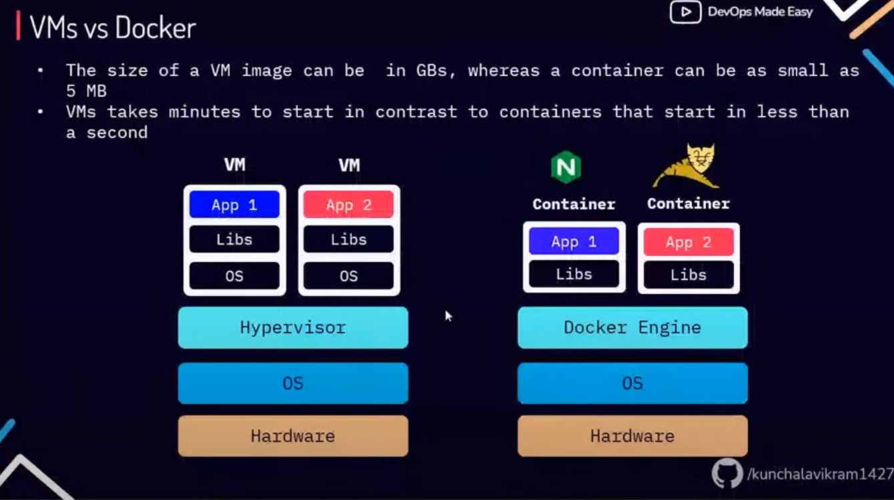

# Docker command

```
docker run -it --user=1001 ubuntu bash

```

## Explain Docker architecture and its components: 
docker has 2 components: 1-cli, 2-daemon



## what is hypervisor:


## what is virtualalization


## what is containerization



## what is docker image
It is a template that will have all the dependencies along with your application binaries.
this is image should not have any sources code or unwanted dependencies.


## what is docker container
running instance of a docker image, or is an isolated process running in an isolated environment created by cgroups and namespace. the processes running within this container are visible to your host machine, but the process that runs in host machine is not visible in docker container.

## what is cgroups & namespace
namespace provide the container necessary resources like storage, network, file system, ...
cgroups provide resources like RAM, CPU. so with cgroups and namespaces your container are usually created.


## what is container Runtime environment
container runtime environment is also known as container engine which is responsible for creating containers. Runtime uses cgroups and namespaces to create isolated environment for running containers.


## What is difference between VMs and Docker



## list some important docker command

```
docker --version
docker info
docker df
docker events
docker system prune
docker volume prune

docker image inspect image_name
docker login https://hub.docker.com

usermod -aG docker <USER>
newgrp docker

docker cp <host_address> container_name:/tmp  #copy a file from host to a container
docker cp container_name:/tmp/web.conf .      # copy a file from container to host


# backup
tar -zcvf docker-backup-$(date +%s).tar.gz /var/lib/docker


docker stats
docker top container_name


docker container run --name container_name -e test=devops -e pass=password nginx:latest
docker run --name container_name --env-from=env.txt nginx:latest


----
docker network create net1
docker network create net2

docker run -itd --name web1 --net net1 nginx:latest
docker run -itd --name web2 --net net2 nginx:latest

docker network connect net1 web2


```

## how do you check the total size occupied by docker home
```
docker system df
```

## what is difference between docker stop and kill
docker stop will give 10 seconds of time for stop a container(gracefully terminated) but docker kill imadiately sent SIGKILL(kill -9) a container.


## what is Dockerfile
Its a set of instructions that builds a docker image.

## what is .dockerignore
when you try to build a docker image from dockerfile, the content in .dockerignore will ignore to send these file to docker daemon.

## what is difference between ADD and COPY
COPY only use local file system but ADD can download from remote server(ADD can be copy a tar or a zip file and untar o r unzip them when copying.)

## what is difference between CMD and ENTRYPOINT
both CMD and ENTRYPOINT defines the starting of your docker container.

## what is difference between RUN and CMD

RUN run when building image, but CMD run when running a container


## Tip
```
ARG TAG
FROM nginx:$TAG

docker build --build-arg TAG=1.4 -t web:ver1 .


```

## Can we have multiple CMD in Dockerfile
yes, but last one will run when we start a container.


## what is docker network
it will enable networking between your containers. whenever you install docker, docker0(bridge) will create.
```
docker network create net1
docker network create net2

docker network connect net1 container_name
```


## what is the use of --net-alias or --network-alias ?
```
# This is a kind of load balancing.
docker run --name c1 --net-alias c
docker run --name c2 --net-alias c
docker run --name c3 --net-alias c

```

## what is the use of --links?
links two different containers


## is docker compose is a production tools?
no, the production tools is docker swarm or kubernetes.

## Is it possible use json instead of yaml for writing docker compose?
yes, we can use it. but we have to specify the filename with the following command: 
```
docker-compose -f docker-compoes.jso up -d
```


## what is ONBUILD instructions in Dockerfile
```


```