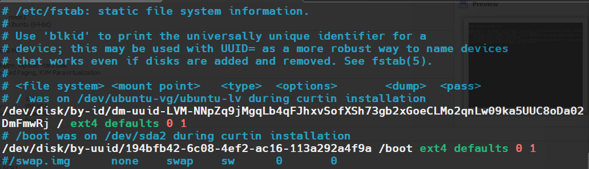

## **Kubernetes Master (Control Plane) Components**  
The **Master Node** is the brain of the Kubernetes cluster, responsible for managing and controlling the cluster.  

### **1. kube-apiserver**  
- **Role**: The front-end of the Kubernetes control plane.  
- **Function**:  
  - Exposes the Kubernetes API (used by `kubectl`, dashboards, and other components).  
  - Validates and processes REST requests.  
  - Communicates with `etcd` to store/retrieve cluster state.  

### **2. etcd**  
- **Role**: Kubernetes’ distributed key-value database.  
- **Function**:  
  - Stores all cluster data (Pods, Deployments, Configs, Secrets).  
  - Ensures high availability (if running in HA mode).  

### **3. kube-scheduler**  
- **Role**: Assigns Pods to Worker Nodes.  
- **Function**:  
  - Watches for newly created Pods with no assigned Node.  
  - Selects the best Node based on resource requirements, policies, and constraints.  

### **4. kube-controller-manager**  
- **Role**: Runs controller processes that regulate cluster state.  
- **Key Controllers**:  
  - **Node Controller**: Monitors Node status.  
  - **Deployment Controller**: Manages desired Pod replicas.  
  - **Service Controller**: Handles LoadBalancer creation (in cloud environments).  

### **5. cloud-controller-manager (Optional)**  
- **Role**: Integrates with cloud provider APIs (AWS, GCP, Azure).  
- **Function**:  
  - Manages cloud-specific resources (Load Balancers, Storage Volumes).  

---

## **Kubernetes Worker Node Components**  
Worker Nodes are where **containers/Pods** actually run.  

### **1. kubelet**  
- **Role**: The Kubernetes agent running on each Node.  
- **Function**:  
  - Ensures Pods are running in a healthy state.  
  - Reports Node status back to the control plane.  

### **2. kube-proxy**  
- **Role**: Maintains network rules for Pod communication.  
- **Function**:  
  - Implements Services (ClusterIP, NodePort, LoadBalancer).  
  - Uses iptables/IPVS to route traffic to Pods.  

### **3. Container Runtime**  
- **Role**: Software that runs containers (e.g., Docker, containerd, CRI-O).  
- **Function**:  
  - Pulls images, starts/stops containers, and manages storage.  

---

## **How Components Work Together**  
1. **User runs `kubectl create deployment`** → Request goes to `kube-apiserver`.  
2. **`kube-apiserver` validates & stores data in `etcd`**.  
3. **`kube-scheduler` assigns Pod to a Worker Node**.  
4. **`kubelet` (on the Node) pulls the image & runs the Pod**.  
5. **`kube-proxy` sets up networking for the Pod**.  

---

## **Summary Table**  
| **Component**          | **Type**       | **Responsibility** |  
|------------------------|---------------|--------------------|  
| `kube-apiserver`       | Master        | API gateway for Kubernetes |  
| `etcd`                 | Master        | Cluster state storage |  
| `kube-scheduler`       | Master        | Assigns Pods to Nodes |  
| `kube-controller-manager` | Master    | Ensures cluster state matches specs |  
| `kubelet`              | Worker        | Runs Pods on Nodes |  
| `kube-proxy`           | Worker        | Manages networking |  
| `Container Runtime`    | Worker        | Runs containers (Docker, etc.) |  


# Installation wiht kubeadm
[ref](https://www.fortaspen.com/install-kubernetes-containerd-ubuntu-linux-22-04/)
one master node 192.168.229.11
two worker node 192.168.229.12.192.168.229.13


### netplan configuration
[for dns resolver we use electro](https://electrotm.org/)
```
root@node1:~/calico# cat /etc/netplan/00-installer-config.yaml
# This is the network config written by 'subiquity'
network:
  ethernets:
    ens32:
      addresses:
      - 192.168.229.11/24
      nameservers:
        addresses: [8.8.8.8]
        search: []
      routes:
        - to: default
          via: 192.168.229.2
  version: 2

```


# On all nodes

## check on all nodes
```
sudo cat /sys/class/dmi/id/product_uuid # must different on all nodes


# disable swap 
swapoff -a
# disable permanently in /etc/fstab
vim /etc/fstab
# comment the line start with /swap.img
```



```
# or you can delete that line with below command:
sudo sed -i '/swap/d' /etc/fstab


```

## load required kernetl module

```
cat <<EOF | sudo tee /etc/modules-load.d/k8s.conf
overlay
br_netfilter
EOF

```
That file will be read at the next system start. If you needed to start the modules immediately use below

```
sudo modprobe overlay
sudo modprobe br_netfilter


```
## Update Kernel Networking Config

```
cat <<EOF | sudo tee /etc/sysctl.d/k8s.conf
net.bridge.bridge-nf-call-iptables  = 1
net.bridge.bridge-nf-call-ip6tables = 1
net.ipv4.ip_forward                 = 1
EOF


sysctl -p /etc/sysctl.d/k8s.conf

```

## Install kubernetes pakages 

```
sudo apt-get install -y apt-transport-https ca-certificates curl


curl -fsSL https://pkgs.k8s.io/core:/stable:/v1.32/deb/Release.key | sudo gpg --dearmor -o /etc/apt/keyrings/kubernetes-apt-keyring.gpg

echo 'deb [signed-by=/etc/apt/keyrings/kubernetes-apt-keyring.gpg] https://pkgs.k8s.io/core:/stable:/v1.32/deb/ /' | sudo tee /etc/apt/sources.list.d/kubernetes.list


sudo apt-get update
sudo apt-get install -y kubelet kubeadm kubectl
sudo apt-mark hold kubelet kubeadm kubectl


```


## Setup containerd on all nodes

```
sudo apt-get install -y containerd


sudo mkdir /etc/containerd
containerd config default | sudo tee /etc/containerd/config.toml

# change below attribute in systemd-cgroup to true

vim /etc/containerd/config.toml
-------
SystemdCgroup = true

------

systemctl restart containerd.service
systemctl status containerd.service


```


## Initialize the cluster (master-node)

```
# pull all required images
kubeadm config images pull


# open /etc/hosts in all nodes and add below 
-------
192.168.229.11 node1
192.168.229.12 node2
192.168.229.13 node3

------


# on master node initialize the cluster

kubeadm init --pod-network-cidr 10.244.0.0/16 --apiserver-advertise-address 192.168.229.11 --kubernetes-version 1.32.4


If everything is correct, you will get a result like the one below.


[addons] Applied essential addon: CoreDNS
[addons] Applied essential addon: kube-proxy

Your Kubernetes control-plane has initialized successfully!

To start using your cluster, you need to run the following as a regular user:

  mkdir -p $HOME/.kube
  sudo cp -i /etc/kubernetes/admin.conf $HOME/.kube/config
  sudo chown $(id -u):$(id -g) $HOME/.kube/config

Alternatively, if you are the root user, you can run:

  export KUBECONFIG=/etc/kubernetes/admin.conf

You should now deploy a pod network to the cluster.
Run "kubectl apply -f [podnetwork].yaml" with one of the options listed at:
  https://kubernetes.io/docs/concepts/cluster-administration/addons/

Then you can join any number of worker nodes by running the following on each as root:

kubeadm join 192.168.229.11:6443 --token l1ne8g.rcuofdodgrrw1nzd \
        --discovery-token-ca-cert-hash sha256:6528d59ad1218a935503527b98101dccdb385741081c63cecd47d6ade69d19dc


# enable auto-commplete on kubectl 
source <(kubectl completion bash) # set up autocomplete in bash into the current shell, bash-completion package should be installed first.
echo "source <(kubectl completion bash)" >> ~/.bashrc # add autocomplete permanently to your bash shell.

```

### setup CNI (we use calico)
[ref](https://docs.tigera.io/calico/latest/getting-started/kubernetes/quickstart)
```

wget https://raw.githubusercontent.com/projectcalico/calico/v3.29.3/manifests/tigera-operator.yaml

kubectl create -f tigera-operator.yaml

wget https://raw.githubusercontent.com/projectcalico/calico/v3.29.3/manifests/custom-resources.yaml

# open the file and  change cidr to  -->  cidr: 10.244.0.0/16


kubectl create -f custom-resources.yaml


```

### join worker nodes

```
# generate token on master node

kubeadm token list
kubeadm token create --print-join-command --ttl 1h

# on worker node run below command

kubeadm join 192.168.229.11:6443 --token sa1ok3.j5whis4u5n84ekgt --discovery-token-ca-cert-hash sha256:6528d59ad1218a935503527b98101dccdb385741081c63cecd47d6ade69d19dc


```

