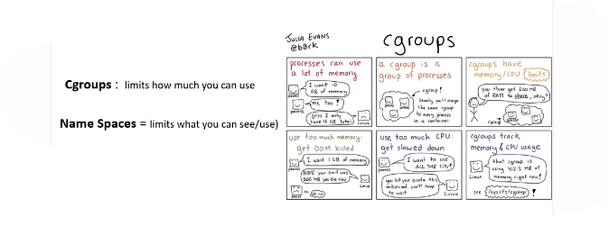

#  Kubernetes 


+-----------------------------------------------+
|               Control Plane                   |
| (manages and schedules everything)             |
|-----------------------------------------------|
|  API Server | Controller Manager | Scheduler  |
|  etcd (Database)                                |
+-----------------------------------------------+
               |
               | communicates via API
               v
+-----------------------------------------------+
|                Worker Nodes                   |
|-----------------------------------------------|
| Kubelet | Kube Proxy | Container Runtime      |
| Pods (with containers inside)                 |
+-----------------------------------------------+


----------------------------------
                    +---------------------------+
                    |      Control Plane        |
                    |---------------------------|
                    | +-----------------------+ |
                    | | API Server            | |
                    | +-----------------------+ |
                    | | etcd (Cluster State)  | |
                    | +-----------------------+ |
                    | | Scheduler             | |
                    | +-----------------------+ |
                    | | Controller Manager    | |
                    | +-----------------------+ |
                    +------------|--------------+
                                 |
                                 v
          +-----------------------------------------------+
          |                 Worker Nodes                  |
          |-----------------------------------------------|
          | +------------+  +------------+  +------------+ |
          | |  kubelet   |  |  kubelet   |  |  kubelet   | |
          | | kube-proxy |  | kube-proxy |  | kube-proxy | |
          | | containerd |  | containerd |  | containerd | |
          | |  Pods      |  |  Pods      |  |  Pods      | |
          | +------------+  +------------+  +------------+ |
          +-----------------------------------------------+




Cordon → block new Pods

Drain → evict existing Pods

Uncordon → allow Pods again

Evict → graceful Pod removal & reschedule


```sh
# maintainace
kubectl cordon node # Stop new Pods from being scheduled, Existing Pods keep running, No eviction

kubectl drain node  # Stop new Pods from being scheduled, Evicts existing Pods (gracefully)

kubectl uncordon node # Allow scheduling again, New Pods can be placed on the node
‍‍‍‍‍‍‍‍‍


# set lable
kubectl label node node3 role=worker
kubectl label node node3 role-
kubectl get node node3 --show-labels


```

### CoreDNS

**What it is:**
The **cluster-wide DNS server**.

**What it does:**

* Resolves Kubernetes service names like
  `my-service.my-namespace.svc.cluster.local`
* Forwards external queries (e.g. `google.com`) to upstream DNS
* Watches the Kubernetes API to keep DNS records up to date

**Where it runs:**

* As pods (usually in `kube-system`)
* Shared by *all* nodes in the cluster

**Key point:**
Every pod’s DNS query normally goes **over the network** to CoreDNS.

---

### NodeLocal DNS (NodeLocal DNSCache)

**What it is:**
A **per-node DNS cache** that runs locally on each node.

**What it does:**

* Caches DNS responses close to pods
* Reduces latency and packet loss
* Reduces load on CoreDNS during traffic spikes

**Where it runs:**

* As a DaemonSet (one pod per node)
* Listens on a local IP (usually `169.254.20.10`)

**Key point:**
Pods talk to **local NodeLocal DNS first**, not directly to CoreDNS.

---

### How they work together

```
Pod
 ↓
NodeLocal DNS (cache, local)
 ↓ (cache miss)
CoreDNS (cluster DNS)
 ↓
Upstream DNS (for external names)
```

NodeLocal DNS **does not replace CoreDNS** — it just sits in front of it.

---

### When you need NodeLocal DNS

You’ll see benefits if:

* Large cluster (many pods)
* High DNS QPS
* DNS timeouts during scale events
* Network plugins with occasional packet loss

Small clusters often do just fine with CoreDNS alone.

---

### Quick comparison

| Feature              | CoreDNS           | NodeLocal DNS |
| -------------------- | ----------------- | ------------- |
| Scope                | Cluster-wide      | Per-node      |
| Role                 | Authoritative DNS | Local cache   |
| Required             | Yes               | Optional      |
| Improves latency     | ❌                 | ✅             |
| Reduces CoreDNS load | ❌                 | ✅             |

---