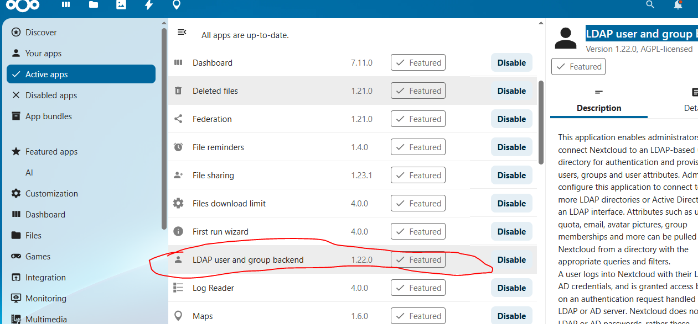

# Deploy nextcloud on ubuntu 

[ref](https://mailserverguru.com/install-nextcloud-on-ubuntu-24-04-lts/)


# Setup mariadb 
## installation on ubuntu 
### Install the LTS version of that

[MariaDB Lifecycle: End Of Life And Support Status](https://www.itechtics.com/eol/mariadb/)

[add mariadb-repository](https://mariadb.org/download/?t=mariadb&o=true&p=mariadb&r=11.4.4&os=windows&cpu=x86_64&pkg=msi&mirror=archive)


```sh
apt-cache policy mariadb-server

apt install mariadb-server

mariadb-secure-installation

```

# change some mariadb configuration
```sh
vim /etc/mysql/mariadb.conf.d/50-server.cnf
-----------
innodb_buffer_pool_size = 2G


-----------

```
## disable ipv6 first if you don't need it


```sh
## disable ipv6 first if you don't need it
vim /etc/default/grub
--------------
GRUB_CMDLINE_LINUX_DEFAULT="ipv6.disable=1"
GRUB_CMDLINE_LINUX="ipv6.disable=1"
--------------

sudo update-grub

reboot
```


## config firewall with ufw 
```sh

ufw status
ufw allow 22
ufw reload

```

## create database

```sh
create database nextcloud;


# create user
CREATE USER 'ncuser'@'localhost' IDENTIFIED BY 'ncuAA5544@@@^^4445HHtfser';
CREATE DATABASE ncloud CHARACTER SET utf8mb4 COLLATE utf8mb4_general_ci;
GRANT ALL PRIVILEGES ON nextcloud.* TO 'ncuser'@'localhost';
FLUSH PRIVILEGES;
quit;

```

## step-1: install next-cloud

```sh

sudo apt install apache2 -y

sudo apt install php php-common libapache2-mod-php php-bz2 php-gd php-mysql php-curl php-mbstring php-imagick php-zip php-common php-curl php-xml php-json php-bcmath php-xml php-intl php-gmp zip unzip wget -y


# add some apache module
a2enmod env rewrite dir mime headers setenvif ssl

# allow some firewall rule
sudo ufw allow 80
sudo ufw allow 443
sudo ufw reload

# load phpenmod module
phpenmod bcmath gmp imagick intl

```

[next-cloud-releases](https://download.nextcloud.com/server/releases/)
```sh
wget https://download.nextcloud.com/server/releases/nextcloud-31.0.7.zip
cp nextcloud-31.0.7.zip /var/www/html
cd /var/www/html
unzip nextcloud-31.0.7.zip
rm -rf nextcloud-31.0.7.zip
chown -R www-data:www-data /var/www/html/nextcloud/


cd nextcloud
sudo -u www-data php occ  maintenance:install --database \
"mysql" --database-name "nextcloud"  --database-user "ncuser" --database-pass \
'ncuAA5544@@@^^4445HHtfser' --admin-user "admin" --admin-pass "password"


vim /var/www/html/nextcloud/config/config.php
----------
  'trusted_domains' =>
  array (
    0 => 'localhost',
    1 => 'nc.mailserverguru.com',   // we Included the Sub Domain
    2 => '192.168.96.200',
  ),
-------------


# now config the apache web server
sudo vim /etc/apache2/sites-enabled/000-default.conf
-------------

<VirtualHost *:80>
        ServerAdmin webmaster@localhost
        DocumentRoot /var/www/html/nextcloud
        
        <Directory /var/www/html/nextcloud>
            Options Indexes FollowSymLinks
            AllowOverride All
            Require all granted
	      </Directory>
        
        ErrorLog ${APACHE_LOG_DIR}/error.log
        CustomLog ${APACHE_LOG_DIR}/access.log combined
</VirtualHost>


-------------

sudo systemctl restart apache2


# now you can login into your browser and open the http://192.168.96.200
```


## step-2 : fine-tunning

```sh

apt install php8.3-fpm

systemctl status php8.3-fpm.service
php-fpm8.3 -v


# 2. Check the PHP-FPM is running, its version and Socket is created.
# this is the sock file 
ls -la /var/run/php/php8.3-fpm.sock


# 3. Disable mod_php and prefork module
a2dismod php8.3
a2dismod mpm_prefork


# 4. Enable PHP-FPM
a2enmod mpm_event proxy_fcgi setenvif
a2enconf php8.3-fpm


systemctl restart apache2


vim /etc/php/8.3/fpm/php.ini
----------
upload_max_filesize = 64M
post_max_size = 96M
memory_limit = 512M
max_execution_time = 600
max_input_vars = 3000
max_input_time = 1000


-----------

# check change applied or not

grep -E "upload_max_filesize|post_max_size|memory_limit|max_execution_time|max_input_vars|max_input_time" /etc/php/8.3/fpm/php.ini


# you can set config with sed config

sed -i 's/^upload_max_filesize.*/upload_max_filesize = 64M/; s/^post_max_size.*/post_max_size = 96M/; s/^memory_limit.*/memory_limit = 512M/; s/^max_execution_time.*/max_execution_time = 600/; s/^;max_input_vars.*/max_input_vars = 3000/; s/^max_input_time.*/max_input_time = 1000/' /etc/php/8.3/fpm/php.ini


vim /etc/php/8.3/fpm/pool.d/www.conf
----------
pm.max_children = 64
pm.start_servers = 16
pm.min_spare_servers = 16
pm.max_spare_servers = 32

----------

# check if applied or not
grep -E "pm.max_children|pm.start_servers|pm.min_spare_servers|pm.max_spare_servers" /etc/php/8.3/fpm/pool.d/www.conf


service php8.3-fpm restart


# direct apache to handover the php file processing to PHP-FPM.
vim /etc/apache2/sites-enabled/000-default.conf
-------------
	<FilesMatch ".php$">
         SetHandler "proxy:unix:/var/run/php/php8.3-fpm.sock|fcgi://localhost/"
	</FilesMatch>

-------------
systemctl restart apache2

# 11. After providing the code, apache’s default site configuration will look like the below snippet.
vi /etc/apache2/sites-enabled/000-default.conf 

<VirtualHost *:80>

	ServerAdmin webmaster@localhost
	DocumentRoot /var/www/html/nextcloud

	<Directory /var/www/html/nextcloud>
          Options Indexes FollowSymLinks
          AllowOverride All
          Require all granted
	</Directory>

	<FilesMatch ".php$"> 
          SetHandler "proxy:unix:/var/run/php/php8.3-fpm.sock|fcgi://localhost/"
	</FilesMatch>

	ErrorLog ${APACHE_LOG_DIR}/error.log
	CustomLog ${APACHE_LOG_DIR}/access.log combined

</VirtualHost>


# Enable OPCache in PHP
## Check it is running


## Opcache JIT
vim /etc/php/8.3/fpm/conf.d/10-opcache.ini
------------
zend_extension=opcache.so
opcache.enable_cli=1
opcache.jit=on
opcache.jit = 1255
opcache.jit_buffer_size = 128M
------------

service php8.3-fpm restart


# Enable APCu in PHP

apt install php8.3-apcu

vim /etc/php/8.3/fpm/conf.d/20-apcu.ini
------------
extension=apcu.so
apc.enable_cli=1
---------


systemctl restart php8.3-fpm
systemctl restart apache2


# Now, Configure Nextcloud to use APCu for memory caching.
vim /var/www/html/nextcloud/config/config.php
--------
'memcache.local' => '\OC\Memcache\APCu',
--------


# Install and Configure Redis Cache

apt install redis-server php-redis -y


systemctl start redis-server
systemctl enable redis-server

# config redis
vim /etc/redis/redis.conf
--------------
port 0
unixsocket /var/run/redis/redis.sock
unixsocketperm 770
-------------

usermod -a -G redis www-data


# Configure Nextcloud for using Redis for File Locking

vim /var/www/html/nextcloud/config/config.php
----------
'filelocking.enabled' => 'true',
'memcache.locking' => '\OC\Memcache\Redis',
'redis' => [
     'host'     => '/var/run/redis/redis.sock',
     'port'     => 0,
     'dbindex'  => 0,
     'password' => '',
     'timeout'  => 1.5,
],
---------


#  Enable Redis session locking in PHP

vim /etc/php/8.3/fpm/php.ini
-----------
redis.session.locking_enabled=1
redis.session.lock_retries=-1
redis.session.lock_wait_time=10000
-------------


systemctl restart redis-server
systemctl restart php8.3-fpm
systemctl restart apache2

```


## step-3: Systems Security
```sh
a2enmod http2

systemctl restart apache2


# 4. Configure default SSL site for the http2 protocols
vim /etc/apache2/sites-enabled/000-default.conf
----------------------------
<VirtualHost *:80>
    ServerName cloud.imanjowkar.ir
    Redirect permanent / https://cloud.imanjowkar.ir/
</VirtualHost>

<VirtualHost *:443>
        # The ServerName directive sets the request scheme, hostname and port that
        # the server uses to identify itself. This is used when creating
        # redirection URLs. In the context of virtual hosts, the ServerName
        # specifies what hostname must appear in the request's Host: header to
        # match this virtual host. For the default virtual host (this file) this
        # value is not decisive as it is used as a last resort host regardless.
        # However, you must set it for any further virtual host explicitly.
        #ServerName www.example.com
        Protocols h2 http/1.1
        ServerAdmin webmaster@localhost
        DocumentRoot /var/www/html/nextcloud

        SSLEngine on
        SSLCertificateFile /etc/apache2/ssl/fullchain.pem
        SSLCertificateKeyFile /etc/apache2/ssl/privkey.pem


        <IfModule mod_headers.c>
                Header always set Strict-Transport-Security "max-age=15552000; includeSubDomains"
        </IfModule>


        <Directory /var/www/html/nextcloud>
            Options Indexes FollowSymLinks
            AllowOverride All
            Require all granted
        </Directory>

        <FilesMatch ".php$">
         SetHandler "proxy:unix:/var/run/php/php8.3-fpm.sock|fcgi://localhost/"
        </FilesMatch>

        # Available loglevels: trace8, ..., trace1, debug, info, notice, warn,
        # error, crit, alert, emerg.
        # It is also possible to configure the loglevel for particular
        # modules, e.g.
        #LogLevel info ssl:warn

        ErrorLog ${APACHE_LOG_DIR}/error.log
        CustomLog ${APACHE_LOG_DIR}/access.log combined

        # For most configuration files from conf-available/, which are
        # enabled or disabled at a global level, it is possible to
        # include a line for only one particular virtual host. For example the
        # following line enables the CGI configuration for this host only
        # after it has been globally disabled with "a2disconf".
        #Include conf-available/serve-cgi-bin.conf
</VirtualHost>
--------------------
sudo systemctl reload apache2


# Enable Pretty URL’s
vim /var/www/html/nextcloud/config/config.php
------------
'htaccess.RewriteBase' => '/',
--------------

sudo -u www-data php --define apc.enable_cli=1 /var/www/html/nextcloud/occ maintenance:update:htaccess

```


## connect to Active Directory

```sh
sudo apt-get install php-ldap

```

then download or enable `LDAP user and group backend` app.


now go to administration setting and go the the `LDAP/AD integration`

## check your DC-DNS workd well

```sh
nslookup dc-1.imanjowkar.ir


echo > /dev/tcp/dc-1.imanjowkar.ir/389
```